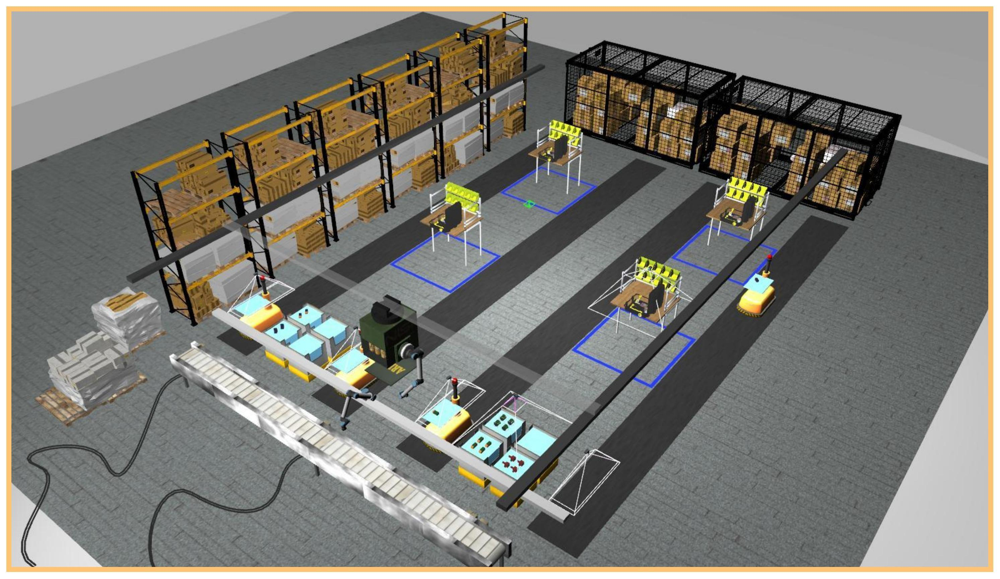

# Wiki | Home

## Wiki for ARIAC 2021.

**NOTE**: These pages are in the process of being updated. If you see something that looks like it got missed, please send us an email at ariac@nist.gov

<!----->

## Important Dates

- Registration Date: TBD
- Competition Qualifiers Date: TBD
- Competition Finals Date: TBD

## [Terminology](wiki/misc/terminology.md)

- This section describes the terminology used in this wiki. If you are new to ARIAC we strongly suggest you visit this page first.
  
## [Updates](wiki/misc/updates.md)

- Check this page for recent updates made to the code.

## [What is new in ARIAC 2021?](wiki/misc/whatisnew.md)

- Summary of the changes made since ARIAC 2020.

## [Documentation](wiki/documentation/documentation.md)

- Specifications of the NIST Agile Robotics for Industrial Automation Competition (ARIAC) and the Gazebo Environment for Agile Robotics (GEAR) software.

## [Tutorials](wiki/tutorials/tutorials.md)

- A set of tutorials to help you get started with the NIST Agile Robotics for Industrial Automation Competition (ARIAC).

## [Qualifiers](wiki/qualifiers/qualifier.md)

- Details of the released qualification tasks for ARIAC.

## [Finals](wiki/finals/finals.md)

- Details of how the ARIAC Finals will run.

## [Bug Reports](wiki/misc/bug_report.md)

- Improving the software and fixing issues.
