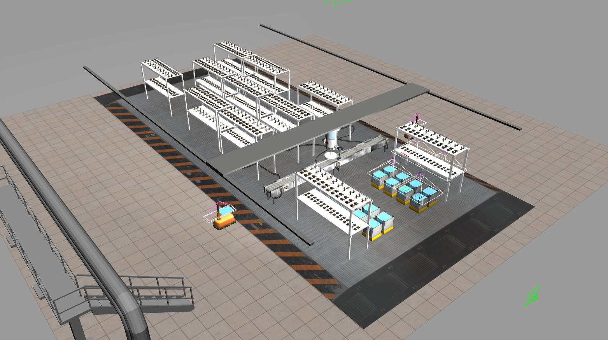

# Wiki | Home
* Wiki for ARIAC 2020, consisting of kit building in a simulated warehouse with a dual arm gantry robot.

**NOTE**: These pages are in the process of being updated. If you see something that looks like it got missed, please send us an email at ariac@nist.gov

<!----->

<!----->

## [Documentation](wiki/documentation.md)
Specifications of the NIST Agile Robotics for Industrial Automation Competition (ARIAC) and the GEAR software.
## [Tutorials](wiki/tutorials.md) 
A set of tutorials to help you get started with the NIST Agile Robotics for Industrial Automation Competition (ARIAC).
## [Qualifiers](wiki/qualifier.md) 
Details of the released qualification tasks for ARIAC.
## [Finals](wiki/finals.md) 
Details of how the ARIAC Finals will run.
## [Bug Reports](wiki/bug_report.md) 
Improving the software and fixing issues.
## [News](wiki/updates.md) 
Check this page for latest news.

