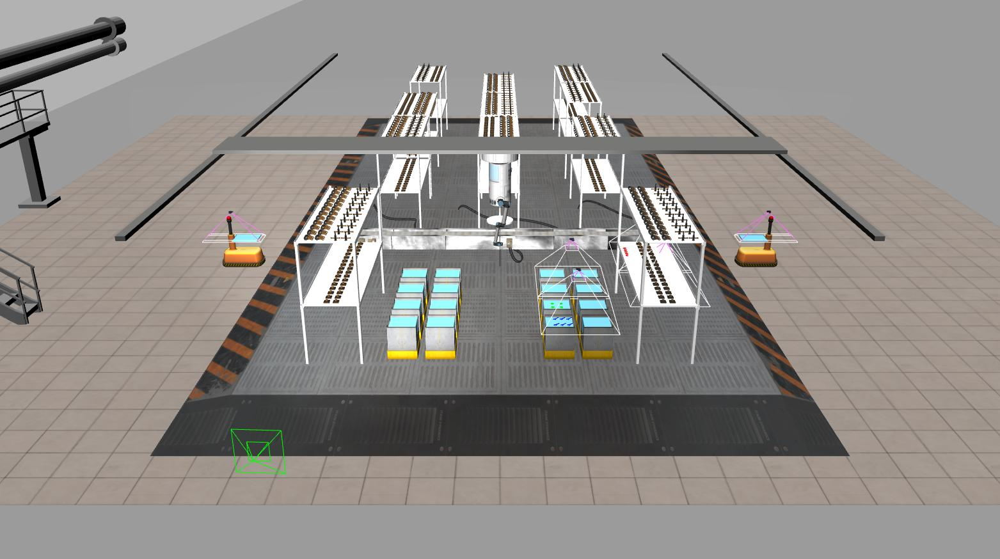
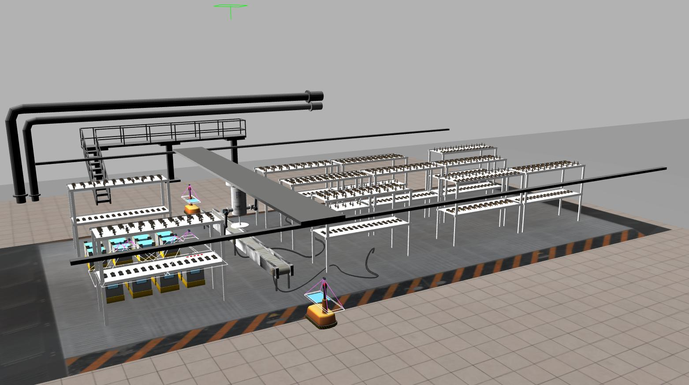

# Wiki | Home

## Wiki for ARIAC 2020, consisting of kit building in a simulated warehouse with a dual arm gantry robot.

**NOTE**: These pages are in the process of being updated. If you see something that looks like it got missed, please send us an email at ariac@nist.gov

<!----->

<!----->

## Important Dates
* Registration Open : Now Through April 2020
* Competition Qualifier: April 6-24, 2020
  - **Deadline**: Friday 04/24 at 11:59 pm (PST)
* Competition Finals: May 11-15, 2020

## [Updates](wiki/misc/updates.md)
Check this page for recent updates made to the code.
## [What is new in ARIAC 2020?](wiki/misc/whatisnew.md)
Summary of the changes made since ARIAC 2019.
## [Documentation](wiki/documentation/documentation.md)
Specifications of the NIST Agile Robotics for Industrial Automation Competition (ARIAC) and the GEAR software.
## [Tutorials](wiki/tutorials/tutorials.md)
A set of tutorials to help you get started with the NIST Agile Robotics for Industrial Automation Competition (ARIAC).
## [Qualifiers](wiki/qualifiers/qualifier.md)
Details of the released qualification tasks for ARIAC.
## [Finals](wiki/finals/finals.md)
Details of how the ARIAC Finals will run.
## [Bug Reports](wiki/misc/bug_report.md)
Improving the software and fixing issues.

