# Environment

The simulation environment is a representation of an order fulfillment workcell.

## Parts

Parts are used for both kitting and assembly. There are four unique part types and each part can be one of five colors.

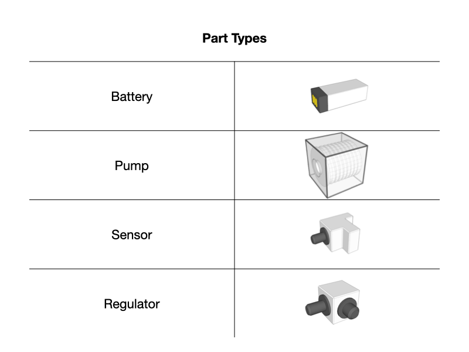

The parts are designed to be installed to a respirator

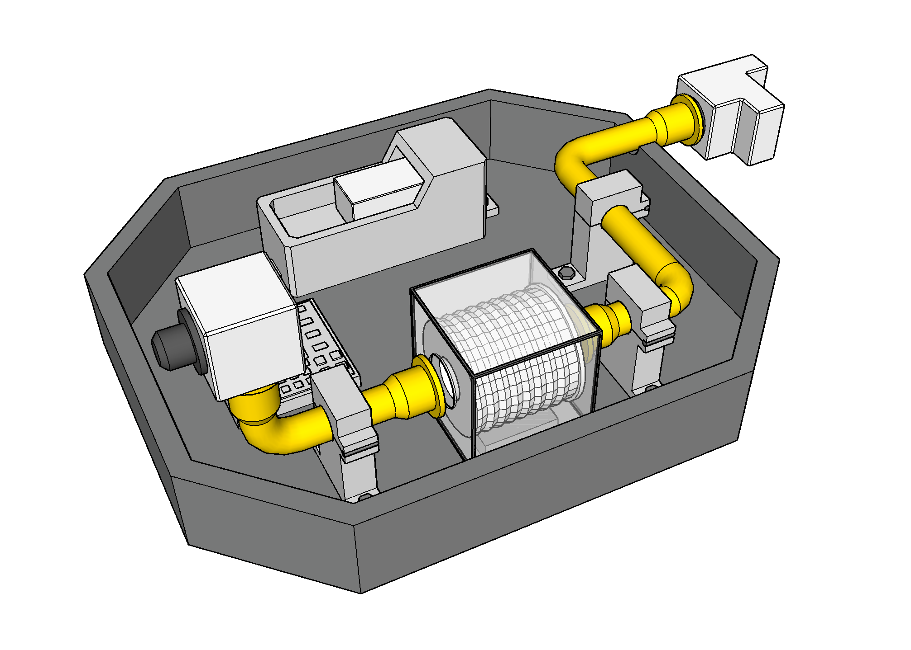

## Kit Trays

For ARIAC 2023, the kitting trays have been redesigned. The tray has been separated into four quadrants. The center is also marked with a fiducial tag. This tag follows the ARUCO standard and encodes an integer value that denotes the tray ID (0 - 9).

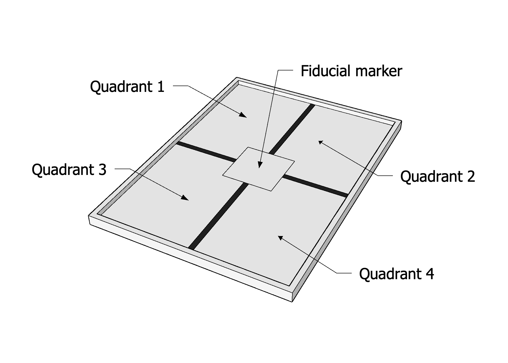

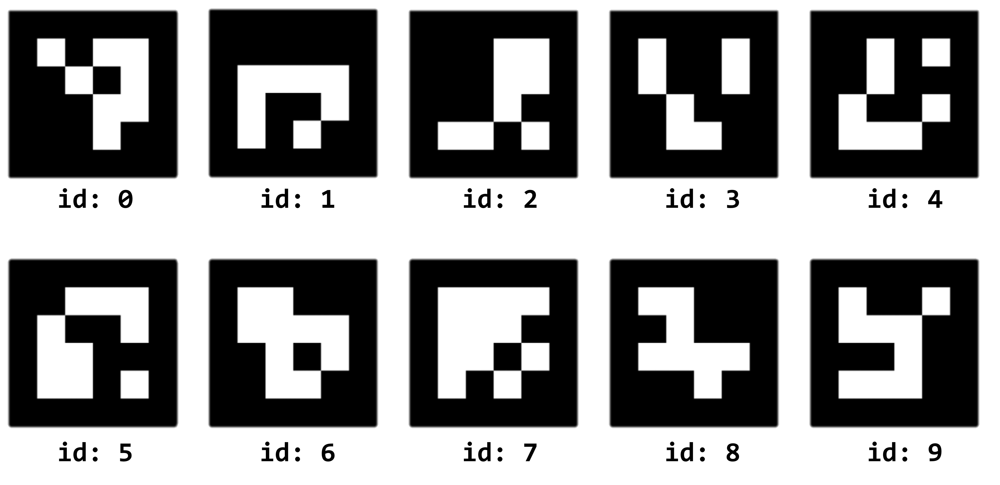

## Robots

The workcell consists of two modified UR10e robots, which can perform pick-and-place operations. Each robot end effector is affixed with a vacuum gripper that can be used to pick up either parts or kit trays. The gripper requires contact with the part in order to grab an object.

### Floor Robot

The first UR10e arm is mounted to a linear rail parallel to the conveyor belt. This gives the floor robot access to pick up kit trays from either of the two kitting stations or pick parts from the bins or the conveyor belt. The floor robot can only perform kitting.

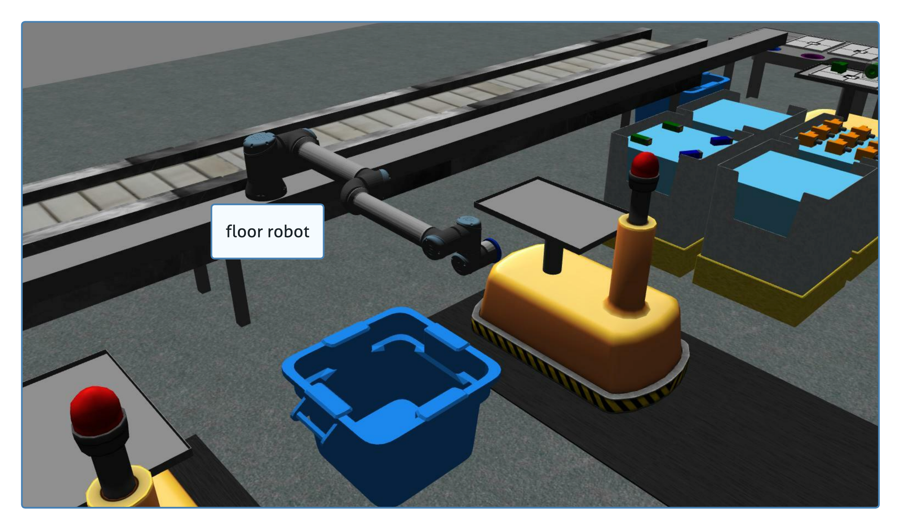

### Ceiling Robot

The second UR10e arm is mounted to a gantry on the ceiling. This gantry allows for movement in the x and y direction in the environment as well as rotation around the torso base. The ceiling robot is capable of performing both kitting and assembly.

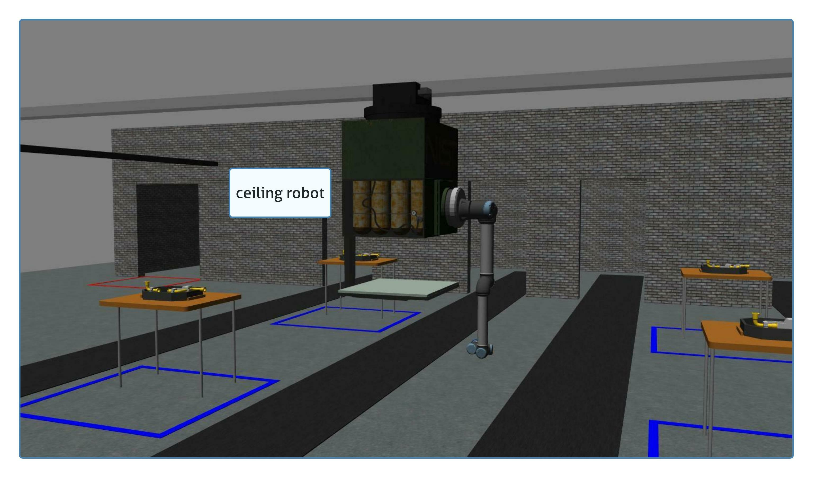

### Automated Guided Vehicles (AGVs)

The other robots located in the workcell are automated guided vehicles (AGVs), which can be used to transport parts between stations or to the warehouse. New to ARIAC2023 these robots have working ROS velocity controllers which means the movement can be directly controller by users. 

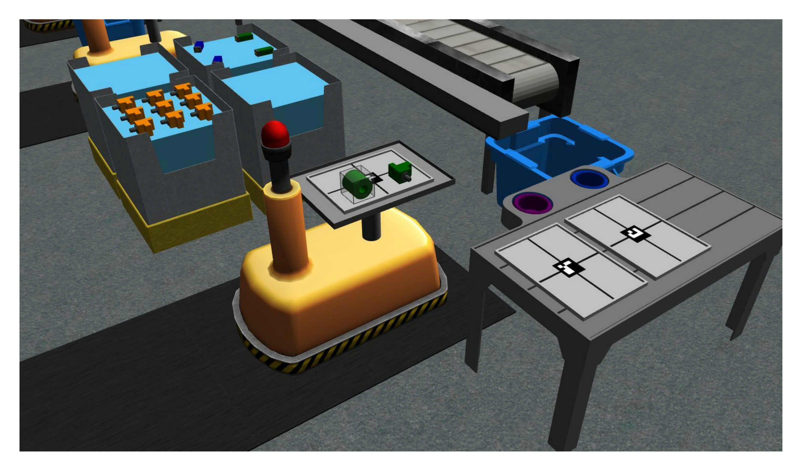

Using a ROS service, competitors can move each AGV to a kitting station, to two assembly stations, and to the warehouse. In the figure below, each AGV is at its kitting station. The black path on the floor show the path each AGV can take. 

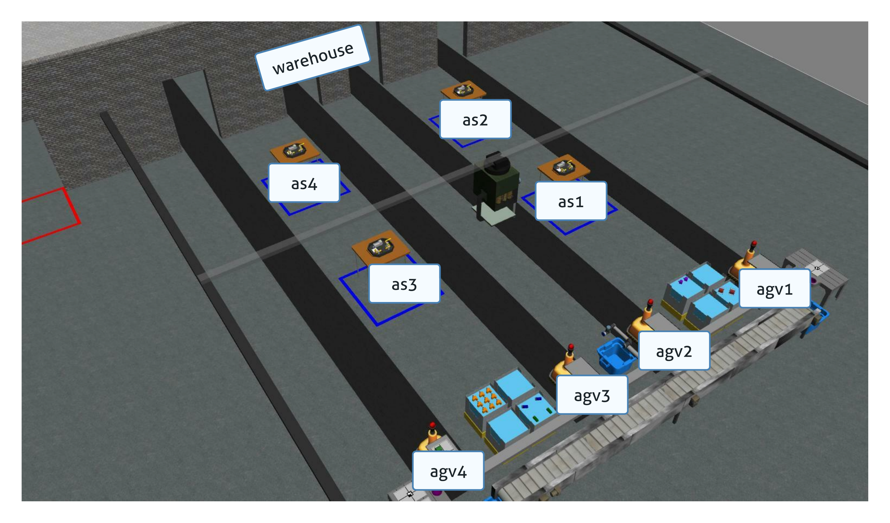

## Part Locations

Parts can spawn in the environment in one of three places: bins, conveyor belt, or on AGVs.

### Part Bins

There are a total of eight part bins in the workcell. Each bin consists of nine slots (see Figure) where parts can be located. Parts can be at any rotation and can be flipped.

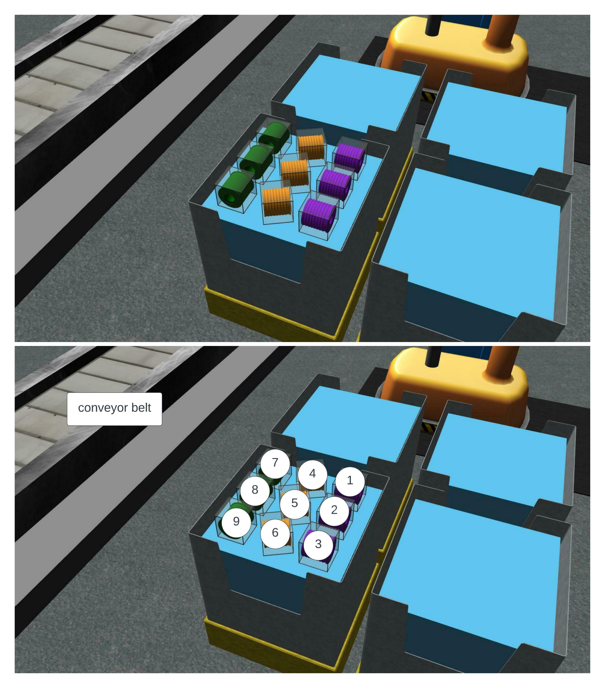

### Conveyor Belt

The conveyor belt is a secondary location where parts can be found. The conveyor starts spawning parts when the competition is started. Users will need to pick parts from the conveyor belt while it is moving. 

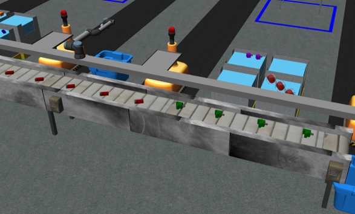

## Kit Tray/Tool Changer Station

The workcell consists of two kit tray/tool changing stations. Each station is used to store kit trays needed for kitting and up to three kit trays can be located on one single station.

The floor robot and the ceiling robot are both equipped with a vacuum gripper. The gripper has two tool types: parts or trays and the color of the gripper will reflect the current state. To change the tool type for either robots, competitors must use the tool-changing stations at either of the two kitting stations. Competitors must move the robot they want to change the tool of to the corresponding tool changer and call a ROS service.

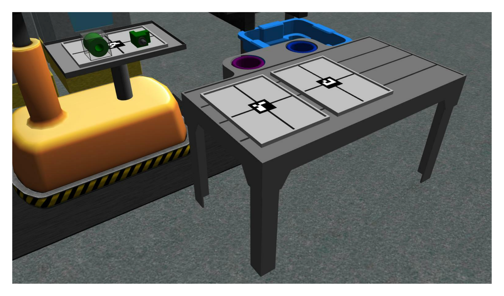

## Assembly Stations

There are four assembly stations in the environment (AS1, AS2, AS3, and AS4). Each of the assembly stations contains an insert where parts can be installed. 

## Warehouse

The warehouse is one of the possible destinations for the AGVs. It is a separate room where workers can process the parts from kitting orders. Humans in the environment will start from the warehouse. 

## Part Disposal Bins

Three part collectors are provided to the competitors. These bins can be used to discard faulty parts without a penalty.

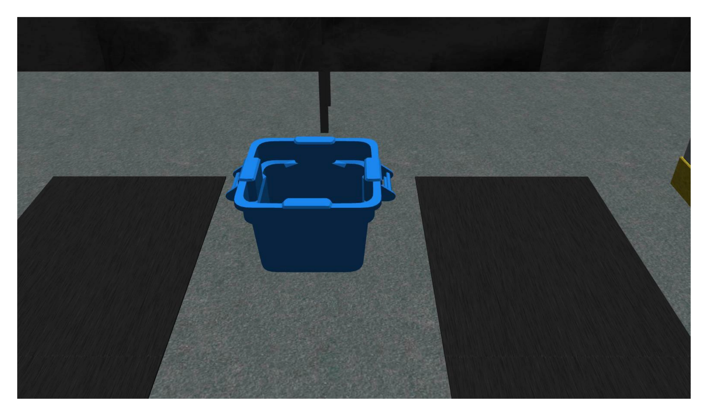

