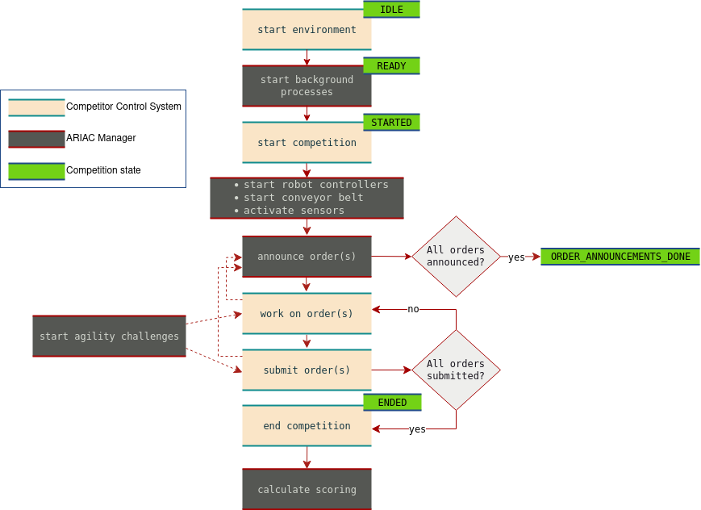

# Overview of the Competition

The flowchart below provides an overview of the competition. The competition consists of two main actors, the Competitor Control System (CCS) and the ARIAC Manager (AM). The competition is set to different states while it is running and competitors need to subscribe to the topic `/ariac/competition_state` to properly implement the programming logic.



A description of the flowchart is provided below.

1. **start environment**: The competitor starts the environment with the following command:

    ```bash
    ros2 launch ariac_gazebo ariac.launch.py trial_config:=<yaml_file> user_config:=<yaml_file>
    ```

    The Gazebo simulation environment will start and many ARIAC processes will start in the background. The competition is in the `IDLE` state. Once all the required processes have been loaded in the background, the AM will set the competition state to `READY`. 

2. **start competition**: Once the state of the competition is set to`READY`, the CCS can call the following service to start the competition:

    ```bash
    ros2 service call /ariac/start_competition std_srvs/srv/Trigger
    ```
    
    The call to this service will start the robot controllers, the conveyor belt, and will activate all sensors. Orders will be announced on the topic `/ariac/orders`. The result of the call will set the state of the competition to `STARTED`.

3. **announce order(s)**: The AM will announce orders on the topic`/ariac/orders`. The CCS will  need to subscribe to the topic to receive the orders. If all orders have been announced, the AM will set the state of the competition to`ORDER_ANNOUNCEMENTS_DONE`. This state does not mean that the competition is over. The CCS may still be working on orders that were announced earlier.

4. **work on order(s)**: During this phase, the CCS will perform different activities in order to fulfill the orders. The AM may announce new orders or start agility challenges based on the state of the workcell.

5. **submit order(s)**: After orders are completed they are submitted by the CCS. Order submission may announce new orders and/or start agility challenges.  

6. **end competition**: Once the CCS have submitted all orders, they need to call the following service to end the competition.

    ```bash
    ros2 service call /ariac/end_competition std_srvs/srv/Trigger
    ```

    The result of the call will set the state of the competition to `ENDED`.

7. **calculate scoring**: The last phase of a trial is the computation of the score for the trial. The score is computed using the formulas described in the [Scoring](scoring.md) section. The score is published on the topic `/ariac/score` and is also displayed on the terminal.
