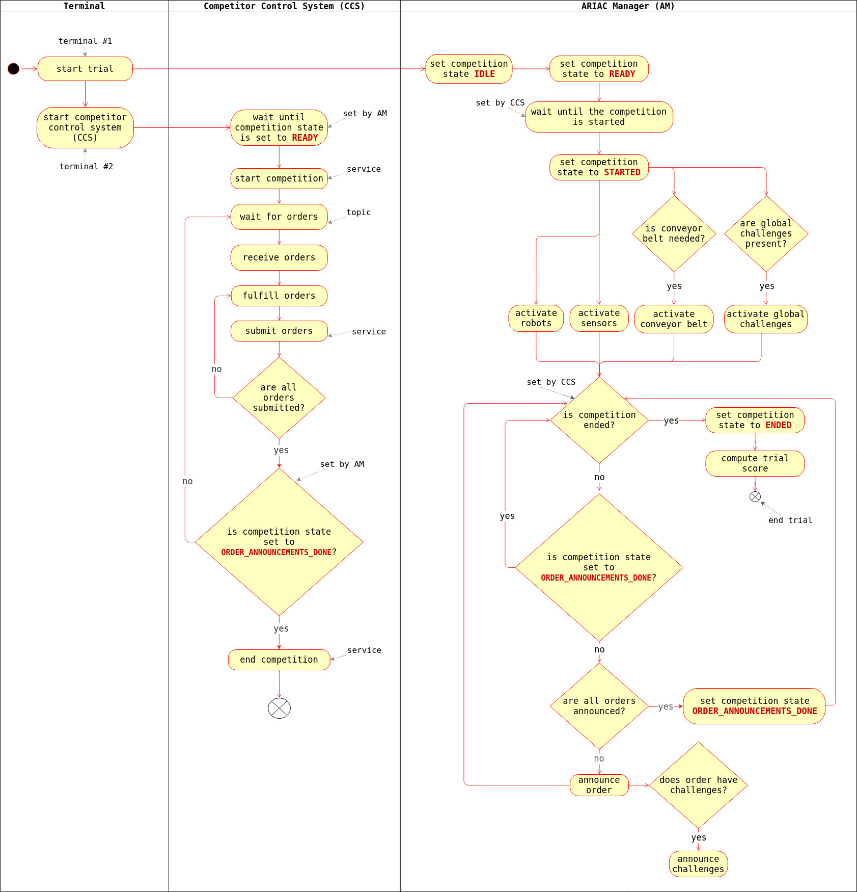

Overview of the Competition
===========================

   

   Flowchart showing the interactions between the :term:`Competitor Control System (CCS)<Competitor Control System (CCS)>` and the :term:`ARIAC Manager (AM)<ARIAC Manager (AM)>`.

   

:numref:`flowchart` provides an overview of the competition. 
The competition consists of two main actors, the CCS and the AM. 
The competition is set to different states while it is running and the CCS needs to subscribe to the topic :topic:`/ariac/competition_state` to properly implement the programming logic. 

Start Commands
--------------

To compete in ARIAC, competitors have to issue two commands in two different terminals.

- *terminal 1*: In the first terminal, competitors start the trial with the following command:

    .. code-block:: console

        ros2 launch ariac_gazebo ariac.launch.py trial_name:={name_of_trial} competitor_pkg:={package_name} sensor_config:={name_of_sensor_config}

    
    This command starts the Gazebo simulation environment and the AM, the latter handles the communications between the CCS and the ARIAC software. The state of the competition changes multiple times during a trial. The state of the competition is published to the topic :topic:`ariac/competition_state`.
    The CCS needs to subscribe to this topic to properly implement the programming logic.

- *terminal 2*: Once the trial is started, competitors start the CCS. Starting the CCS can be done with :console:`ros2 run` or :console:`ros2 launch` command. The first task of the CCS is to start the competition with the service :rosservice:`/ariac/start_competition`. Although the simulation environment is running, the competition is not started at this point.
    
    The state of the competition must be ``READY`` before this service can be called. The call to this service starts the robot controllers, activates all sensors, starts the conveyor belt (if used in the trial), and starts the global challenges (if used in the trial). Orders will be announced on the topic :topic:`/ariac/orders`. The result of the call will set the state of the competition to ``STARTED``.

    Once orders are announced, the CCS fulfills and submits orders. Order announcements can be time based, part placement based, or order submission based. More information on these conditions can be found in :ref:`CONDITIONS`. Agility challenges can also be announced with these conditions. More information on agility challenges can be found in :ref:`AGILITY_CHALLENGES`. To submit orders, the CCS needs to call the service :rosservice:`/ariac/submit_order` which uses the ID of the order as an argument.

    .. warning:: 
        
        To submit a kitting order, the CCS first has to move the AGV to the warehouse with the service :rosservice:`/ariac/move_agv{n}`.
        Once the AGV is at the warehouse, then the submission service should be called. 
        To know the location of an AGV in the workcell, the CCS has to subscribe to the topic :topic:`/ariac/agv{n}_status`.

    

    Once all orders have been submitted, the CCS calls the service :rosservice:`/ariac/end_competition`.  The result of the call will set the state of the competition to ``ENDED``. The CCS can then exit. The AM will then compute the scoring for the current trial (see :ref:`SCORING` section), end the trial, and save the results. Before calling the service to end the competition, the CCS needs to ensure that all orders have been announced. The state of competition is set to ``ORDER_ANNOUNCEMENTS_DONE`` when all orders from the trial have been announced. 

