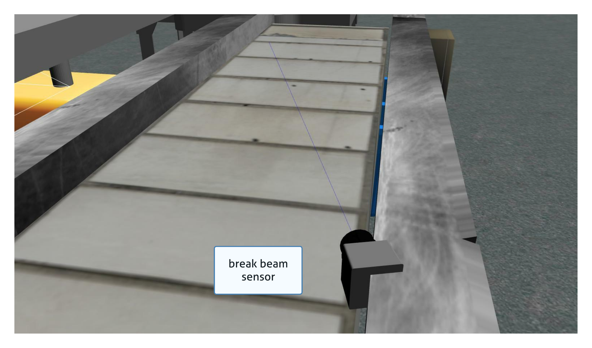
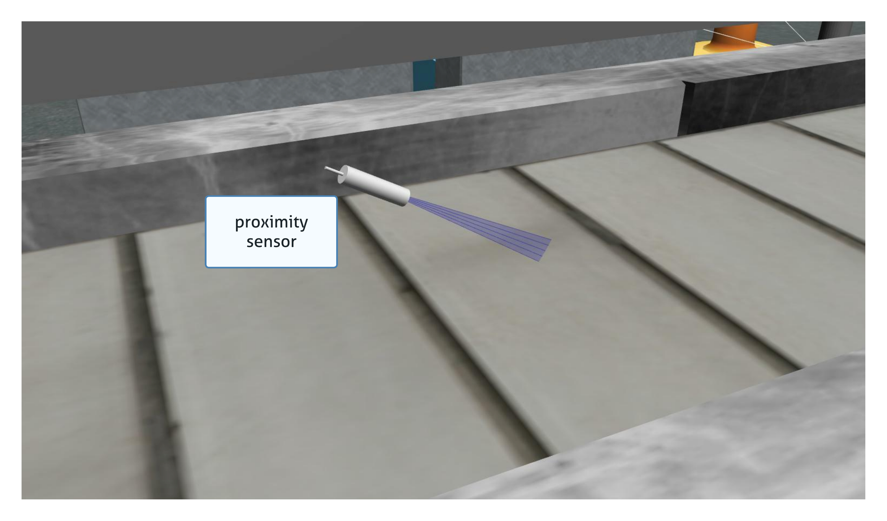
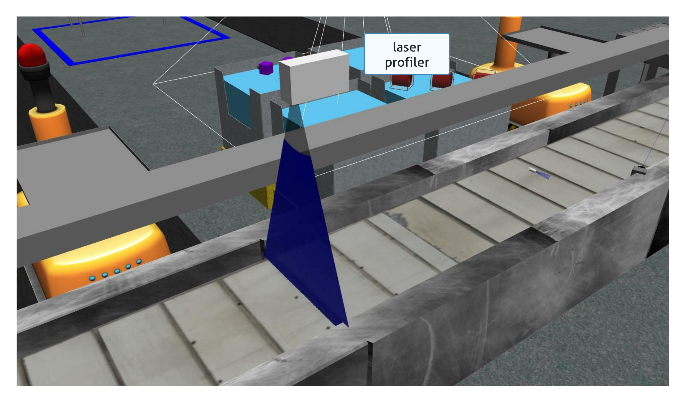
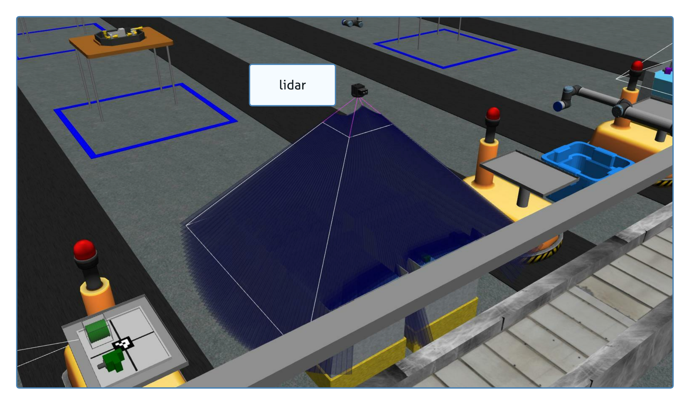
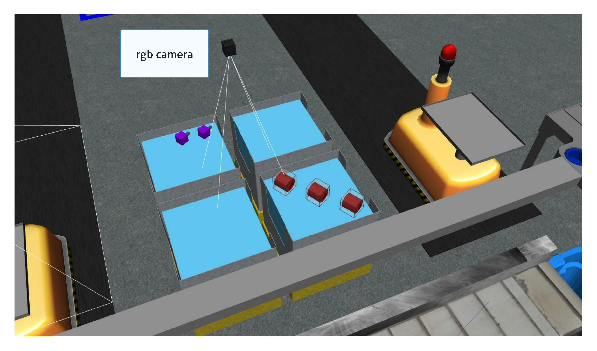
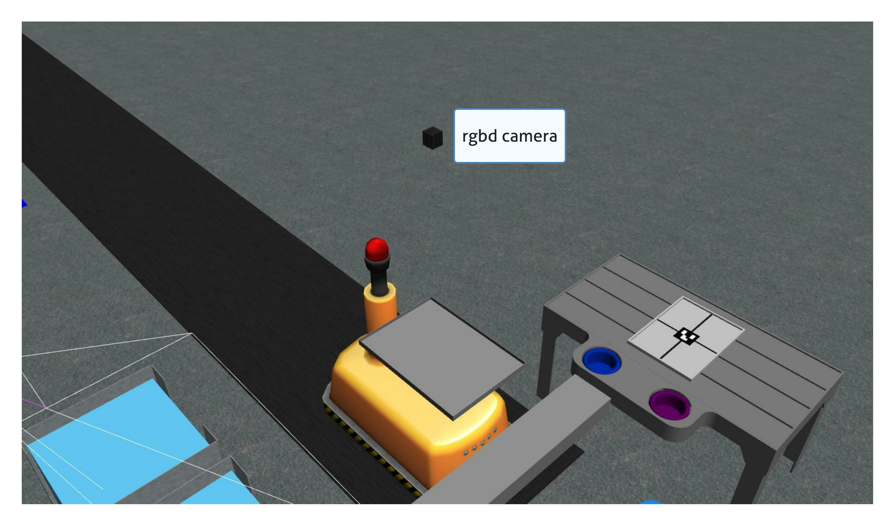
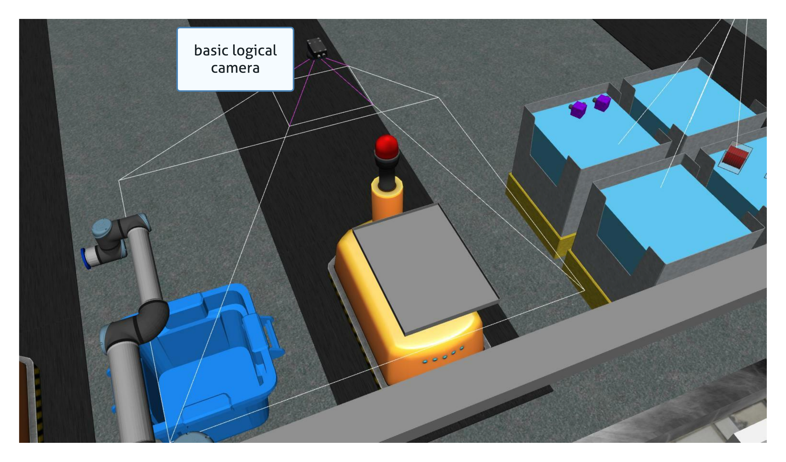

# Sensors

Competitors can place sensors anywghere in the environment. Sensors have no collision so they can overlap if necessary. Each sensor has a cost that factors into the final score.

## Sensor Costs

| Sensor Type               | Cost  |
| ---                       | ---   |
| `break_beam`              | $100  |
| `proximity`               | $100  |
| `laser_profiler`          | $200  |
| `lidar`	                | $300  |
| `rgb_camera`              | $300  |
| `rgbd_camera`             | $500  |
| `basic_logical_camera`    | $500  |
| `advanced_logical_camera` | $2000 |

## Sensor Types

### Break Beam

The break beam sensor reports when a beam is broken by an object. It does not provide distance information.



### Proximity

The proximity sensor outputs how far an object is from the sensor.


### Laser Profiler

The laser profiler provides an array of distances to a sensed object.


### Lidar

The LIDAR sensor provides a point cloud of detected objects.



### RGB Camera

The RGBD camera provides an RGB image.



### RGBD Camera

The RGBD camera provides an RGB image and a depth image.



### Basic Logical Camera

The basic logical camera provides a list of kit tray poses and a list of part poses. The type and the color of an object are not reported by this sensor.



### Advanced Logical Camera

The advanced logical camera reports the pose, the type, and the color of a detected object.


## Sensor Configuration File

 Sensors are configured using a YAML file. See the [Configuration Files](trials.md) page for more information on how to configure the competition environment with sensors.

<!--Competitors should create a configuration file similar to the one below for all sensors they want to place in the environment. Each sensor has the ability to show the FOV for testing by setting the `visualize_fov` item to `true`.

> NOTE: the RGB and RGBD camera FOV is not displayed properly. Use a tool like RVIZ or RQT to see the output of the sensor

``` yaml
sensors:
  breakbeam_0:
    type: break_beam
    visualize_fov: true
    pose:
      xyz: [-0.35, 3, 0.95]
      rpy: [0, 0, pi]

  proximity_sensor_0:
    type: proximity
    pose:
      xyz: [-0.573, 2.84, 1]
      rpy: [pi/2, pi/6, pi/2]

  laser_profiler_0:
    type: laser_profiler
    pose:
      xyz: [-0.573, 1.486, 1.526]
      rpy: [pi/2, pi/2, 0]

  lidar_0:
    type: lidar
    pose:
      xyz: [-2.286, -2.96, 1.8]
      rpy: [pi, pi/2, 0]

  rgb_camera_0:
    type: rgb_camera
    pose:
      xyz: [-2.286, 2.96, 1.8]
      rpy: [pi, pi/2, 0]

  rgbd_camera_0:
    type: rgbd_camera
    pose:
      xyz: [-2.286, 4.96, 1.8]
      rpy: [pi, pi/2, 0]

  basic_logical_camera_0:
    visualize_fov: true
    type: basic_logical_camera
    pose:
      xyz: [-2.286, 2.96, 1.8]
      rpy: [pi, pi/2, 0]

  advanced_logical_camera_0:
    type: advanced_logical_camera
    pose:
      xyz: [-2.286, -2.96, 1.8]
      rpy: [pi, pi/2, 0]
``` -->
  


