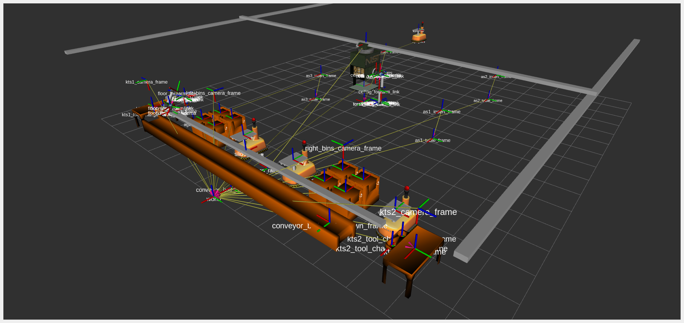

# TF Frames





This section describes the TF frames used in the competition. The TF frames are used to describe the position and orientation of the different objects in the competition. After starting the environment, one can visualize the TF tree with the following command:

```bash
cd /tmp && ros2 run tf2_tools view_frames  && evince frames.pdf
```

A PDF file containing the TF frames is also available [here](../images/frames.pdf). A summary of the TF frames used in the competition is provided below:

* **World**: The `world` frame is the root frame of the TF tree. It is located at the origin of the competition arena.
* **AGV Trays**: Frames for the AGV trays  are located at the origin of the trays. The frames are named as `agvX_tray` where `X` is the agv number.

```
    world
    └─── agv1_track
    |    |
    |    └─── agv1_base
    |         |
    |         └─── agv1_tray
    └─── agv2_track
    |    |
    |    └─── agv2_base
    |         |
    |         └─── agv2_tray
    └─── agv3_track
    |    |
    |    └─── agv3_base
    |         |
    |         └─── agv3_tray
    └─── agv4_track
         |
         └─── agv4_base
              |
              └─── agv4_tray
```

* **Robots**: Frames of the robots are provided in the TF tree.

```
    world
    └─── long_rail_1 (frames for the ceiling robot)
    |    |
    |    └─── ...
    └─── slide_bar (frames for the floor robot)
         |
         └─── ...
```

* **Cameras**: Frames for the cameras and sensors defined in the sensor configuration file are published on the TF tree. **Note**: In previous versions of ARIAC parts detected by cameras were published on the TF tree. This is no longer the case. The TF frames are only used to describe the position and orientation of the cameras and sensors. Competitors are expected to subscribe to the topics provided by the cameras and sensors to get the information about the parts.

```
    world
    └─── right_bins_camera_frame
    |
    └─── left_bins_camera_frame
    | 
    └─── ...
```

* **Bins**: Frames for the bins are located at the origin of the bins. The frames are named as `binX_frame` where `X` is the bin number.

```
    world
    └─── bin1_frame
    |
    └─── bin2_frame
    |
    └─── bin3_frame
    |
    └─── bin4_frame
    |
    └─── bin5_frame
    |
    └─── bin6_frame
    |
    └─── bin7_frame
    |
    └─── bin8_frame
```

* **Inserts**: Frames for the inserts are located at the origin of the inserts. The frames are named as `asX_insert_frame` where `X` is the assembly station number. These frames are useful for assembly and combined tasks.

```
    world
    └─── as1_table_frame
    |    |
    |    └─── as1_insert_frame
    |
    └─── as2_table_frame
    |    |
    |    └─── as2_insert_frame
    |
    └─── as3_table_frame
    |    |
    |    └─── as3_insert_frame
    |
    └─── as4_table_frame
         |
         └─── as4_insert_frame
```

* **Tray/Tool Changer Tables**: Frames for the tray tables are  named as `ktsX_table_frame` where `X` is the table number. Each `ktsX_table_frame` has two children:
  * `ktsX_tool_changer_parts_frame` is the frame of the tool changer for the parts gripper.
  * `ktsX_tool_changer_trays_frame` is the frame of the tool changer for the trays gripper.

```
    world
    |
    └─── kts1_table_frame
    |    |
    |    └─── kts1_tool_changer_parts_frame
    |    |
    |    └─── kts1_tool_changer_trays_frame
    |
    └─── kts2_table_frame
         |
         └─── kts2_tool_changer_parts_frame
         |
         └─── kts2_tool_changer_trays_frame
```

* **Conveyor Belt**: Frames for the conveyor belt consists of two frames:
  * `conveyor_belt_base_frame` is the frame located below the conveyor belt.
  * `conveyor_belt_part_spawn_frame` is the frame origin where parts are spawn on the conveyor belt. This frame is located at one end of the conveyor belt.

```
    world
    |
    └─── conveyor_belt_base_frame
         |
         └─── conveyor_belt_part_spawn_frame
```