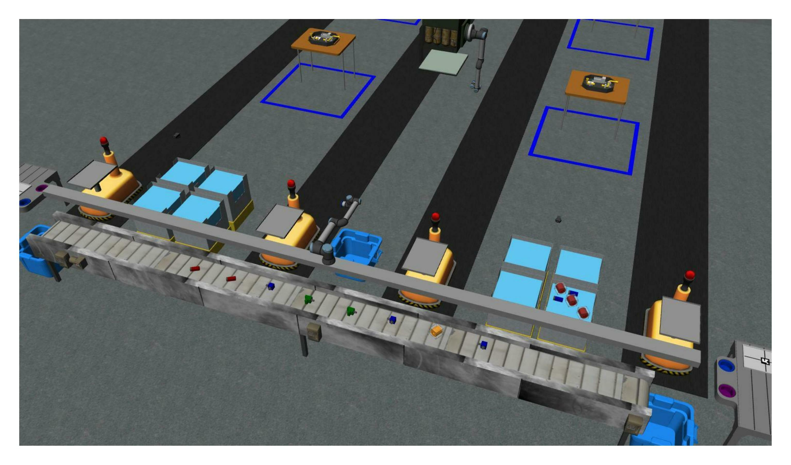

# Configuration Files

Configuration files are described in the YAML format. YAML is a human-readable data serialization format. It is commonly used for configuration files and in applications where data is being stored or transmitted. For more information on YAML, see the [YAML website](http://yaml.org/).

ARIAC consists of two main configuration files, which are described below in the following subsections.

## Sensor Configuration File

The sensor configuration file describes the location of the sensors on the competition field. One example of sensor configuration file (`sensors.yaml`) is provided in the [test_competitor](https://github.com/usnistgov/ARIAC/tree/ariac2023/test_competitor/config) package.

Below is a description of the different fields in the sensor configuration file. This file contains 4 sensors which have to be described under the field `sensors` and each sensor consists of:

1. A name (e.g. `right_bins_camera`). This name has to be unique among all sensors in the same configuration file.
2. A type (e.g. `advanced_logical_camera`). This type has to be one of the following types described in the section [Sensors](sensors.md).

   * `break_beam`
   * `proximity`
   * `laser_profiler`
   * `lidar`
   * `rgb_camera`
   * `rgbd_camera`
   * `basic_logical_camera`
   * `advanced_logical_camera`
3. A pose (defined in the world frame):
    * Position (e.g. `xyz: [-2.286, 2.96, 1.8]`).
    * Orientation (e.g. `rpy: [pi, pi/2, 0]`). The orientation is defined using the [roll-pitch-yaw](https://en.wikipedia.org/wiki/Euler_angles) convention. The orientation is defined in radians and can be defined using floating-point values or with the `pi` constant (`pi`, `pi/2`, `pi/4`, etc.).

Below is an example of a sensor configuration file. The field `visualize_fov` is optional and can be used to visualize the field of view of the sensor. The field `visualize_fov` can be set to `true` or `false`. If the field `visualize_fov` is not defined, the field of view will not be visualized.

```yaml
sensors:
   breakbeam_0:
       type: break_beam
       visualize_fov: true
       pose:
           xyz: [-0.35, 3, 0.95]
           rpy: [0, 0, pi]

   proximity_sensor_0:
       type: proximity
       visualize_fov: true
       pose:
           xyz: [-0.573, 2.84, 1]
           rpy: [pi/2, pi/6, pi/2]

   laser_profiler_0:
       type: laser_profiler
       visualize_fov: true
       pose:
           xyz: [-0.573, 1.486, 1.526]
           rpy: [pi/2, pi/2, 0]

   lidar_0:
       type: lidar
       visualize_fov: false
       pose:
           xyz: [-2.286, -2.96, 1.8]
           rpy: [pi, pi/2, 0]

   rgb_camera_0:
       type: rgb_camera
       visualize_fov: false
       pose:
           xyz: [-2.286, 2.96, 1.8]
           rpy: [pi, pi/2, 0]

   rgbd_camera_0:
       type: rgbd_camera
       visualize_fov: false
       pose:
           xyz: [-2.286, 4.96, 1.8]
           rpy: [pi, pi/2, 0]

   basic_logical_camera_0:
       visualize_fov: false
       type: basic_logical_camera
       pose:
           xyz: [-2.286, 2.96, 1.8]
           rpy: [pi, pi/2, 0]

   advanced_logical_camera_0:
       visualize_fov: false
       type: advanced_logical_camera
       pose:
           xyz: [-2.286, -2.96, 1.8]
           rpy: [pi, pi/2, 0]
```

### Placing Sensors in the Environment

To add sensors in the environment, one can start the simulation environment and use Gazebo's GUI to add sensors. The sensors can be added by clicking on the `Insert` button and then selecting the desired sensor type. The sensors can be placed in the environment by clicking on the `Move` button and then clicking on the desired location in the environment. The sensors can be rotated by clicking on the `Rotate` button and then clicking on the desired orientation in the environment.  The sensors can be deleted by clicking on the `Delete` button and then clicking on the desired sensor in the environment. Once the sensors are placed in the environment, the sensor configuration file can be updated with the new sensor information.

Another way to place sensors is to add them in the sensor configuration file and then run the simulation environment. The sensors will be added to the environment automatically. They can the been moved and rotated in the environment. Once the sensors are placed in the environment, the sensor configuration file can be updated with the new sensor information.

## Trial Configuration File

Trials are the main way to test your robot's performance. Multiple trials are used during the qualifiers and the finals. The results of each trial are recorded and then used to rank competitors.

### ARIAC GUI

A graphical interface for creating trial configuration yaml files was created for ARIAC2023. The use of this tool is demonstrated in [this youtube video](https://youtu.be/8xqCEhBE4-s) 

To run the gui, build and source the workspace using the [installation instructions](../getting_started/installation.md) and run:
```
ros2 run ariac_gui gui
```

### Trial Configuration Fields

A trial configuration file (`sample.yaml`) is provided in the [ariac_gazebo](https://github.com/usnistgov/ARIAC/tree/ariac2023/ariac_gazebo/config/trials) package. Below is a description of the different sections in the trial configuration file. 

#### Time Limit (Mandatory Field)

The time limit is defined in the `time_limit` field. The time limit is defined in (simulation) seconds and can be defined using floating-point values. A time limit of `-1` means that there is no time limit for this trial. Competitors can set no time limit during testing. During the qualifiers and the finals, there will be a time limit for each trial.

```yaml
time_limit: -1 # no time limit
```

```yaml
time_limit: 300 # A 5 minute time limit
```

#### Kitting Trays (Mandatory Field)

Kitting trays are defined in the `kitting_trays` field. Information in this field is used to spawn kitting trays in the environment. The tray IDs are provided in a list of integers and set with the field `tray_ids`. Kitting tray IDs range from 0 to 9. The location of kitting trays in the environment is defined in the field `slots`, which are slots located on the tray tables. Each tray table has 3 slots. Slots 1-3 for one tray table and slots 4-6 for the other tray table.


The example below describes 2 kitting trays which are located in slots 2 and 4 on the tray tables. The tray IDs are 1 and 6 respectively.

```yaml
kitting_trays: # Which kitting trays will be spawn
  tray_ids: [1, 6] 
  slots: [2, 4]
```

#### Part Locations (Mandatory Field)

Parts can be found in 3 different location types: Bins, conveyor belt, and AGVs. The locations of parts in the environment are defined in the `parts` field. The `parts` field can have three subfields: `bins`, `agvs`, `conveyor_belt`.

##### Bins

```yaml
bins: # bin params - 8 total bins each bin has nine total slots (1-9)
    bin1: 
      - type: 'pump'
        color: 'red'
        slots: [1, 5, 9]
        rotation: 'pi/6'
        flipped: true
      - type: 'battery'
        color: 'blue'
        slots: [4, 2]
        rotation: 'pi/2'
    bin3:
      - type: 'regulator'
        color: 'purple'
        slots: [1, 2]
        rotation: 'pi/2'
      - type: 'regulator'
        color: 'purple'
        slots: [3, 4]
        rotation: 'pi/6'
        flipped: true
      - type: 'regulator'
        color: 'purple'
        slots: [5, 6]
        rotation: 0
        flipped: true
```

The `bins` field can have 8 subfields: `bin1`, `bin2`, `bin3`, `bin4`, `bin5`, `bin6`, `bin7`, `bin8`. Each bin has 9 slots. The slots are numbered from 1 to 9 (see the [Environment](environment.md) page for more information on bin slots). The `type` field describes the part type in a bin. There can be multiple parts of different types in a bin and multiple parts of the same type. In the provided example, there are 3 pumps and 2 batteries in bin1. There are 6 purple regulators in bin3. The way part locations are defined in bin3 allows for the same part type and color with different orientations and flipped states to be placed in the same bin.

The `color` field describes the part color in a bin. The `slots` field describes the slots in a bin where the part can be found. The `rotation` field describes the rotation of the part in a bin. The `flipped` field describes whether the parts are flipped in a bin. The `flipped` field can be set to `true` or `false`. If the `flipped` field is not defined, the parts will not be flipped. In the provided example, all red pumps in bin1 are flipped and all the blue batteries in bin1 are not flipped. See the [Challenges](challenges.rst) page for more information about flipped parts.

##### AGVs

In trials where assembly is required, the environment starts with parts already located on the AGVs. The `agvs` field describes the parts on the AGVs. The subfields of `agvs` can be `agv1`, `agv2`, `agv3`, and `agv4`. Each one of these subfields contains a tray ID and a list of parts. The `tray_id` field describes the tray ID located on the AGV. By convention, tray IDs located on AGVs at the start of the environment are 0. The `parts` field describes the parts on the AGV. The `type` field describes the part type on the AGV. The `color` field describes the part color on the AGV. The `quadrant` field describes the quadrant of the AGV where the part is located. The `rotation` field describes the rotation of the part on the AGV. The `flipped` field describes whether the part is flipped on the AGV. The `flipped` field can be set to `true` or `false`. If the `flipped` field is not defined, the parts will not be flipped. See the [Challenges](challenges.rst) page for more information about flipped parts.

It is important to note that AGVs are always located at their kitting station. Competitors have to move the AGVs to the assembly station to assemble the parts.

```yaml
parts:
  agvs:
    agv4:
      tray_id: 0
      parts:
        - type: 'pump'
          color: 'green'
          quadrant: 1
          rotation: 0
          flipped: true
        - type: 'sensor'
          color: 'green'
          quadrant: 3
          rotation: 'pi'
```

##### Conveyor Belt

Some trials require parts to be spawned on the conveyor belt. It can happen that parts required in a trial can only be found on the conveyor belt. Below is an example of how parts are defined on the conveyor belt.

```yaml
  conveyor_belt: # population params for conveyor belt
    active: true
    spawn_rate: 3.0 # seconds between spawn
    order: 'random' # random or sequential
    parts_to_spawn:
      - type: 'battery'
        color: 'red'
        number: 2
        offset: 0.15 # between -1 and 1
        flipped: false
        rotation: 'pi/6'
      - type: 'sensor'
        color: 'green'
        number: 2
        offset: 0.1 # between -1 and 1
        flipped: true
        rotation: 'pi'
      - type: 'regulator'
        color: 'blue'
        number: 3
        offset: -0.2 # between -1 and 1
        flipped: false
        rotation: 'pi/2'
      - type: 'pump'
        color: 'orange'
        number: 1
        offset: -0.15 # between -1 and 1
        flipped: true
        rotation: 'pi/3'
```

* The `conveyor_belt` field describes the parts on the conveyor belt.
  * `active` field describes whether the conveyor belt is active. The `active` field can be set to `true` or `false`. If the `active` field is not defined, the conveyor belt will not be active (parts will not be spawned on the conveyor belt).
  * `spawn_rate` field describes the rate at which parts are spawned on the conveyor belt. The `spawn_rate` field is a float value in seconds.
  * `order` field describes the order in which parts are spawned on the conveyor belt. The `order` field can be set to `random` or `sequential`. When set to `sequential`, parts will be spawned in the order they are defined in the `parts_to_spawn` field. When set to `random`, parts will be spawned in a random order.
  * `parts_to_spawn` field describes the parts that will be spawned on the conveyor belt. The `parts_to_spawn` field contains a list of parts.
    * The `type` field describes the part type on the conveyor belt.
    * The `color` field describes the part color on the conveyor belt. 
    * The `number` field describes the number of parts of the same type and color that will be spawned on the conveyor belt.
    * The `offset` field describes the offset between parts of the same type and color that will be spawned on the conveyor belt. The `offset` field is a float value in meters and must be between -1 and 1. 
    * The `flipped` field describes whether the parts are flipped on the conveyor belt. The `flipped` field can be set to `true` or `false`. If the `flipped` field is not defined, the parts will not be flipped. See the [Challenges](challenges.rst) page for more information about flipped parts.
    * The `rotation` field describes the rotation of the parts on the conveyor belt.

The Figure below shows an example of how parts are spawned on the conveyor belt from the snippet above.



## Challenges

The field `challenges` is used to define the challenges that will be used in the trial. See the [Challenges](challenges.rst) page for more information on how to define challenges.

## Orders

The field `orders` is used to define the orders that will be used in the trial. See the [Orders and Tasks](orders.rst) page for more information on how to define orders.