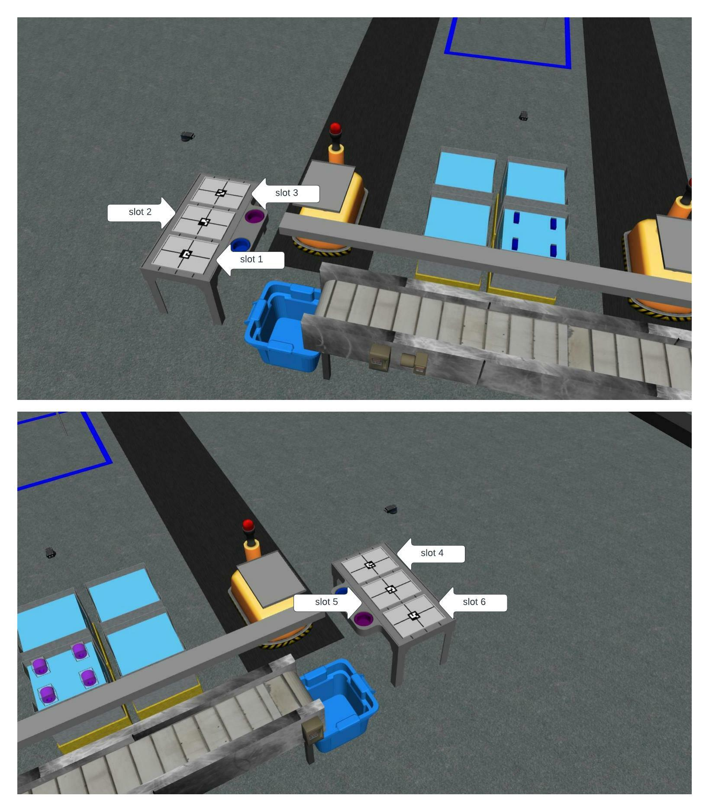

Configuration Files
==============================

Configuration files are described in the YAML format. YAML is a human-readable data serialization format. It is commonly used for configuration files and in applications where data is being stored or transmitted. For more information on YAML, see the `YAML website <http://yaml.org/>`_.

ARIAC consists of two main configuration files, which are described below in the following subsections.

.. _sensor_configuration_file:

Sensor Configuration File
--------------------------------

The sensor configuration file describes the location of the sensors in the workcell. One example of sensor configuration file (`sensors.yaml`) is provided in the `test_competitor <https://github.com/usnistgov/ARIAC/tree/ariac2023/test_competitor/config>`_ package.

Below is a description of the different fields in the sensor configuration file. This file contains 4 sensors which have to be described under the field :yamlname:`sensors` and each sensor consists of:

#. A name (e.g. :yamlname:`right_bins_camera`). This name has to be unique among all sensors in the same configuration file.
#. A type (e.g. :yaml:`type: advanced_logical_camera`). This type has to be one of the types defined in the :yamlname:`sensor_types` field.

    * :yaml:`break_beam`
    * :yaml:`proximity`
    * :yaml:`laser_profiler`
    * :yaml:`lidar`
    * :yaml:`rgb_camera`
    * :yaml:`rgbd_camera`
    * :yaml:`basic_logical_camera`
    * :yaml:`advanced_logical_camera`
#. A pose (defined in the world frame with the field :yamlname:`pose`):

    * Position (e.g. :yaml:`xyz: [-2.286, 2.96, 1.8]`).
    * Orientation (e.g. :yaml:`rpy: [pi, pi/2, 0]`). The orientation is defined using the `roll-pitch-yaw <https://en.wikipedia.org/wiki/Euler_angles>`_ convention. The orientation is defined in radians and can be defined using floating-point values or with the :yaml:`pi` constant (:yaml:`pi`, :yaml:`pi/2`, :yaml:`pi/4`, etc.).

:numref:`sensor-configuration-file` shows an example of a sensor configuration file. The field :yamlname:`visualize_fov` is optional and can be used to visualize the field of view of the sensor. The field :yamlname:`visualize_fov` can be set to :yaml:`true` or :yaml:`false`. If the field :yamlname:`visualize_fov` is not defined, the field of view will not be visualized.

.. code-block:: yaml
      :caption: An example of a sensor configuration file.
      :name: sensor-configuration-file

      sensors:
        breakbeam_0:
            type: break_beam
            visualize_fov: true
            pose:
                xyz: [-0.35, 3, 0.95]
                rpy: [0, 0, pi]

        proximity_sensor_0:
            type: proximity
            visualize_fov: true
            pose:
                xyz: [-0.573, 2.84, 1]
                rpy: [pi/2, pi/6, pi/2]

        laser_profiler_0:
            type: laser_profiler
            visualize_fov: true
            pose:
                xyz: [-0.573, 1.486, 1.526]
                rpy: [pi/2, pi/2, 0]

        lidar_0:
            type: lidar
            visualize_fov: false
            pose:
                xyz: [-2.286, -2.96, 1.8]
                rpy: [pi, pi/2, 0]

        rgb_camera_0:
            type: rgb_camera
            visualize_fov: false
            pose:
                xyz: [-2.286, 2.96, 1.8]
                rpy: [pi, pi/2, 0]

        rgbd_camera_0:
            type: rgbd_camera
            visualize_fov: false
            pose:
                xyz: [-2.286, 4.96, 1.8]
                rpy: [pi, pi/2, 0]

        basic_logical_camera_0:
            visualize_fov: false
            type: basic_logical_camera
            pose:
                xyz: [-2.286, 2.96, 1.8]
                rpy: [pi, pi/2, 0]

        advanced_logical_camera_0:
            visualize_fov: false
            type: advanced_logical_camera
            pose:
                xyz: [-2.286, -2.96, 1.8]
                rpy: [pi, pi/2, 0]

Placing Sensors in the Environment
~~~~~~~~~~~~~~~~~~~~~~~~~~~~~~~~~~~~~~~~~~~~~~

To add sensors in the environment, one can start the simulation environment and use Gazebo's GUI to add sensors. The sensors can be added by clicking on the :guilabel:`Insert` button and then selecting the desired sensor type. The sensors can be placed in the environment by clicking on the :guilabel:`Move` button and then clicking on the desired location in the environment. The sensors can be rotated by clicking on the :guilabel:`Rotate` button and then clicking on the desired orientation in the environment.  The sensors can be deleted by clicking on the :guilabel:`Delete` button and then clicking on the desired sensor in the environment. Once the sensors are placed in the environment, the sensor configuration file can be updated with the new sensor information.

Another way to place sensors is to add them in the sensor configuration file and then run the simulation environment. The sensors will be added to the environment automatically. They can the been moved and rotated in the environment. Once the sensors are placed in the environment, the sensor configuration file can be updated with the new sensor information.

Trial Configuration File
--------------------------------

Trials are the main way to test your robot's performance. Multiple trials are used during the qualifiers and the finals. The results of each trial are recorded and then used to rank competitors.

.. admonition:: Graphical User Interface
  :class: tip
  :name: gui

  A graphical user interface (GUI) for creating trial configuration yaml files was developed for ARIAC2023. The use of this tool is demonstrated in `this youtube video <https://youtu.be/8xqCEhBE4-s>`_.
  
  To run the GUI, build and source the workspace using the :ref:`installation instructions <INSTALLATION>` and run:
  
  .. code-block:: console
    :class: highlight

    ros2 run ariac_gui gui

Trial Configuration Fields
^^^^^^^^^^^^^^^^^^^^^^^^^^^^^^^^^^^^^^^^

A trial configuration file (:file:`sample.yaml`) is provided in the `ariac_gazebo package <https://github.com/usnistgov/ARIAC/tree/ariac2023/ariac_gazebo/config/trials>`_. Below is a description of the different sections in the trial configuration file. 

Time Limit
~~~~~~~~~~~~~~

The time limit is defined with the :yamlname:`time_limit` field. The time limit is defined in (simulation) seconds and can be defined using floating-point values. A time limit of :yaml:`-1` means that there is no time limit (infinite) for this trial. Competitors can set no time limit during testing. 

.. attention:: 
    During the qualifiers and the finals, a finite time limit will be set for each trial.

Kitting Trays
~~~~~~~~~~~~~~~~~~

Kitting trays are defined with the :yamlname:`kitting_trays` field. Information in this field is used to spawn kitting trays in the environment. The tray IDs are provided in a list of integers and set with the field :yamlname:`tray_ids`. Kitting tray IDs range from 0 to 9. The location of kitting trays in the environment is defined in the field :yamlname:`slots`, which are slots located on the tray tables. Each tray table has 3 slots. Slots 1-3 for one tray table and slots 4-6 for the other tray table (see :numref:`kittraytables`).

   Tray tables with slots.

:numref:`kit-tray-yaml` describes 2 kitting trays which are located in slots 2 and 4 on the tray tables. The tray IDs are 1 and 6 respectively.

.. code-block:: yaml
      :caption: Example of kit tray locations.
      :name: kit-tray-yaml

      kitting_trays: # Which kitting trays will be spawn
        tray_ids: [1, 6] 
        slots: [2, 4]

Part Locations
~~~~~~~~~~~~~~~~~~

Parts can be found in 3 different location types: Bins, conveyor belt, and AGVs. The locations of parts in the environment are defined with the :yamlname:`parts` field. This field can have three subfields: :yamlname:`bins`, :yamlname:`agvs`, :yamlname:`conveyor_belt`.

Bins
^^^^^^^^

.. code-block:: yaml
      :caption: Parts in bins.
      :name: parts-in-bins

      bins: # bin params - 8 total bins each bin has nine total slots (1-9)
        bin1: 
        - type: 'pump'
            color: 'red'
            slots: [1, 5, 9]
            rotation: 'pi/6'
            flipped: true
        - type: 'battery'
            color: 'blue'
            slots: [4, 2]
            rotation: 'pi/2'
        bin3:
        - type: 'regulator'
            color: 'purple'
            slots: [1, 2]
            rotation: 'pi/2'
        - type: 'regulator'
            color: 'purple'
            slots: [3, 4]
            rotation: 'pi/6'
            flipped: true
        - type: 'regulator'
            color: 'purple'
            slots: [5, 6]
            rotation: 0
            flipped: true

- The :yamlname:`bins` field can have 8 different :yamlname:`binX` subfields where :yamlname:`X` is the bin number. The bin numbers range from 1 to 8. 
 
    - The :yamlname:`type` field describes the part type in a bin. There can be multiple parts of different types in a bin and multiple parts of the same type. In :numref:`parts-in-bins`, there are 3 pumps and 2 batteries in :yamlname:`bin1` and 6 purple regulators in :yamlname:`bin3`. The way part locations are defined in :yamlname:`bin3` allows for the same part type and color with different orientations and flipped states to be placed in the same bin.
    - The :yamlname:`color` field describes the part color in a bin. 
    - The :yamlname:`slots` field describes the slots in a bin where the part can be found. Each bin has 9 slots. The slots are numbered from 1 to 9 (see :doc:`environment.md`  for more information on bin slots).
    - The :yamlname:`rotation` field describes the rotation of the part in a bin. 
    - The :yamlname:`flipped` field describes whether the parts are flipped in a bin. In the provided example, all red pumps in :yamlname:`bin1` are flipped and all the blue batteries in :yamlname:`bin1` are not flipped. See :ref:`Flipped Parts <FLIPPED_PARTS>` for more information about flipped parts.

Automated Guided Vehicles (AGVs)
^^^^^^^^^^^^^^^^^^^^^^^^^^^^^^^^

In trials where assembly is required, the environment starts with parts already located on the AGVs. 

- The field :yamlname:`agvs` specifies each AGV in the environment that has parts located on their back at the start of the simulation. 

    - The :yamlname:`agvs` field can have 4 subfields: :yamlname:`agv1`, :yamlname:`agv2`, :yamlname:`agv3`, and :yamlname:`agv4`. Each one of these subfields contains a tray ID and a list of parts. 
    - The :yamlname:`tray_id` field describes the tray ID located on the AGV. By convention, tray IDs located on AGVs at the start of the environment are 0. 
    - The :yamlname:`parts` field describes the parts on the AGV. 
    
        - The :yamlname:`type` field describes the part type on the AGV. 
        - The :yamlname:`color` field describes the part color on the AGV. 
        - The :yamlname:`quadrant` field describes the quadrant of the AGV where the part is located. 
        - The :yamlname:`rotation` field describes the rotation of the part on the AGV. 
        - The :yamlname:`flipped` field describes whether the part is flipped on the AGV. 
        
:numref:`parts-on-agvs` shows an example of how to start the simulation with 2 parts located on AGV 4.

.. note:: 
    In all trials, AGVs are always located at their respective kitting stations. Competitors have to move the AGVs to the assembly station to assemble the parts.

.. code-block:: yaml
      :caption: Parts on AGVs.
      :name: parts-on-agvs

      parts:
        agvs:
            agv4:
            tray_id: 0
            parts:
                - type: 'pump'
                color: 'green'
                quadrant: 1
                rotation: 0
                flipped: true
                - type: 'sensor'
                color: 'green'
                quadrant: 3
                rotation: 'pi'

Conveyor Belt
^^^^^^^^^^^^^^^^

The conveyor belt is the third location where parts can be found. 

- Parts on the conveyor belt travel at a constant speed of 0.2 m/s. 
- When a part reaches the end of the conveyor belt, it is removed from the environment.

:numref:`parts-on-conveyor` shows an example of how to spawn parts on the conveyor belt.

.. code-block:: yaml
      :caption: Parts on the conveyor belt.
      :name: parts-on-conveyor

      conveyor_belt: 
        active: true
        spawn_rate: 3.0 
        order: 'random' 
        parts_to_spawn:
        - type: 'battery'
            color: 'red'
            number: 2
            offset: 0.15 # between -1 and 1
            flipped: false
            rotation: 'pi/6'
        - type: 'sensor'
            color: 'green'
            number: 2
            offset: 0.1 # between -1 and 1
            flipped: true
            rotation: 'pi'
        - type: 'regulator'
            color: 'blue'
            number: 3
            offset: -0.2 # between -1 and 1
            flipped: false
            rotation: 'pi/2'
        - type: 'pump'
            color: 'orange'
            number: 1
            offset: -0.15 # between -1 and 1
            flipped: true
            rotation: 'pi/3'
                
- The top level field :yamlname:`conveyor_belt` specifies the parameters for the conveyor belt.

    - The :yamlname:`active` field specifies whether the conveyor belt is active. If the conveyor belt is active, parts will spawn on the conveyor belt. If the conveyor belt is not active, no parts will spawn on the conveyor belt.
    - The :yamlname:`spawn_rate` field specifies the rate at which parts spawn on the conveyor belt. The spawn rate is measured in seconds. In the provided example, parts spawn on the conveyor belt every 3 seconds.
    - The :yamlname:`order` field specifies the order in which parts spawn on the conveyor belt. The order can be either :yaml:`'random'` or :yaml:`'sequential'`.
    - The :yamlname:`parts_to_spawn` field specifies the parts that spawn on the conveyor belt. The :yamlname:`parts_to_spawn` field can have multiple part types. In the provided example, there are 2 red batteries, 2 green sensors, 3 blue regulators, and 1 orange pump that spawn on the conveyor belt. 

        - The :yamlname:`type` field specifies the part type that spawns on the conveyor belt. 
        - The :yamlname:`color` field specifies the part color that spawns on the conveyor belt. 
        - The :yamlname:`number` field specifies the number of parts that spawn on the conveyor belt. 
        - The :yamlname:`offset` field specifies the offset of the parts that spawn on the conveyor belt. The offset is measured in meters and ranges from -1 to 1. The offset is the distance between the center of the part and the center of the conveyor belt. In the provided example, the red batteries spawn 0.15 meters to the left of the center of the conveyor belt, the green sensors spawn 0.1 meters to the right of the center of the conveyor belt, the blue regulators spawn 0.2 meters to the left of the center of the conveyor belt, and the orange pump spawns 0.15 meters to the right of the center of the conveyor belt. 
        - The :yamlname:`flipped` field specifies whether the parts that spawn on the conveyor belt are flipped. 
        - The :yamlname:`rotation` field specifies the rotation of the parts that spawn on the conveyor belt.