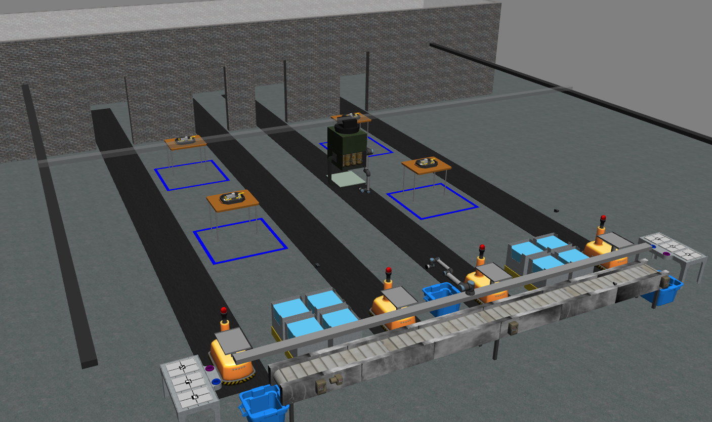

ARIAC Documentation
===================

Welcome to ARIAC 2023!

Github repository: `https://www.github.com/usnistgov/ARIAC/ <https://www.github.com/usnistgov/ARIAC/>`_

.. Hidden TOCs

.. toctree::
   :caption: ⏩ Getting Started
   :maxdepth: 3
   :hidden:

   getting_started/updates.rst
   getting_started/installation.rst
   getting_started/registering
   getting_started/events

.. toctree::
   :caption: ⏩ Competition Specifications
   :maxdepth: 3
   :hidden:

   competition/terminology
   competition/overview
   competition/environment
   competition/orders
   competition/sensors
   competition/trials.rst
   competition/ros_communication
   competition/challenges
   competition/tf_frames
   competition/scoring

.. toctree::
   :caption: ⏩ Tutorials
   :maxdepth: 3
   :hidden:

   tutorials/tutorials.rst
   tutorials/tutorial_1.rst
   tutorials/tutorial_2.rst
   tutorials/tutorial_3.rst
   tutorials/tutorial_4.rst
   tutorials/tutorial_5.rst
   tutorials/tutorial_6.rst
   tutorials/tutorial_7.rst

.. toctree::
   :caption: 🚧 Automated Evaluation
   :maxdepth: 3
   :hidden:

   automated_evaluation/docker_setup.md
 
