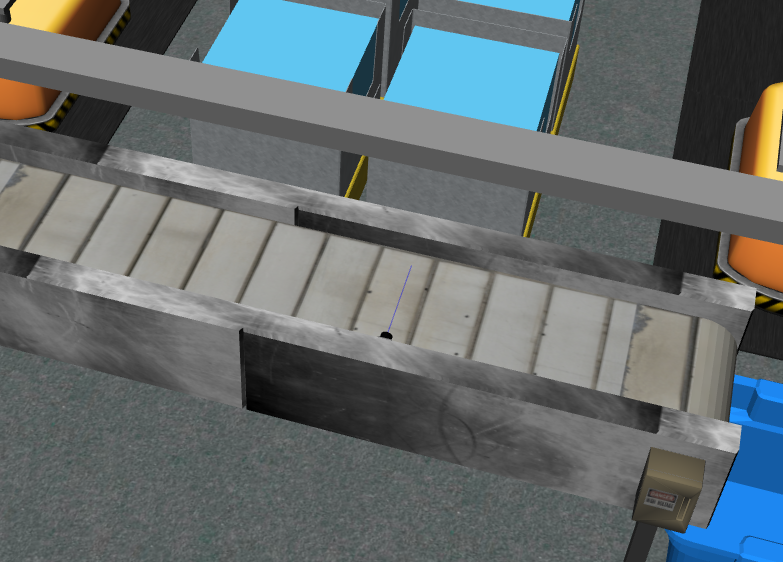

.. _TUTORIAL2:

**********************************************
Tutorial 2: Read Data from a Break Beam Sensor
**********************************************

.. admonition:: Tutorial 2
  :class: attention
  :name: tutorial_2

  - **Prerequisites:** :ref:`Introduction to Tutorials <TUTORIALS>` and :ref:`Tutorial 1 <TUTORIAL1>`
  - **Source Code**: `https://github.com/jaybrecht/ariac_tutorials/tree/tutorial_2 <https://github.com/jaybrecht/ariac_tutorials/tree/tutorial_2>`_ 
  - **Switch Branch**:

    .. code-block:: bash
        
            cd ~/ariac_ws/src/ariac_tutorials
            git switch tutorial_2

This tutorial covers the following:

  - Creating a configuration file for sensors and cameras, 
  - Reading data published by the sensor,
  - Logging the outputs in the terminal.

Package Structure
=================

Updates and additions that are specific to :tuto:`Tutorial 2`  are highlighted in the tree below.

.. code-block:: text
    :emphasize-lines: 4,5,8, 11
    :class: no-copybutton
    
    ariac_tutorials
    ├── CMakeLists.txt
    ├── package.xml
    ├── config
    │   └── sensors.yaml
    ├── ariac_tutorials
    │   ├── __init__.py
    │   └── competition_interface.py
    └── scripts
        ├── tutorial_1.py
        └── tutorial_2.py

Updated/Created Files
=====================

Sensor Configuration File
-------------------------

A sensor configuration file for a given package must be created in the folder :file:`config` in the package. The file must be added to the :file:`CMakeLists.txt` file in the package to allow the competition software to find the file.
To learn more about sensor configuration files, see the Sensor configuration file :ref:`section  <sensor_configuration_file>`.

A break beam sensor was added to :file:`sensors.yaml` as seen in :numref:`sensors-yaml-break-beam`. 

.. code-block:: yaml
    :caption: :file:`sensors.yaml`
    :name: sensors-yaml-break-beam

    sensors:
      breakbeam_0:
        type: break_beam
        visualize_fov: true
        pose:
          xyz: [-0.36, 3.5, 0.88]
          rpy: [0, 0, pi]

Competition Interface
---------------------

The competition interface for :tuto:`Tutorial 2` is shown in :numref:`competitioninterface-tutorial2`.

.. code-block:: python
    :caption: :file:`competition_interface.py`
    :name: competitioninterface-tutorial2
    :emphasize-lines: 3, 8, 57-68, 70-72, 74-83
    :linenos:

    import rclpy
    from rclpy.node import Node
    from rclpy.qos import qos_profile_sensor_data
    from rclpy.parameter import Parameter

    from ariac_msgs.msg import (
        CompetitionState as CompetitionStateMsg,
        BreakBeamStatus as BreakBeamStatusMsg,
    )

    from std_srvs.srv import Trigger

    class CompetitionInterface(Node):
        '''
        Class for a competition interface node.

        Args:
            Node (rclpy.node.Node): Parent class for ROS nodes

        Raises:
            KeyboardInterrupt: Exception raised when the user uses Ctrl+C to kill a process
        '''
        _competition_states = {
            CompetitionStateMsg.IDLE: 'idle',
            CompetitionStateMsg.READY: 'ready',
            CompetitionStateMsg.STARTED: 'started',
            CompetitionStateMsg.ORDER_ANNOUNCEMENTS_DONE: 'order_announcements_done',
            CompetitionStateMsg.ENDED: 'ended',
        }
        '''Dictionary for converting CompetitionState constants to strings'''

        def __init__(self):
            super().__init__('competition_interface')

            sim_time = Parameter(
                "use_sim_time",
                rclpy.Parameter.Type.BOOL,
                True
            )

            self.set_parameters([sim_time])

            # Service client for starting the competition
            self._start_competition_client = self.create_client(Trigger, '/ariac/start_competition')

            # Subscriber to the competition state topic
            self._competition_state_sub = self.create_subscription(
                CompetitionStateMsg,
                '/ariac/competition_state',
                self._competition_state_cb,
                10)
            
            # Store the state of the competition
            self._competition_state: CompetitionStateMsg = None

            # Subscriber to the break beam status topic
            self._break_beam0_sub = self.create_subscription(
                BreakBeamStatusMsg,
                '/ariac/sensors/breakbeam_0/status',
                self._breakbeam0_cb,
                qos_profile_sensor_data)
            
            # Store the number of parts that crossed the beam
            self._conveyor_part_count = 0
            
            # Store whether the beam is broken
            self._object_detected = False

        @property
        def conveyor_part_count(self):
            return self._conveyor_part_count

        def _breakbeam0_cb(self, msg: BreakBeamStatusMsg):
            '''Callback for the topic /ariac/sensors/breakbeam_0/status

            Arguments:
                msg -- BreakBeamStatusMsg message
            '''
            if not self._object_detected and msg.object_detected:
                self._conveyor_part_count += 1

            self._object_detected = msg.object_detected

        def _competition_state_cb(self, msg: CompetitionStateMsg):
            '''Callback for the topic /ariac/competition_state
            Arguments:
                msg -- CompetitionState message
            '''
            # Log if competition state has changed
            if self._competition_state != msg.competition_state:
                state = CompetitionInterface._competition_states[msg.competition_state]
                self.get_logger().info(f'Competition state is: {state}', throttle_duration_sec=1.0)
            
            self._competition_state = msg.competition_state

        def start_competition(self):
            '''Function to start the competition.
            '''
            self.get_logger().info('Waiting for competition to be ready')

            if self._competition_state == CompetitionStateMsg.STARTED:
                return
            # Wait for competition to be ready
            while self._competition_state != CompetitionStateMsg.READY:
                try:
                    rclpy.spin_once(self)
                except KeyboardInterrupt:
                    return

            self.get_logger().info('Competition is ready. Starting...')

            # Check if service is available
            if not self._start_competition_client.wait_for_service(timeout_sec=3.0):
                self.get_logger().error('Service \'/ariac/start_competition\' is not available.')
                return

            # Create trigger request and call starter service
            request = Trigger.Request()
            future = self._start_competition_client.call_async(request)

            # Wait until the service call is completed
            rclpy.spin_until_future_complete(self, future)

            if future.result().success:
                self.get_logger().info('Started competition.')
            else:
                self.get_logger().warn('Unable to start competition')

Code Explanation
^^^^^^^^^^^^^^^^^

- Imports

    - :python:`from rclpy.qos import qos_profile_sensor_data` is the ROS 2 Quality of Service API. This is used to set the QoS profile for the floor robot gripper state subscriber.
    - :python:`BreakBeamStatus`: Message class that stores the status of the break beam (:term:`ariac_msgs/msg/BreakBeamStatus`).

- Instance Variables

    - :python:`_break_beam0_sub`: Subscriber to the break beam status topic.
    - :python:`_conveyor_part_count`: Store the number of parts that crossed the beam.
    - :python:`_object_detected`: Store whether the beam is broken.

- Instance Methods

    - :python:`conveyor_part_count(self)` is  a getter to the :python:`_conveyor_part_count` attribute.

    - :python:`_breakbeam0_cb(self, msg)` is the callback function for the sensor topic. The callback increments the variable :python:`_conveyor_part_count` when the beam is broken and the variable :python:`_object_detected` is false. The variable :python:`_object_detected` is set to true when the beam is broken.

Executable
----------

.. code-block:: python
    :caption: :file:`tutorial_2.py`
    
    #!/usr/bin/env python3
    '''
    To test this script, run the following commands in separate terminals:
    - ros2 launch ariac_gazebo ariac.launch.py trial_name:=tutorial competition_pkg:=ariac_tutorials
    - ros2 run ariac_tutorials tutorial_2.py
    '''

    import rclpy
    from ariac_tutorials.competition_interface import CompetitionInterface

    def main(args=None):
        rclpy.init(args=args)
        interface = CompetitionInterface()
        interface.start_competition()

        while rclpy.ok():
            try:
                rclpy.spin_once(interface)
                interface.get_logger().info(
                    f'Part Count: {interface.conveyor_part_count}', 
                    throttle_duration_sec=2.0)
            except KeyboardInterrupt:
                break

        interface.destroy_node()
        rclpy.shutdown()

    if __name__ == '__main__':
        main()

Code Explanation
^^^^^^^^^^^^^^^^

This executable does the following:

    - Initialize the ROS client library.
    - Create an instance of the class :python:`CompetitionInterface` as a ROS node.
    - Start the competition.
    - Log the number of parts that crossed the beam every 2 seconds.

Build Instructions
------------------

To allow for the competition software to be able to find the sensor configuration, it must be installed to the share directory of the package. The :tuto:`Tutorial 2` executable also needs to be installed.

.. code-block:: cmake
    :emphasize-lines: 15-18, 26

    cmake_minimum_required(VERSION 3.8)
    project(ariac_tutorials)

    if(CMAKE_COMPILER_IS_GNUCXX OR CMAKE_CXX_COMPILER_ID MATCHES "Clang")
    add_compile_options(-Wall -Wextra -Wpedantic)
    endif()

    find_package(ament_cmake REQUIRED)
    find_package(ament_cmake_python REQUIRED)
    find_package(rclcpp REQUIRED)
    find_package(rclpy REQUIRED)
    find_package(ariac_msgs REQUIRED)

    # Install the config directory to the package share directory
    install(DIRECTORY 
    config
    DESTINATION share/${PROJECT_NAME}
    )

    # Install Python modules
    ament_python_install_package(${PROJECT_NAME} SCRIPTS_DESTINATION lib/${PROJECT_NAME})

    # Install Python executables
    install(PROGRAMS
    scripts/tutorial_1.py
    scripts/tutorial_2.py
    DESTINATION lib/${PROJECT_NAME}
    )

    ament_package()

Test the Sensor Configuration
=============================

To test the sensor was correctly added to the environment, run the following commands:

.. code-block:: bash

  cd ~/ariac_ws
  colcon build
  . install/setup.bash
  ros2 launch ariac_gazebo ariac.launch.py trial_name:=tutorial competitor_pkg:=ariac_tutorials

You should see a break beam sensor on the right side of the conveyor belt, as shown in the figure.

Run the Executable
==================

- In *terminal 1*, run the following commands:

    .. code-block:: bash

        cd ~/ariac_ws
        colcon build
        . install/setup.bash
        ros2 run ariac_tutorials tutorial_2.py

    The node will wait until the competition is ready. In a second terminal, run the following:

- In *terminal 2*, run the following commands:

    .. code-block:: bash

        cd ~/ariac_ws
        . install/setup.bash
        ros2 launch ariac_gazebo ariac.launch.py competitor_pkg:=ariac_tutorials trial_name:=tutorial

    Once the environment is loaded and the competition state is ready, the interface node running in *terminal 2* will start the competition and the sensor will start publishing data. In *terminal 1* you should see the the part count output increasing as parts on the conveyor break the sensor beam, as shown in the figure below.

    .. figure:: ../images/tutorial_2_image2.png
        :align: center

Outputs
=======

.. code-block:: console
    :class: no-copybutton
    :caption: terminal 1 output
    
    [INFO] [1679428743.578614247] [competition_interface]: Waiting for competition to be ready
    [INFO] [1679428754.940750669] [competition_interface]: Competition state is: idle
    [INFO] [1679428762.504895731] [competition_interface]: Competition state is: ready
    [INFO] [1679428762.505326133] [competition_interface]: Competition is ready. Starting...
    [INFO] [1679428762.509538747] [competition_interface]: Started competition.
    [INFO] [1679428762.510511399] [competition_interface]: Part Count: 0
    [INFO] [1679428764.511474366] [competition_interface]: Part Count: 0
    [INFO] [1679428766.511995691] [competition_interface]: Part Count: 0
    [INFO] [1679428768.512622679] [competition_interface]: Part Count: 0
    [INFO] [1679428770.514520304] [competition_interface]: Part Count: 0
    [INFO] [1679428772.514817360] [competition_interface]: Part Count: 0
    [INFO] [1679428774.515932382] [competition_interface]: Part Count: 1
    [INFO] [1679428776.515979983] [competition_interface]: Part Count: 1
    [INFO] [1679428778.518514127] [competition_interface]: Part Count: 1
    [INFO] [1679428780.518756275] [competition_interface]: Part Count: 2
    [INFO] [1679428782.520491157] [competition_interface]: Part Count: 2
    [INFO] [1679428783.500808671] [competition_interface]: Competition state is: order_announcements_done
    [INFO] [1679428784.520939857] [competition_interface]: Part Count: 2
    [INFO] [1679428786.523672799] [competition_interface]: Part Count: 3
    [INFO] [1679428788.525155723] [competition_interface]: Part Count: 3
    [INFO] [1679428790.525464506] [competition_interface]: Part Count: 3
    [INFO] [1679428792.526773421] [competition_interface]: Part Count: 4
    [INFO] [1679428794.527383003] [competition_interface]: Part Count: 4
    [INFO] [1679428796.528573468] [competition_interface]: Part Count: 4

