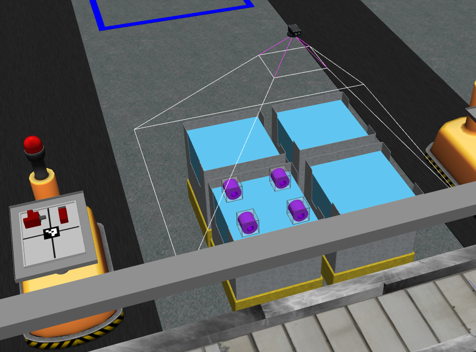

.. _TUTORIAL3:

*****************************************************
Tutorial 3: Read Data from an Advanced Logical Camera
*****************************************************

.. admonition:: Tutorial 3
  :class: attention
  :name: tutorial_3

  - **Prerequisites:** :ref:`Introduction to Tutorials <TUTORIALS>` and :ref:`Tutorial 2 <TUTORIAL2>`
  - **Source Code**: `https://github.com/jaybrecht/ariac_tutorials/tree/tutorial_3 <https://github.com/jaybrecht/ariac_tutorials/tree/tutorial_3>`_ 
  - **Switch Branch**:

    .. code-block:: bash
        
            cd ~/ariac_ws/src/ariac_tutorials
            git switch tutorial_3

This tutorial covers the following topics:

  - Add a camera to the environment,
  - Receive messages from the camera, 
  - Store camera data internally as an instance of a class,
  - Display the stored data on the standard output.

Package Structure
=================

Updates and additions that are specific to :tuto:`Tutorial 3`  are highlighted in the tree below.

.. code-block:: text
    :emphasize-lines: 2, 5, 8, 9, 13
    :class: no-copybutton
    
    ariac_tutorials
    ├── CMakeLists.txt
    ├── package.xml
    ├── config
    │   └── sensors.yaml
    ├── ariac_tutorials
    │   ├── __init__.py
    │   ├── utils.py
    │   └── competition_interface.py
    └── nodes
        ├── tutorial_1.py
        ├── tutorial_2.py
        └── tutorial_3.py

Updated/Created Files
=====================

Sensor Configuration File
-------------------------

An advanced logical camera is added to :file:`sensors.yaml` above the right bins (see lines 8-13 in :numref:`sensors-camera-yaml`). 

.. code-block:: yaml
    :caption: :file:`sensors.yaml`
    :name: sensors-camera-yaml
    :emphasize-lines: 8-13
    :linenos:
    
    sensors:
      breakbeam_0:
        type: break_beam
        visualize_fov: true
        pose:
          xyz: [-0.36, 3.5, 0.88]
          rpy: [0, 0, pi]
      advanced_camera_0:
        type: advanced_logical_camera
        visualize_fov: true
        pose:
          xyz: [-2.286, 2.96, 1.8]
          rpy: [pi, pi/2, 0]

Competition Interface
--------------------------------

The competition interface for :tuto:`Tutorial 3` is shown in :numref:`competitioninterface-tutorial3`.

.. code-block:: python
    :caption: :file:`competition_interface.py`
    :name: competitioninterface-tutorial3
    :emphasize-lines: 9-11, 16-21, 43-67, 106-114, 116-118, 124-132, 190-239
    :linenos:

    import rclpy
    from rclpy.node import Node
    from rclpy.qos import qos_profile_sensor_data
    from rclpy.parameter import Parameter

    from ariac_msgs.msg import (
        CompetitionState as CompetitionStateMsg,
        BreakBeamStatus as BreakBeamStatusMsg,
        AdvancedLogicalCameraImage as AdvancedLogicalCameraImageMsg,
        Part as PartMsg,
        PartPose as PartPoseMsg,
    )

    from std_srvs.srv import Trigger

    from ariac_tutorials.utils import (
        multiply_pose,
        rpy_from_quaternion,
        rad_to_deg_str,
        AdvancedLogicalCameraImage
    )

    class CompetitionInterface(Node):
        '''
        Class for a competition interface node.

        Args:
            Node (rclpy.node.Node): Parent class for ROS nodes

        Raises:
            KeyboardInterrupt: Exception raised when the user uses Ctrl+C to kill a process
        '''
        _competition_states = {
            CompetitionStateMsg.IDLE: 'idle',
            CompetitionStateMsg.READY: 'ready',
            CompetitionStateMsg.STARTED: 'started',
            CompetitionStateMsg.ORDER_ANNOUNCEMENTS_DONE: 'order_announcements_done',
            CompetitionStateMsg.ENDED: 'ended',
        }
        '''Dictionary for converting CompetitionState constants to strings'''
        
        _part_colors = {
            PartMsg.RED: 'red',
            PartMsg.BLUE: 'blue',
            PartMsg.GREEN: 'green',
            PartMsg.ORANGE: 'orange',
            PartMsg.PURPLE: 'purple',
        }
        '''Dictionary for converting Part color constants to strings'''

        _part_colors_emoji = {
            PartMsg.RED: '🟥',
            PartMsg.BLUE: '🟦',
            PartMsg.GREEN: '🟩',
            PartMsg.ORANGE: '🟧',
            PartMsg.PURPLE: '🟪',
        }
        '''Dictionary for converting Part color constants to emojis'''

        _part_types = {
            PartMsg.BATTERY: 'battery',
            PartMsg.PUMP: 'pump',
            PartMsg.REGULATOR: 'regulator',
            PartMsg.SENSOR: 'sensor',
        }
        '''Dictionary for converting Part type constants to strings'''
        
        def __init__(self):
            super().__init__('competition_interface')

            sim_time = Parameter(
                "use_sim_time",
                rclpy.Parameter.Type.BOOL,
                True
            )

            self.set_parameters([sim_time])

            # Service client for starting the competition
            self._start_competition_client = self.create_client(Trigger, '/ariac/start_competition')

            # Subscriber to the competition state topic
            self._competition_state_sub = self.create_subscription(
                CompetitionStateMsg,
                '/ariac/competition_state',
                self._competition_state_cb,
                10)
            
            # Store the state of the competition
            self._competition_state: CompetitionStateMsg = None

            # Subscriber to the break beam status topic
            self._break_beam0_sub = self.create_subscription(
                BreakBeamStatusMsg,
                '/ariac/sensors/breakbeam_0/status',
                self._breakbeam0_cb,
                qos_profile_sensor_data)
            
            # Store the number of parts that crossed the beam
            self._conveyor_part_count = 0

            # Store whether the beam is broken
            self._object_detected = False
            
            # Subscriber to the logical camera topic
            self._advanced_camera0_sub = self.create_subscription(
                AdvancedLogicalCameraImageMsg,
                '/ariac/sensors/advanced_camera_0/image',
                self._advanced_camera0_cb,
                qos_profile_sensor_data)
            
            # Store each camera image as an AdvancedLogicalCameraImage object
            self._camera_image: AdvancedLogicalCameraImage = None
            
        @property
        def camera_image(self):
            return self._camera_image

        @property
        def conveyor_part_count(self):
            return self._conveyor_part_count
    
        def _advanced_camera0_cb(self, msg: AdvancedLogicalCameraImageMsg):
            '''Callback for the topic /ariac/sensors/advanced_camera_0/image

            Arguments:
                msg -- AdvancedLogicalCameraImage message
            '''
            self._camera_image = AdvancedLogicalCameraImage(msg.part_poses,
                                                            msg.tray_poses,
                                                            msg.sensor_pose)

        def _breakbeam0_cb(self, msg: BreakBeamStatusMsg):
            '''Callback for the topic /ariac/sensors/breakbeam_0/status

            Arguments:
                msg -- BreakBeamStatusMsg message
            '''
            if not self._object_detected and msg.object_detected:
                self._conveyor_part_count += 1

            self._object_detected = msg.object_detected

        def _competition_state_cb(self, msg: CompetitionStateMsg):
            '''Callback for the topic /ariac/competition_state
            Arguments:
                msg -- CompetitionState message
            '''
            # Log if competition state has changed
            if self._competition_state != msg.competition_state:
                state = CompetitionInterface._competition_states[msg.competition_state]
                self.get_logger().info(f'Competition state is: {state}', throttle_duration_sec=1.0)
            
            self._competition_state = msg.competition_state

        def start_competition(self):
            '''Function to start the competition.
            '''
            self.get_logger().info('Waiting for competition to be ready')

            if self._competition_state == CompetitionStateMsg.STARTED:
                return
            # Wait for competition to be ready
            while self._competition_state != CompetitionStateMsg.READY:
                try:
                    rclpy.spin_once(self)
                except KeyboardInterrupt:
                    return

            self.get_logger().info('Competition is ready. Starting...')

            # Check if service is available
            if not self._start_competition_client.wait_for_service(timeout_sec=3.0):
                self.get_logger().error('Service \'/ariac/start_competition\' is not available.')
                return

            # Create trigger request and call starter service
            request = Trigger.Request()
            future = self._start_competition_client.call_async(request)

            # Wait until the service call is completed
            rclpy.spin_until_future_complete(self, future)

            if future.result().success:
                self.get_logger().info('Started competition.')
            else:
                self.get_logger().warn('Unable to start competition')
                
        def parse_advanced_camera_image(self, image: AdvancedLogicalCameraImage) -> str:
            '''
            Parse an AdvancedLogicalCameraImage message and return a string representation.
            '''
            
            if len(image._part_poses) == 0:
                return 'No parts detected'

            output = '\n\n'
            for i, part_pose in enumerate(image._part_poses):
                part_pose: PartPoseMsg
                output += '==========================\n'
                part_color = CompetitionInterface._part_colors[part_pose.part.color].capitalize()
                part_color_emoji = CompetitionInterface._part_colors_emoji[part_pose.part.color]
                part_type = CompetitionInterface._part_types[part_pose.part.type].capitalize()
                output += f'Part {i+1}: {part_color_emoji} {part_color} {part_type}\n'
                output += '--------------------------\n'
                output += 'Camera Frame\n'
                output += '--------------------------\n'
                
                output += '  Position:\n'
                output += f'    x: {part_pose.pose.position.x:.3f} (m)\n'
                output += f'    y: {part_pose.pose.position.y:.3f} (m)\n'
                output += f'    z: {part_pose.pose.position.z:.3f} (m)\n'

                roll, pitch, yaw = rpy_from_quaternion(part_pose.pose.orientation)
                output += '  Orientation:\n'
                output += f'    roll: {rad_to_deg_str(roll)}\n'
                output += f'    pitch: {rad_to_deg_str(pitch)}\n'
                output += f'    yaw: {rad_to_deg_str(yaw)}\n'
                
                part_world_pose = multiply_pose(image._sensor_pose, part_pose.pose)
                output += '--------------------------\n'
                output += 'World Frame\n'
                output += '--------------------------\n'

                output += '  Position:\n'
                output += f'    x: {part_world_pose.position.x:.3f} (m)\n'
                output += f'    y: {part_world_pose.position.y:.3f} (m)\n'
                output += f'    z: {part_world_pose.position.z:.3f} (m)\n'

                roll, pitch, yaw = rpy_from_quaternion(part_world_pose.orientation)
                output += '  Orientation:\n'
                output += f'    roll: {rad_to_deg_str(roll)}\n'
                output += f'    pitch: {rad_to_deg_str(pitch)}\n'
                output += f'    yaw: {rad_to_deg_str(yaw)}\n'

                output += '==========================\n\n'

            return output
    

Code Explanation
^^^^^^^^^^^^^^^^^

The competition interface from :ref:`Tutorial 2 <TUTORIAL2>` was augmented with the components described below.

- Imports

    - :python:`AdvancedLogicalCameraImage`: Message class that stores the part poses and sensor pose of the advanced logical camera (:term:`ariac_msgs/msg/AdvancedLogicalCameraImage`).
    - :python:`Part`: Message class that stores the part type and color (:term:`ariac_msgs/msg/Part`).
    - :python:`PartPose`: Message class that stores a :python:`Part` and its :python:`Pose`  (:term:`ariac_msgs/msg/PartPose`).
        
        - **Note**: These message classes are imported as aliases since the package consists of Python classes with the same name.

    - The module :python:`utils` contains reusable functions and classes.
    - The function :python:`multiply_pose()` is used to compute the pose of the parts detected by the camera in the world frame.
    - The function :python:`rpy_from_quaternion()` is used to convert a quaternion to euler angles roll, pitch, yaw.
    - The function :python:`rad_to_deg_str()` is used to convert a value in radians to a string in degrees.
    - The class :python:`AdvancedLogicalCameraImage` is a Python class which is used to store the message published on the camera topic. Although a class is not strictly necessary, it makes the code more readable and easier to maintain.

- Class Variables

    - :python:`_part_colors` is a dictionary that maps the integer values of the part color to their string representations. 
    - :python:`_part_types` is a dictionary that maps the integer values of the part type to their string representations. 
    - :python:`_part_colors_emoji` is a dictionary that maps the integer values of the part color to their emoji representations. 
        
        - **Note**: These dictionaries are mainly used to display the part color and type in a human-readable format.

- Instance Variables

    - :python:`_advanced_camera0_sub` is a subscriber to the camera topic. The callback function :python:`advanced_camera0_cb()` is called when a message is published on the camera topic. 
    - :python:`_camera_image` is an object of the class :python:`AdvancedLogicalCameraImage` that stores the latest message published on the camera topic.

- Instance Methods

    - :python:`camera_image(self)` is a getter to the :python:`_camera_image` attribute and is provided to access the latest message published on the camera topic.

    - :python:`_advanced_camera0_cb(self, msg)` is the callback function for the camera topic. It stores the message in the :python:`_camera_image` attribute.

    - :python:`parse_advanced_camera_image(self)` parses the message stored in :python:`_camera_image` and returns a string representation of the message. This method is used to display the part color, type, and pose in a human-readable format. The output is printed in the following format:
        
        - Emoji for the part color using the class attribute :python:`part_colors_emoji_`.
        - Part color using the class attribute :python:`part_colors_`.
        - Part type using the class attribute :python:`part_types_`.
        - Part pose in the camera frame: This is the pose returned by the camera.
        - Part pose in the world frame: This is calculated by multiplying the camera pose with the part pose in the camera frame. This multiplication is done using the method :python:`multiply_pose()`.

Create the Executable
--------------------------------

.. code-block:: python
    :caption: :file:`tutorial_3.py`
    
    #!/usr/bin/env python3
    '''
    To test this script, run the following commands in separate terminals:
    - ros2 launch ariac_gazebo ariac.launch.py trial_name:=tutorial competitor_pkg:=ariac_tutorials
    - ros2 run ariac_tutorials tutorial_3.py
    '''

    import rclpy
    from ariac_tutorials.competition_interface import CompetitionInterface

    def main(args=None):
        rclpy.init(args=args)
        interface = CompetitionInterface()
        interface.start_competition()

        while rclpy.ok():
            try:
                rclpy.spin_once(interface)
                image = interface.camera_image
                if image is not None:
                    interface.get_logger().info(interface.parse_advanced_camera_image(image), throttle_duration_sec=5.0)
            except KeyboardInterrupt:
                break

        interface.destroy_node()
        rclpy.shutdown()

    if __name__ == '__main__':
        main()

Code Explanation
^^^^^^^^^^^^^^^^^^^^^^^

This executable does the following:

    - Initialize the ROS client library.
    - Create an instance of the class :python:`CompetitionInterface` as a ROS node.
    - Start the competition.
    - Log the content of :python:`interface.camera_image` every 5 seconds.

Build Instructions
------------------

.. code-block:: cmake
    :emphasize-lines: 13, 28
    :caption: :file:`CMakeLists.txt`

    cmake_minimum_required(VERSION 3.8)
    project(ariac_tutorials)

    if(CMAKE_COMPILER_IS_GNUCXX OR CMAKE_CXX_COMPILER_ID MATCHES "Clang")
    add_compile_options(-Wall -Wextra -Wpedantic)
    endif()

    find_package(ament_cmake REQUIRED)
    find_package(ament_cmake_python REQUIRED)
    find_package(rclcpp REQUIRED)
    find_package(rclpy REQUIRED)
    find_package(ariac_msgs REQUIRED)
    find_package(orocos_kdl REQUIRED)

    # Install the config directory to the package share directory
    install(DIRECTORY 
    config
    DESTINATION share/${PROJECT_NAME}
    )

    # Install Python modules
    ament_python_install_package(${PROJECT_NAME} SCRIPTS_DESTINATION lib/${PROJECT_NAME})

    # Install Python executables
    install(PROGRAMS
    scripts/tutorial_1.py
    scripts/tutorial_2.py
    scripts/tutorial_3.py
    DESTINATION lib/${PROJECT_NAME}
    )

    ament_package()

Package Manifest
----------------

This tutorial adds a dependency to the PyKDL module. This is added to the package manifest.

.. code-block:: xml
    :emphasize-lines: 16-17
    :caption: :file:`package.xml`

    <?xml version="1.0"?>
    <?xml-model href="http://download.ros.org/schema/package_format3.xsd" schematypens="http://www.w3.org/2001/XMLSchema"?>
    <package format="3">
        <name>ariac_tutorials</name>
        <version>0.0.0</version>
        <description>Tutorial 3</description>
        <maintainer email="justin.albrecht@nist.gov">Justin Albrecht</maintainer>
        <license>Apache License 2.0</license>

        <buildtool_depend>ament_cmake</buildtool_depend>

        <depend>rclcpp</depend>
        <depend>rclpy</depend>
        <depend>ariac_msgs</depend>
        <depend>geometry_msgs</depend>
        <depend>orocos_kdl</depend>
        <depend>python3-pykdl</depend>

        <export>
            <build_type>ament_cmake</build_type>
        </export>
    </package>

Test the Sensor Configuration
=============================

To test  the camera was correctly added to the environment, run the following commands:

.. code-block:: bash

  cd ~/ariac_ws
  colcon build
  . install/setup.bash
  ros2 launch ariac_gazebo ariac.launch.py trial_name:=tutorial competitor_pkg:=ariac_tutorials

You should see the camera above bins 1-4 as shown in the figure below.

Run the Executable
==================
- In *terminal 1*, run the following commands:

    .. code-block:: bash

        cd ~/ariac_ws
        rosdep install --from-paths src -y --ignore-src
        colcon build
        . install/setup.bash
        ros2 run ariac_tutorials tutorial_3.py

    *The rosdep command needs to be run again because the package.xml was updated with a new dependency.*

- In *terminal 2*, run the following commands:

    .. code-block:: bash

        cd ~/ariac_ws
        . install/setup.bash
        ros2 launch ariac_gazebo ariac.launch.py trial_name:=tutorial competitor_pkg:=ariac_tutorials

    Once the environment is loaded and the competition state is ready, the interface node running in *terminal 1* will start the competition and the sensor will start publishing data.
    Each part detected by the camera will be logged to the terminal.

Outputs
=======

.. code-block:: console
    :caption: terminal 1 output
    :class: no-copybutton

    [INFO] [1679430757.556470727] [competition_interface]: Waiting for competition to be ready
    [INFO] [1679430770.831452522] [competition_interface]: Competition state is: idle
    [INFO] [1679430778.086868765] [competition_interface]: Competition state is: ready
    [INFO] [1679430778.087507486] [competition_interface]: Competition is ready. Starting...
    [INFO] [1679430778.090600012] [competition_interface]: Started competition.
    [INFO] [1679430778.252110253] [competition_interface]: 

    ==========================
    Part 1: 🟪 Purple Pump
    --------------------------
    Camera Frame
    --------------------------
    Position:
        x: 1.077 (m)
        y: 0.515 (m)
        z: -0.206 (m)
    Orientation:
        roll: 0°
        pitch: -90°
        yaw: 0°
    --------------------------
    World Frame
    --------------------------
    Position:
        x: -2.080 (m)
        y: 2.445 (m)
        z: 0.723 (m)
    Orientation:
        roll: 0°
        pitch: 0°
        yaw: 180°
    ==========================

    ==========================
    Part 2: 🟪 Purple Pump
    --------------------------
    Camera Frame
    --------------------------
    Position:
        x: 1.077 (m)
        y: 0.155 (m)
        z: -0.206 (m)
    Orientation:
        roll: 179°
        pitch: -90°
        yaw: -178°
    --------------------------
    World Frame
    --------------------------
    Position:
        x: -2.080 (m)
        y: 2.805 (m)
        z: 0.723 (m)
    Orientation:
        roll: 0°
        pitch: 0°
        yaw: 180°
    ==========================

    ==========================
    Part 3: 🟪 Purple Pump
    --------------------------
    Camera Frame
    --------------------------
    Position:
        x: 1.077 (m)
        y: 0.515 (m)
        z: -0.566 (m)
    Orientation:
        roll: 177°
        pitch: -90°
        yaw: -177°
    --------------------------
    World Frame
    --------------------------
    Position:
        x: -1.720 (m)
        y: 2.445 (m)
        z: 0.723 (m)
    Orientation:
        roll: 0°
        pitch: 0°
        yaw: 180°
    ==========================

    ==========================
    Part 4: 🟪 Purple Pump
    --------------------------
    Camera Frame
    --------------------------
    Position:
        x: 1.077 (m)
        y: 0.155 (m)
        z: -0.566 (m)
    Orientation:
        roll: 0°
        pitch: -90°
        yaw: 0°
    --------------------------
    World Frame
    --------------------------
    Position:
        x: -1.720 (m)
        y: 2.805 (m)
        z: 0.723 (m)
    Orientation:
        roll: 0°
        pitch: 0°
        yaw: 180°
    ==========================
