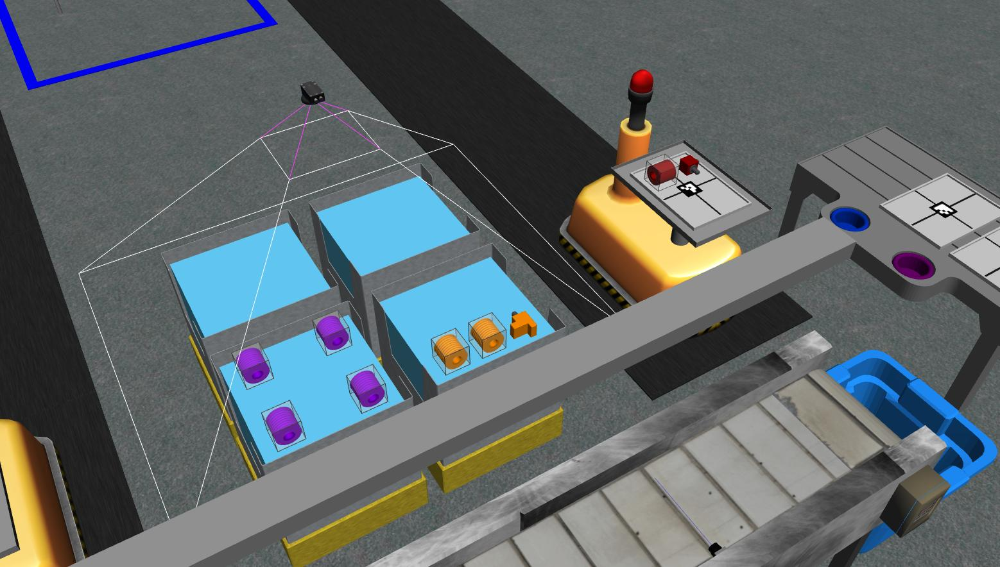

.. _TUTORIAL_3:

=========================================================
Tutorial 3: Reading Data from an Advanced Logical Camera
=========================================================

.. note::
  **Prerequisites**: Tutorial 1 should be completed before starting this tutorial.

This tutorial covers the following steps:

  - Receive messages from a camera, 
  - Store the data internally as an instance of a class,
  - Display the stored data on the standard output.

The package ``competition_tutorials`` is expected to have the following structure for tutorial 3:

.. code-block:: bash
    
    competition_tutorials
    ├── CMakeLists.txt                  (updated)
    ├── package.xml
    ├── competition_tutorials
    │   ├── __init__.py
    │   └── competition_interface.py
    └── src
        ├── start_competition.py        (from tutorial 1)
        ├── read_break_beam_sensor.py   (from tutorial 2)
        └── read_advanced_camera.py     (new)

Add a Camera to the Environment
--------------------------------

Add an advanced logical camera to  ``sensors.yaml`` (lines 8-13 in :numref:`sensors-yaml`). 

.. code-block:: yaml
    :caption: sensors.yaml
    :name: sensors-yaml
    :emphasize-lines: 8, 9, 10, 11, 12, 13
    :linenos:
    
    sensors:
      breakbeam_0:
        type: break_beam
        visualize_fov: true
        pose:
          xyz: [-0.36, 3.5, 0.88]
          rpy: [0, 0, pi]
      advanced_camera_0:
        type: advanced_logical_camera
        visualize_fov: true
        pose:
          xyz: [-2.286, 2.96, 1.8]
          rpy: [pi, pi/2, 0]

Verify the Camera is Added to the Environment
^^^^^^^^^^^^^^^^^^^^^^^^^^^^^^^^^^^^^^^^^^^^^^

To test  the camera was correctly added to the environment:

.. code-block:: bash

  cd ~/ariac_ws
  colcon build
  . install/setup.bash
  ros2 launch ariac_gazebo ariac.launch.py trial_name:=tutorial competitor_pkg:=competition_tutorials

You should see the camera above bins 1-4 as shown in the figure below.

.. _fig-advanced-camera-0:

    

Competition Interface
--------------------------------

The competition interface used in this tutorial is shown in :numref:`competitioninterface-tutorial3`.

.. code-block:: python
    :caption: Competition interface for tutorial 3
    :name: competitioninterface-tutorial3
    :emphasize-lines: 2, 3, 5, 7, 11-14, 19-26, 39-45, 47-53
    :linenos:

    import rclpy
    import PyKDL
    from dataclasses import dataclass
    from rclpy.node import Node
    from rclpy.qos import qos_profile_sensor_data
    from rclpy.parameter import Parameter
    from geometry_msgs.msg import Pose

    from ariac_msgs.msg import (
        CompetitionState,
        Part,
        AdvancedLogicalCameraImage as AdvancedLogicalCameraImageMsg,
        PartPose as PartPoseMsg,
        KitTrayPose as KitTrayPoseMsg,
    )

    from std_srvs.srv import Trigger

    @dataclass
    class AdvancedLogicalCameraImage:
    '''
    Class to store information about a AdvancedLogicalCameraImageMsg.
    '''
        _part_poses: PartPoseMsg
        _tray_poses: KitTrayPoseMsg
        _sensor_pose: Pose

    class CompetitionInterface(Node):
        '''
        Class for a competition interface node.

        Args:
            Node (rclpy.node.Node): Parent class for ROS nodes

        Raises:
            KeyboardInterrupt: Exception raised when the user uses Ctrl+C to kill a process
        '''

        _part_colors = {
            PartMsg.RED: 'red',
            PartMsg.BLUE: 'blue',
            PartMsg.GREEN: 'green',
            PartMsg.ORANGE: 'orange',
            PartMsg.PURPLE: 'purple',
        }
        '''Dictionary for converting PartColor constants to strings'''

        _part_colors_emoji = {
            PartMsg.RED: '🟥',
            PartMsg.BLUE: '🟦',
            PartMsg.GREEN: '🟩',
            PartMsg.ORANGE: '🟧',
            PartMsg.PURPLE: '🟪',
        }
        '''Dictionary for converting PartColor constants to strings'''

        _part_types = {
            PartMsg.BATTERY: 'battery',
            PartMsg.PUMP: 'pump',
            PartMsg.REGULATOR: 'regulator',
            PartMsg.SENSOR: 'sensor',
        }
        '''Dictionary for converting PartType constants to strings'''

        _competition_states = {
            CompetitionStateMsg.IDLE: 'idle',
            CompetitionStateMsg.READY: 'ready',
            CompetitionStateMsg.STARTED: 'started',
            CompetitionStateMsg.ORDER_ANNOUNCEMENTS_DONE: 'order_announcements_done',
            CompetitionStateMsg.ENDED: 'ended',
        }
        '''Dictionary for converting CompetitionState constants to strings'''

        def __init__(self):
            super().__init__('competition_interface')

            sim_time = Parameter(
                "use_sim_time",
                rclpy.Parameter.Type.BOOL,
                True
            )

            self.set_parameters([sim_time])

            # Service client for starting the competition
            self._start_competition_client = self.create_client(Trigger, '/ariac/start_competition')

            # Subscriber to the competition state topic
            self._competition_state_sub = self.create_subscription(
                CompetitionStateMsg,
                '/ariac/competition_state',
                self.competition_state_cb,
                10)

            # Store the state of the competition
            self._competition_state: CompetitionStateMsg = None

            # Subscriber to the logical camera topic
            self._advanced_camera0_sub = self.create_subscription(
                AdvancedLogicalCameraImageMsg,
                '/ariac/sensors/advanced_camera_0/image',
                self.advanced_camera0_cb,
                qos_profile_sensor_data)

            # Store each camera image as an AdvancedLogicalCameraImage object
            self._camera_image: AdvancedLogicalCameraImage = None

        @property
        def camera_image(self):
            '''Store one camera message as an object of AdvancedLogicalCameraImage.'''
            return self._camera_image

        def competition_state_cb(self, msg: CompetitionStateMsg):
            '''Callback for the topic /ariac/competition_state

            Arguments:
                msg -- CompetitionStateMsg message
            '''
            # Log if competition state has changed
            if self._competition_state != msg.competition_state:
                self.get_logger().info(
                    f'Competition state is: \
                    {CompetitionInterface._competition_states[msg.competition_state]}',
                    throttle_duration_sec=1.0)
            self._competition_state = msg.competition_state

        def start_competition(self):
            '''Function to start the competition.
            '''
            self.get_logger().info('Waiting for competition to be ready')

            if self._competition_state == CompetitionStateMsg.STARTED:
                return
            # Wait for competition to be ready
            while self._competition_state != CompetitionStateMsg.READY:
                try:
                    rclpy.spin_once(self)
                except KeyboardInterrupt:
                    return

            self.get_logger().info('Competition is ready. Starting...')

            # Call ROS service to start competition
            while not self._start_competition_client.wait_for_service(timeout_sec=1.0):
                self.get_logger().info('Waiting for /ariac/start_competition to be available...')

            # Create trigger request and call starter service
            request = Trigger.Request()
            future = self._start_competition_client.call_async(request)

            # Wait until the service call is completed
            rclpy.spin_until_future_complete(self, future)

            if future.result().success:
                self.get_logger().info('Started competition.')
            else:
                self.get_logger().info('Unable to start competition')

        def advanced_camera0_cb(self, msg: AdvancedLogicalCameraImageMsg):
            '''Callback for the topic /ariac/sensors/advanced_camera_0/image

            Arguments:
                msg -- AdvancedLogicalCameraImageMsg message
            '''
            self._camera_image = AdvancedLogicalCameraImage(msg.part_poses,
                                                            msg.tray_poses,
                                                            msg.sensor_pose)

        def multiply_pose(self, pose1: Pose, pose2: Pose):
            '''
            Use KDL to multiply two poses together.

            Args:
                pose1 (Pose): Pose of the first frame
                pose2 (Pose): Pose of the second frame

            Returns:
                Pose: Pose of the resulting frame
            '''

            frame1 = PyKDL.Frame(PyKDL.Rotation.Quaternion(pose1.orientation.x,
                                                        pose1.orientation.y,
                                                        pose1.orientation.z,
                                                        pose1.orientation.w),
                                PyKDL.Vector(pose1.position.x, pose1.position.y, pose1.position.z))

            frame2 = PyKDL.Frame(PyKDL.Rotation.Quaternion(pose2.orientation.x,
                                                        pose2.orientation.y,
                                                        pose2.orientation.z,
                                                        pose2.orientation.w),
                                PyKDL.Vector(pose2.position.x, pose2.position.y, pose2.position.z))

            frame3: PyKDL.Frame = frame1 * frame2

            tf2 = Pose()
            tf2.position.x = frame3.p.x()
            tf2.position.y = frame3.p.y()
            tf2.position.z = frame3.p.z()
            tf2.orientation.x = frame3.M.GetQuaternion()[0]
            tf2.orientation.y = frame3.M.GetQuaternion()[1]
            tf2.orientation.z = frame3.M.GetQuaternion()[2]
            tf2.orientation.w = frame3.M.GetQuaternion()[3]

            # return the resulting pose from frame3
            return tf2

        def parse_advanced_camera_image(self):
            '''
            Parse an AdvancedLogicalCameraImage message and return a string representation.

            Args:
                image (AdvancedLogicalCameraImage): Object of type AdvancedLogicalCameraImage
            '''
            output = '\n\n==========================\n'

            sensor_pose: Pose = self._camera_image._sensor_pose

            part_pose: PartPoseMsg
            
            counter = 1
            for part_pose in self._camera_image._part_poses:
                part_color = CompetitionInterface._part_colors[part_pose.part.color].capitalize()
                part_color_emoji = CompetitionInterface._part_colors_emoji[part_pose.part.color]
                part_type = CompetitionInterface._part_types[part_pose.part.type].capitalize()
                output += f'Part {counter}: {part_color_emoji} {part_color} {part_type}\n'
                output += '==========================\n'
                output += 'Camera Frame\n'
                output += '==========================\n'
                position = f'x: {part_pose.pose.position.x}\n\t\ty: {part_pose.pose.position.y}\n\t\tz: {part_pose.pose.position.z}'
                orientation = f'x: {part_pose.pose.orientation.x}\n\t\ty: {part_pose.pose.orientation.y}\n\t\tz: {part_pose.pose.orientation.z}\n\t\tw: {part_pose.pose.orientation.w}'

                output += '\tPosition:\n'
                output += f'\t\t{position}\n'
                output += '\tOrientation:\n'
                output += f'\t\t{orientation}\n'
                output += '==========================\n'
                output += 'World Frame\n'
                output += '==========================\n'
                part_world_pose = self.multiply_pose(sensor_pose, part_pose.pose)
                position = f'x: {part_world_pose.position.x}\n\t\ty: {part_world_pose.position.y}\n\t\tz: {part_world_pose.position.z}'
                orientation = f'x: {part_world_pose.orientation.x}\n\t\ty: {part_world_pose.orientation.y}\n\t\tz: {part_world_pose.orientation.z}\n\t\tw: {part_world_pose.orientation.w}'

                output += '\tPosition:\n'
                output += f'\t\t{position}\n'
                output += '\tOrientation:\n'
                output += f'\t\t{orientation}\n'
                output += '==========================\n'
                
                counter += 1

            return output

The content of the interface is described as follows:

    - ``AdvancedLogicalCameraImage`` class: This class stores a message from  ``/ariac/sensors/advanced_camera_0/image``. 

        - The class attribute ``_part_poses`` is a list of ``PartPose`` objects that contain the part type, color, and pose. 
        - The class attribute ``_tray_poses`` is a list of ``TrayPose`` objects that contain the tray type and pose. 
        - The class attribute ``_sensor_pose`` is a ``Pose`` object that contains the pose of the camera sensor.
    - ``_part_colors`` and ``_part_types`` are dictionaries that map the integer values of the part color and type to their string representations. ``_part_colors_emoji`` is a dictionary that maps the integer values of the part color to their emoji representations. These dictionaries are mainly used to display the part color and type in a human-readable format.
    - ``__init__()``: This method initializes the node and the subscriber to the camera topic. It also initializes the class attribute ``_camera_image`` to an instance of ``AdvancedLogicalCameraImage``.
    - ``advanced_camera0_cb()``: This method is the callback function for the subscriber to the camera topic. It stores the message received on the topic in the class attribute ``_camera_image``.
    - ``multiply_pose()``: This method multiplies two poses and returns the resulting pose. This method is used to convert the pose of the part in the camera frame to the world frame.
    - ``parse_advanced_camera_image()``: This method parses the message stored in the class attribute ``_camera_image`` and returns a string representation of the message. This method is used to display the part color, type, and pose in a human-readable format. The output is printed in the following format:

        - Emoji for the part color using the class attribute ``part_colors_emoji_``.
        - Part color using the class attribute ``part_colors_``.
        - Part type using the class attribute ``part_types_``.
        - Part pose in the camera frame: This is the pose returned by the camera.
        - Part pose in the world frame: This is calculated by multiplying the camera pose with the part pose in the camera frame. This multiplication is done using the method ``multiply_pose`` (see  :numref:`multiply-pose`).

Create the Executable
--------------------------------

To test this tutorial, create a new file ``read_advanced_camera.py`` in ``competition_tutorials/src``:

.. code-block:: bash

    cd ~/ariac_ws/src/competition_tutorials/src
    touch read_advanced_camera.py
    chmod +x read_advanced_camera.py

Copy the following code in the file ``read_advanced_camera.py``:

.. code-block:: python
    :caption: read_advanced_camera.py
    
    #!/usr/bin/env python3

    import rclpy
    from competition_tutorials.competition_interface import CompetitionInterface

    def main(args=None):
        rclpy.init(args=args)
        interface = CompetitionInterface()
        interface.start_competition()

        while rclpy.ok():
        try:
        rclpy.spin_once(interface)

        if interface.camera_image is not None:
            interface.get_logger().info(interface.parse_advanced_camera_image(), throttle_duration_sec=2.0)
        except KeyboardInterrupt:
        break

        interface.destroy_node()
        rclpy.shutdown()

    if __name__ == '__main__':
    main()

This executable creates an instance of the interface, starts the competition and logs the content of ``_camera_image`` every 2 seconds.

Update CMakelists.txt
^^^^^^^^^^^^^^^^^^^^^^

Update ``CMakeLists.txt`` to add ``read_advanced_camera.py`` as an executable.

.. code-block:: cmake

  # Install Python executables
  install(PROGRAMS
    src/start_competition.py
    src/read_break_beam_sensor.py
    src/read_advanced_camera.py
    DESTINATION lib/${PROJECT_NAME}
  )

Run the Executable
--------------------------------

Next, build the package and run the executable.

.. code-block:: bash
    :caption: Terminal 1

    cd ~/ariac_ws
    colcon build
    . install/setup.bash
    ros2 run competition_tutorials read_advanced_camera.py

The node will wait until the competition is ready. In a second terminal, run the following:

.. code-block:: bash
    :caption: Terminal 2

    cd ~/ariac_ws
    . install/setup.bash
    ros2 launch ariac_gazebo ariac.launch.py competitor_pkg:=ariac_tutorials trial_name:=tutorial

Once the environment is loaded and the competition state is ready, the interface node running in Terminal 1 will start the competition and the sensor will start publishing data.
Each part detected by the camera will be logged to the terminal.

Outputs
--------------------------------

.. code-block:: bash
    :caption: Terminal outputs
    
    ==========================
    Part 1: 🟪 Purple Pump
    ==========================
    Camera Frame
    ==========================
        Position:
            x: 1.0772143770406752
            y: 0.5150000388121461
            z: -0.2060067933778063
        Orientation:
            x: -0.0006855918720226918
            y: -0.7063449441335629
            z: -0.0006911150034743035
            w: 0.7078671289308405
    ==========================
    World Frame
    ==========================
        Position:
            x: -2.0799998435394826
            y: 2.4450000325688257
            z: 0.7227843196083803
        Orientation:
            x: -0.0010731836296401
            y: -0.0009734789503818064
            z: 0.9999989503002881
            w: 3.7353182917545933e-06
    ==========================
    Part 2: 🟪 Purple Pump
    ==========================
    Camera Frame
    ==========================
        Position:
            x: 1.0774243270564583
            y: 0.15500079119043203
            z: -0.20600655688080022
        Orientation:
            x: 0.0003549575317311197
            y: -0.7072292680009703
            z: 0.00035219184924200627
            w: 0.7069840963196159
    ==========================
    World Frame
    ==========================
        Position:
            x: -2.080000206072213
            y: 2.8049992801904398
            z: 0.7225743696009308
        Orientation:
            x: 0.0001765258688373336
            y: 0.0005000301498669066
            z: 0.9999998594026379
            w: 1.7808459680221148e-06