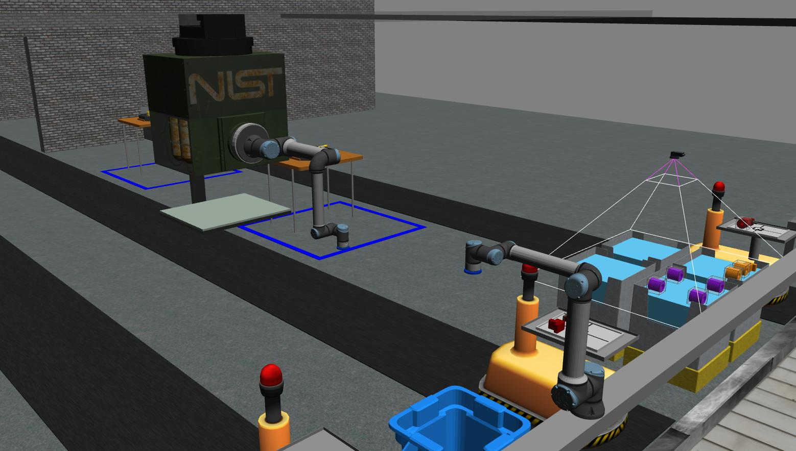

.. _TUTORIAL7:

***********************************
Tutorial 7: Move Robots with MoveIt
***********************************

.. admonition:: Tutorial 7
  :class: attention
  :name: tutorial_7

  - **Prerequisites:** :ref:`Introduction to Tutorials <TUTORIALS>` and :ref:`Tutorial 6 <TUTORIAL6>`
  - **Source Code**: `https://github.com/jaybrecht/ariac_tutorials/tree/tutorial_7 <https://github.com/jaybrecht/ariac_tutorials/tree/tutorial_7>`_ 
  - **Switch Branch**:

    .. code-block:: bash
        
            cd ~/ariac_ws/src/ariac_tutorials
            git switch tutorial_7

This tutorial shows how to move the robots through service calls using the following steps:

  - Create a C++ class for interfacing with MoveIt (:file:`src/robot_commander.cpp`).

    - Initialize a MoveGroupInterface object for each robot.
    - Create a service server for each robot. Service requests sent to these service servers will be used to move the robots to their home position.
  - Create a Python method that will be used to move the robot to its home position using a service client.
  - Call the Python method from the script :file:`tutorial_7.py` to move the robots to their home positions.

Package Structure
=================

Updates and additions that are specific to :tuto:`Tutorial 7`  are highlighted in the tree below.

.. code-block:: text
    :emphasize-lines: 2, 6-7, 12-13, 21
    :class: no-copybutton
    
    ariac_tutorials
    ├── CMakeLists.txt
    ├── package.xml
    ├── config
    │   └── sensors.yaml
    ├── launch
    │   └── robot_commander.launch.py
    ├── ariac_tutorials
    │   ├── __init__.py
    │   ├── utils.py
    │   └── competition_interface.py
    ├── src
    │   └── robot_commander.cpp
    └── scripts
        ├── tutorial_1.py
        ├── tutorial_2.py
        ├── tutorial_3.py
        ├── tutorial_4.py
        ├── tutorial_5.py
        ├── tutorial_6.py
        └── tutorial_7.py

Updated/Created Files
=====================

Competition Interface
---------------------

The competition interface used in this tutorial is shown in :numref:`competitioninterface-tutorial7`.

.. code-block:: python
    :caption: :file:`competition_interface.py`
    :name: competitioninterface-tutorial7
    :linenos:
    :emphasize-lines: 181-187, 606-636

    import rclpy
    from rclpy.time import Duration
    from rclpy.node import Node
    from rclpy.qos import qos_profile_sensor_data
    from rclpy.parameter import Parameter

    from ariac_msgs.msg import (
        CompetitionState as CompetitionStateMsg,
        BreakBeamStatus as BreakBeamStatusMsg,
        AdvancedLogicalCameraImage as AdvancedLogicalCameraImageMsg,
        Part as PartMsg,
        PartPose as PartPoseMsg,
        Order as OrderMsg,
        AssemblyPart as AssemblyPartMsg,
        AGVStatus as AGVStatusMsg,
        AssemblyTask as AssemblyTaskMsg,
        VacuumGripperState,
    )

    from ariac_msgs.srv import (
        MoveAGV,
        VacuumGripperControl
    )

    from std_srvs.srv import Trigger

    from ariac_tutorials.utils import (
        multiply_pose,
        rpy_from_quaternion,
        rad_to_deg_str,
        AdvancedLogicalCameraImage,
        Order,
        KittingTask,
        CombinedTask,
        AssemblyTask,
        KittingPart
    )

    class CompetitionInterface(Node):
        '''
        Class for a competition interface node.

        Args:
            Node (rclpy.node.Node): Parent class for ROS nodes

        Raises:
            KeyboardInterrupt: Exception raised when the user uses Ctrl+C to kill a process
        '''
        _competition_states = {
            CompetitionStateMsg.IDLE: 'idle',
            CompetitionStateMsg.READY: 'ready',
            CompetitionStateMsg.STARTED: 'started',
            CompetitionStateMsg.ORDER_ANNOUNCEMENTS_DONE: 'order_announcements_done',
            CompetitionStateMsg.ENDED: 'ended',
        }
        '''Dictionary for converting CompetitionState constants to strings'''

        _part_colors = {
            PartMsg.RED: 'red',
            PartMsg.BLUE: 'blue',
            PartMsg.GREEN: 'green',
            PartMsg.ORANGE: 'orange',
            PartMsg.PURPLE: 'purple',
        }
        '''Dictionary for converting Part color constants to strings'''

        _part_colors_emoji = {
            PartMsg.RED: '🟥',
            PartMsg.BLUE: '🟦',
            PartMsg.GREEN: '🟩',
            PartMsg.ORANGE: '🟧',
            PartMsg.PURPLE: '🟪',
        }
        '''Dictionary for converting Part color constants to emojis'''

        _part_types = {
            PartMsg.BATTERY: 'battery',
            PartMsg.PUMP: 'pump',
            PartMsg.REGULATOR: 'regulator',
            PartMsg.SENSOR: 'sensor',
        }
        '''Dictionary for converting Part type constants to strings'''

        _destinations = {
            AGVStatusMsg.KITTING: 'kitting station',
            AGVStatusMsg.ASSEMBLY_FRONT: 'front assembly station',
            AGVStatusMsg.ASSEMBLY_BACK: 'back assembly station',
            AGVStatusMsg.WAREHOUSE: 'warehouse',
        }
        '''Dictionary for converting AGVDestination constants to strings'''

        _stations = {
            AssemblyTaskMsg.AS1: 'assembly station 1',
            AssemblyTaskMsg.AS2: 'assembly station 2',
            AssemblyTaskMsg.AS3: 'assembly station 3',
            AssemblyTaskMsg.AS4: 'assembly station 4',
        }
        '''Dictionary for converting AssemblyTask constants to strings'''
        
        _gripper_states = {
            True: 'enabled',
            False: 'disabled'
        }
        '''Dictionary for converting VacuumGripperState constants to strings'''

        def __init__(self):
            super().__init__('competition_interface')

            sim_time = Parameter(
                "use_sim_time",
                rclpy.Parameter.Type.BOOL,
                True
            )

            self.set_parameters([sim_time])

            # Service client for starting the competition
            self._start_competition_client = self.create_client(Trigger, '/ariac/start_competition')

            # Subscriber to the competition state topic
            self._competition_state_sub = self.create_subscription(
                CompetitionStateMsg,
                '/ariac/competition_state',
                self._competition_state_cb,
                10)
            
            # Store the state of the competition
            self._competition_state: CompetitionStateMsg = None

            # Subscriber to the break beam status topic
            self._break_beam0_sub = self.create_subscription(
                BreakBeamStatusMsg,
                '/ariac/sensors/breakbeam_0/status',
                self._breakbeam0_cb,
                qos_profile_sensor_data)
            
            # Store the number of parts that crossed the beam
            self._conveyor_part_count = 0
            
            # Store whether the beam is broken
            self._object_detected = False

            # Subscriber to the logical camera topic
            self._advanced_camera0_sub = self.create_subscription(
                AdvancedLogicalCameraImageMsg,
                '/ariac/sensors/advanced_camera_0/image',
                self._advanced_camera0_cb,
                qos_profile_sensor_data)
            
            # Store each camera image as an AdvancedLogicalCameraImage object
            self._camera_image: AdvancedLogicalCameraImage = None

            # Subscriber to the order topic
            self.orders_sub = self.create_subscription(
                OrderMsg,
                '/ariac/orders',
                self._orders_cb,
                10)
            
            # Flag for parsing incoming orders
            self._parse_incoming_order = False
            
            # List of orders
            self._orders = []
            
            # Subscriber to the floor gripper state topic
            self._floor_robot_gripper_state_sub = self.create_subscription(
                VacuumGripperState,
                '/ariac/floor_robot_gripper_state',
                self._floor_robot_gripper_state_cb,
                qos_profile_sensor_data)

            # Service client for turning on/off the vacuum gripper on the floor robot
            self._floor_gripper_enable = self.create_client(
                VacuumGripperControl,
                "/ariac/floor_robot_enable_gripper")

            # Attribute to store the current state of the floor robot gripper
            self._floor_robot_gripper_state = VacuumGripperState()

            # Service client for moving the floor robot to the home position
            self._move_floor_robot_home = self.create_client(
                Trigger, '/competitor/move_floor_robot_home')
            
            # Service client for moving the ceiling robot to the home position
            self._move_ceiling_robot_home = self.create_client(
                Trigger, '/competitor/move_ceiling_robot_home')

        @property
        def orders(self):
            return self._orders

        @property
        def camera_image(self):
            return self._camera_image

        @property
        def conveyor_part_count(self):
            return self._conveyor_part_count

        @property
        def parse_incoming_order(self):
            return self._parse_incoming_order

        @parse_incoming_order.setter
        def parse_incoming_order(self, value):
            self._parse_incoming_order = value

        def _orders_cb(self, msg: Order):
            '''Callback for the topic /ariac/orders
            Arguments:
                msg -- Order message
            '''
            order = Order(msg)
            self._orders.append(order)
            if self._parse_incoming_order:
                self.get_logger().info(self._parse_order(order))

        def _advanced_camera0_cb(self, msg: AdvancedLogicalCameraImageMsg):
            '''Callback for the topic /ariac/sensors/advanced_camera_0/image

            Arguments:
                msg -- AdvancedLogicalCameraImage message
            '''
            self._camera_image = AdvancedLogicalCameraImage(msg.part_poses,
                                                            msg.tray_poses,
                                                            msg.sensor_pose)

        def _breakbeam0_cb(self, msg: BreakBeamStatusMsg):
            '''Callback for the topic /ariac/sensors/breakbeam_0/status

            Arguments:
                msg -- BreakBeamStatusMsg message
            '''
            if not self._object_detected and msg.object_detected:
                self._conveyor_part_count += 1

            self._object_detected = msg.object_detected

        def _competition_state_cb(self, msg: CompetitionStateMsg):
            '''Callback for the topic /ariac/competition_state
            Arguments:
                msg -- CompetitionState message
            '''
            # Log if competition state has changed
            if self._competition_state != msg.competition_state:
                state = CompetitionInterface._competition_states[msg.competition_state]
                self.get_logger().info(f'Competition state is: {state}', throttle_duration_sec=1.0)
            
            self._competition_state = msg.competition_state
            
        def _floor_robot_gripper_state_cb(self, msg: VacuumGripperState):
            '''Callback for the topic /ariac/floor_robot_gripper_state

            Arguments:
                msg -- VacuumGripperState message
            '''
            self._floor_robot_gripper_state = msg

        def start_competition(self):
            '''Function to start the competition.
            '''
            self.get_logger().info('Waiting for competition to be ready')

            if self._competition_state == CompetitionStateMsg.STARTED:
                return
            # Wait for competition to be ready
            while self._competition_state != CompetitionStateMsg.READY:
                try:
                    rclpy.spin_once(self)
                except KeyboardInterrupt:
                    return

            self.get_logger().info('Competition is ready. Starting...')

            # Check if service is available
            if not self._start_competition_client.wait_for_service(timeout_sec=3.0):
                self.get_logger().error('Service \'/ariac/start_competition\' is not available.')
                return

            # Create trigger request and call starter service
            request = Trigger.Request()
            future = self._start_competition_client.call_async(request)

            # Wait until the service call is completed
            rclpy.spin_until_future_complete(self, future)

            if future.result().success:
                self.get_logger().info('Started competition.')
            else:
                self.get_logger().warn('Unable to start competition')

        def parse_advanced_camera_image(self, image: AdvancedLogicalCameraImage) -> str:
            '''
            Parse an AdvancedLogicalCameraImage message and return a string representation.
            '''
            
            if len(image._part_poses) == 0:
                return 'No parts detected'

            output = '\n\n'
            for i, part_pose in enumerate(image._part_poses):
                part_pose: PartPoseMsg
                output += '==========================\n'
                part_color = CompetitionInterface._part_colors[part_pose.part.color].capitalize()
                part_color_emoji = CompetitionInterface._part_colors_emoji[part_pose.part.color]
                part_type = CompetitionInterface._part_types[part_pose.part.type].capitalize()
                output += f'Part {i+1}: {part_color_emoji} {part_color} {part_type}\n'
                output += '--------------------------\n'
                output += 'Camera Frame\n'
                output += '--------------------------\n'
                
                output += '  Position:\n'
                output += f'    x: {part_pose.pose.position.x:.3f} (m)\n'
                output += f'    y: {part_pose.pose.position.y:.3f} (m)\n'
                output += f'    z: {part_pose.pose.position.z:.3f} (m)\n'

                roll, pitch, yaw = rpy_from_quaternion(part_pose.pose.orientation)
                output += '  Orientation:\n'
                output += f'    roll: {rad_to_deg_str(roll)}\n'
                output += f'    pitch: {rad_to_deg_str(pitch)}\n'
                output += f'    yaw: {rad_to_deg_str(yaw)}\n'
                
                part_world_pose = multiply_pose(image._sensor_pose, part_pose.pose)
                output += '--------------------------\n'
                output += 'World Frame\n'
                output += '--------------------------\n'

                output += '  Position:\n'
                output += f'    x: {part_world_pose.position.x:.3f} (m)\n'
                output += f'    y: {part_world_pose.position.y:.3f} (m)\n'
                output += f'    z: {part_world_pose.position.z:.3f} (m)\n'

                roll, pitch, yaw = rpy_from_quaternion(part_world_pose.orientation)
                output += '  Orientation:\n'
                output += f'    roll: {rad_to_deg_str(roll)}\n'
                output += f'    pitch: {rad_to_deg_str(pitch)}\n'
                output += f'    yaw: {rad_to_deg_str(yaw)}\n'

                output += '==========================\n\n'

            return output
        
        def _parse_kitting_task(self, kitting_task: KittingTask):
            '''
            Parses a KittingTask object and returns a string representation.
            Args:
                kitting_task (KittingTask): KittingTask object to parse
            Returns:
                str: String representation of the KittingTask object
            '''
            output = 'Type: Kitting\n'
            output += '==========================\n'
            output += f'AGV: {kitting_task.agv_number}\n'
            output += f'Destination: {CompetitionInterface._destinations[kitting_task.destination]}\n'
            output += f'Tray ID: {kitting_task.tray_id}\n'
            output += 'Products:\n'
            output += '==========================\n'

            quadrants = {1: "Quadrant 1: -",
                        2: "Quadrant 2: -",
                        3: "Quadrant 3: -",
                        4: "Quadrant 4: -"}

            for i in range(1, 5):
                product: KittingPart
                for product in kitting_task.parts:
                    if i == product.quadrant:
                        part_color = CompetitionInterface._part_colors[product.part.color].capitalize()
                        part_color_emoji = CompetitionInterface._part_colors_emoji[product.part.color]
                        part_type = CompetitionInterface._part_types[product.part.type].capitalize()
                        quadrants[i] = f'Quadrant {i}: {part_color_emoji} {part_color} {part_type}'
            output += f'\t{quadrants[1]}\n'
            output += f'\t{quadrants[2]}\n'
            output += f'\t{quadrants[3]}\n'
            output += f'\t{quadrants[4]}\n'

            return output

        def _parse_assembly_task(self, assembly_task: AssemblyTask):
            '''
            Parses an AssemblyTask object and returns a string representation.

            Args:
                assembly_task (AssemblyTask): AssemblyTask object to parse

            Returns:
                str: String representation of the AssemblyTask object
            '''
            output = 'Type: Assembly\n'
            output += '==========================\n'
            if len(assembly_task.agv_numbers) == 1:
                output += f'AGV: {assembly_task.agv_number[0]}\n'
            elif len(assembly_task.agv_numbers) == 2:
                output += f'AGV(s): [{assembly_task.agv_numbers[0]}, {assembly_task.agv_numbers[1]}]\n'
            output += f'Station: {self._stations[assembly_task.station].title()}\n'
            output += 'Products:\n'
            output += '==========================\n'

            product: AssemblyPartMsg
            for product in assembly_task.parts:
                part_color = CompetitionInterface._part_colors[product.part.color].capitalize()
                part_color_emoji = CompetitionInterface._part_colors_emoji[product.part.color]
                part_type = CompetitionInterface._part_types[product.part.type].capitalize()

                output += f'Part: {part_color_emoji} {part_color} {part_type}\n'

                output += '  Position:\n'
                output += f'    x: {product.assembled_pose.pose.position.x:.3f} (m)\n'
                output += f'    y: {product.assembled_pose.pose.position.y:.3f} (m)\n'
                output += f'    z: {product.assembled_pose.pose.position.z:.3f} (m)\n'

                roll, pitch, yaw = rpy_from_quaternion(product.assembled_pose.pose.orientation)
                output += '  Orientation:\n'
                output += f'    roll: {rad_to_deg_str(roll)}\n'
                output += f'    pitch: {rad_to_deg_str(pitch)}\n'
                output += f'    yaw: {rad_to_deg_str(yaw)}\n'

                output += f'  Install direction:\n'
                output += f'    x: {product.install_direction.x:.1f}\n'
                output += f'    y: {product.install_direction.y:.1f}\n'
                output += f'    z: {product.install_direction.z:.1f}\n'

            return output

        def _parse_combined_task(self, combined_task: CombinedTask):
            '''
            Parses a CombinedTask object and returns a string representation.

            Args:
                combined_task (CombinedTask): CombinedTask object to parse

            Returns:
                str: String representation of the CombinedTask object
            '''

            output = 'Type: Combined\n'
            output += '==========================\n'
            output += f'Station: {self._stations[combined_task.station].title()}\n'
            output += 'Products:\n'
            output += '==========================\n'

            product: AssemblyPartMsg
            for product in combined_task.parts:
                part_color = CompetitionInterface._part_colors[product.part.color].capitalize()
                part_color_emoji = CompetitionInterface._part_colors_emoji[product.part.color]
                part_type = CompetitionInterface._part_types[product.part.type].capitalize()

                output += f'Part: {part_color_emoji} {part_color} {part_type}\n'

                output += '  Position:\n'
                output += f'    x: {product.assembled_pose.pose.position.x:.3f} (m)\n'
                output += f'    y: {product.assembled_pose.pose.position.y:.3f} (m)\n'
                output += f'    z: {product.assembled_pose.pose.position.z:.3f} (m)\n'

                roll, pitch, yaw = rpy_from_quaternion(product.assembled_pose.pose.orientation)
                output += '  Orientation:\n'
                output += f'    roll: {rad_to_deg_str(roll)}\n'
                output += f'    pitch: {rad_to_deg_str(pitch)}\n'
                output += f'    yaw: {rad_to_deg_str(yaw)}\n'

                output += f'  Install direction:\n'
                output += f'    x: {product.install_direction.x:.1f}\n'
                output += f'    y: {product.install_direction.y:.1f}\n'
                output += f'    z: {product.install_direction.z:.1f}\n'

            return output

        def _parse_order(self, order: Order):
            '''Parse an order message and return a string representation.
            Args:
                order (Order) -- Order message
            Returns:
                String representation of the order message
            '''
            output = '\n\n==========================\n'
            output += f'Received Order: {order.order_id}\n'
            output += f'Priority: {order.order_priority}\n'

            if order.order_type == OrderMsg.KITTING:
                output += self._parse_kitting_task(order.order_task)
            elif order.order_type == OrderMsg.ASSEMBLY:
                output += self._parse_assembly_task(order.order_task)
            elif order.order_type == OrderMsg.COMBINED:
                output += self._parse_combined_task(order.order_task)
            else:
                output += 'Type: Unknown\n'
            return output

        def lock_agv_tray(self, num):
            '''
            Lock the tray of an AGV and parts on the tray. This will prevent tray and parts from moving during transport.
            Args:
                num (int):  AGV number
            Raises:
                KeyboardInterrupt: Exception raised when the user presses Ctrl+C
            '''

            # Create a client to send a request to the `/ariac/agv{num}_lock_tray` service
            tray_locker = self.create_client(
                Trigger,
                f'/ariac/agv{num}_lock_tray'
            )

            # Build the request
            request = Trigger.Request()
            # Send the request
            future = tray_locker.call_async(request)

            # Wait for the response
            try:
                rclpy.spin_until_future_complete(self, future)
            except KeyboardInterrupt as kb_error:
                raise KeyboardInterrupt from kb_error

            # Check the response
            if future.result().success:
                self.get_logger().info(f'Locked AGV{num}\'s tray')
            else:
                self.get_logger().warn('Unable to lock tray')

        def move_agv_to_station(self, num, station):
            '''
            Move an AGV to an assembly station.
            Args:
                num (int): AGV number
                station (int): Assembly station number
            Raises:
                KeyboardInterrupt: Exception raised when the user presses Ctrl+C
            '''

            # Create a client to send a request to the `/ariac/move_agv` service.
            mover = self.create_client(
                MoveAGV,
                f'/ariac/move_agv{num}')

            # Create a request object.
            request = MoveAGV.Request()

            # Set the request location.
            if station in [AssemblyTaskMsg.AS1, AssemblyTaskMsg.AS3]:
                request.location = MoveAGV.Request.ASSEMBLY_FRONT
            else:
                request.location = MoveAGV.Request.ASSEMBLY_BACK

            # Send the request.
            future = mover.call_async(request)

            # Wait for the server to respond.
            try:
                rclpy.spin_until_future_complete(self, future)
            except KeyboardInterrupt as kb_error:
                raise KeyboardInterrupt from kb_error

            # Check the result of the service call.
            if future.result().success:
                self.get_logger().info(f'Moved AGV{num} to {self._stations[station]}')
            else:
                self.get_logger().warn(future.result().message)  

        def set_floor_robot_gripper_state(self, state):
            '''Set the gripper state of the floor robot.

            Arguments:
                state -- True to enable, False to disable

            Raises:
                KeyboardInterrupt: Exception raised when the user presses Ctrl+C
            '''
            if self._floor_robot_gripper_state.enabled == state:
                self.get_logger().warn(f'Gripper is already {self._gripper_states[state]}')
                return

            request = VacuumGripperControl.Request()
            request.enable = state

            future = self._floor_gripper_enable.call_async(request)

            try:
                rclpy.spin_until_future_complete(self, future)
            except KeyboardInterrupt as kb_error:
                raise KeyboardInterrupt from kb_error

            if future.result().success:
                self.get_logger().info(f'Changed gripper state to {self._gripper_states[state]}')
            else:
                self.get_logger().warn('Unable to change gripper state')

        def wait(self, duration):
            '''Wait for a specified duration.

            Arguments:
                duration -- Duration to wait in seconds

            Raises:
                KeyboardInterrupt: Exception raised when the user presses Ctrl+C
            '''
            start = self.get_clock().now()

            while self.get_clock().now() <= start + Duration(seconds=duration):
                try:
                    rclpy.spin_once(self)
                except KeyboardInterrupt as kb_error:
                    raise KeyboardInterrupt from kb_error
            
        def move_robot_home(self, robot_name):
            '''Move one of the robots to its home position.

            Arguments:
                robot_name -- Name of the robot to move home
            '''
            request = Trigger.Request()

            if robot_name == 'floor_robot':
                if not self._move_floor_robot_home.wait_for_service(timeout_sec=1.0):
                    self.get_logger().error('Robot commander node not running')
                    return

                future = self._move_floor_robot_home.call_async(request)

            elif robot_name == 'ceiling_robot':
                if not self._move_ceiling_robot_home.wait_for_service(timeout_sec=1.0):
                    self.get_logger().error('Robot commander node not running')
                    return
                future = self._move_ceiling_robot_home.call_async(request)
            else:
                self.get_logger().error(f'Robot name: ({robot_name}) is not valid')
                return

            # Wait until the service call is completed
            rclpy.spin_until_future_complete(self, future)

            if future.result().success:
                self.get_logger().info(f'Moved {robot_name} to home position')
            else:
                self.get_logger().warn(future.result().message)

Code Explanation
^^^^^^^^^^^^^^^^

The competition interface from :ref:`Tutorial 6 <TUTORIAL6>` was augmented with the components described below.

- Instance Variables

    - :python:`_move_floor_robot_home`: Service client for moving the floor robot to the home position.
    - :python:`_move_ceiling_robot_home`: Service client for moving the ceiling robot to the home position.

- Instance Methods

    - :python:`move_robot_home(self, robot_name)`: public method is used in the main function to move each robot to its home position. The method takes the name of the robot to move as an argument. The method then calls the appropriate service client to move the robot to its home position.

Robot Commander
---------------

The RobotCommander class used in this tutorial is shown in :numref:`robot_commander`.

.. code-block:: C++
    :caption: :file:`robot_commander.cpp`
    :name: robot_commander
    :linenos:

    #include <rclcpp/rclcpp.hpp>

    #include <std_srvs/srv/trigger.hpp>

    #include <moveit/move_group_interface/move_group_interface.h>
    #include <moveit/planning_scene_interface/planning_scene_interface.h>

    class RobotCommander : public rclcpp::Node
    {
    public:
    RobotCommander();
    ~RobotCommander();

    private:
    // MoveIt Interfaces 
    moveit::planning_interface::MoveGroupInterface floor_robot_;
    moveit::planning_interface::MoveGroupInterface ceiling_robot_;

    // ROS Services
    rclcpp::Service<std_srvs::srv::Trigger>::SharedPtr floor_robot_move_home_srv_;
    rclcpp::Service<std_srvs::srv::Trigger>::SharedPtr ceiling_robot_move_home_srv_;

    // Service Callbacks
    void FloorRobotMoveHome(
        std_srvs::srv::Trigger::Request::SharedPtr req,
        std_srvs::srv::Trigger::Response::SharedPtr res);

    void CeilingRobotMoveHome(
        std_srvs::srv::Trigger::Request::SharedPtr req,
        std_srvs::srv::Trigger::Response::SharedPtr res);
    };

    RobotCommander::RobotCommander()
    : Node("robot_commander"),
    floor_robot_(std::shared_ptr<rclcpp::Node>(std::move(this)), "floor_robot"),
    ceiling_robot_(std::shared_ptr<rclcpp::Node>(std::move(this)), "ceiling_robot")
    {
    // Use upper joint velocity and acceleration limits
    floor_robot_.setMaxAccelerationScalingFactor(1.0);
    floor_robot_.setMaxVelocityScalingFactor(1.0);

    ceiling_robot_.setMaxAccelerationScalingFactor(1.0);
    ceiling_robot_.setMaxVelocityScalingFactor(1.0);

    // Register services
    floor_robot_move_home_srv_ = create_service<std_srvs::srv::Trigger>(
        "/competitor/move_floor_robot_home", 
        std::bind(
        &RobotCommander::FloorRobotMoveHome, this,
        std::placeholders::_1, std::placeholders::_2));
    
    ceiling_robot_move_home_srv_ = create_service<std_srvs::srv::Trigger>(
        "/competitor/move_ceiling_robot_home", 
        std::bind(
        &RobotCommander::CeilingRobotMoveHome, this,
        std::placeholders::_1, std::placeholders::_2));
    }

    RobotCommander::~RobotCommander() 
    {
        floor_robot_.~MoveGroupInterface();
        ceiling_robot_.~MoveGroupInterface();
    }

    void RobotCommander::FloorRobotMoveHome(
        std_srvs::srv::Trigger::Request::SharedPtr req,
        std_srvs::srv::Trigger::Response::SharedPtr res)
    {
        (void)req; // remove unused parameter warning
        floor_robot_.setNamedTarget("home");

        moveit::planning_interface::MoveGroupInterface::Plan plan;
        bool success = static_cast<bool>(floor_robot_.plan(plan));

        if (success) {
            if (static_cast<bool>(floor_robot_.execute(plan))) {
                res->success = true;
            } else {
                res->success = false;
                res->message = "Trajectory execution failed";
            }
        } else {
            res->message = "Unable to generate trajectory";
            res->success = false;
        }
    }

    void RobotCommander::CeilingRobotMoveHome(
        std_srvs::srv::Trigger::Request::SharedPtr req,
        std_srvs::srv::Trigger::Response::SharedPtr res)
    {
        (void)req; // remove unused parameter warning
        ceiling_robot_.setNamedTarget("home");

        moveit::planning_interface::MoveGroupInterface::Plan plan;
        bool success = static_cast<bool>(ceiling_robot_.plan(plan));

        if (success) {
            if (static_cast<bool>(ceiling_robot_.execute(plan))) {
                res->success = true;
            } else {
                res->success = false;
                res->message = "Trajectory execution failed";
            }
        } else {
            res->message = "Unable to generate trajectory";
            res->success = false;
        }
    }

    int main(int argc, char *argv[])
    {
        rclcpp::init(argc, argv);
        auto robot_commander = std::make_shared<RobotCommander>();
        rclcpp::spin(robot_commander);
        rclcpp::shutdown();
    }

The robot commander node is a C++ node which initializes the :cpp:`MoveGroupInterface` for the floor and ceiling robots. 

    - The move group ``floor_robot`` is used for the floor robot. This group allows control of the arm and its displacement on the linear rail.
    - The move group ``ceiling_robot`` is used for the ceiling robot. This group allows control of the arm and the torso of the robot on the rails.

The node also hosts two services:

    - :rosservice:`/competitor/move_floor_robot_home` calls the method :cpp:`FloorRobotMoveHome()` which moves the floor robot to its home position.
    - :rosservice:`/competitor/move_ceiling_robot_home` calls the method :cpp:`CeilingRobotMoveHome()` which moves the ceiling robot to its home position.

Launch File
-----------

The RobotCommander node and the MoveIt node is started using the launch file shown in  :numref:`robot_commander_launch_file`. Nodes that use the MoveGroupInterface need to be launched with specific ROS parameters. A python function in the ariac_moveit_config module :python:`generate_parameters` has been added to easily create those parameters. The launch file :file:`ariac_robots_moveit.launch.py` is also called to start the move group node. 

.. code-block:: python
    :caption: :file:`robot_commander.launch.py`
    :name: robot_commander_launch_file
    :linenos:

    from launch import LaunchDescription
    from launch_ros.actions import Node
    from launch.launch_description_sources import PythonLaunchDescriptionSource
    from launch.actions import IncludeLaunchDescription
    from launch_ros.substitutions import FindPackageShare

    from ariac_moveit_config.parameters import generate_parameters

    def generate_launch_description():

        # Robot Commander Node
        robot_commander = Node(
            package="ariac_tutorials",
            executable="robot_commander",
            output="screen",
            parameters=generate_parameters()
        )

        # MoveIt node
        moveit = IncludeLaunchDescription(
            PythonLaunchDescriptionSource(
                [FindPackageShare("ariac_moveit_config"), "/launch", "/ariac_robots_moveit.launch.py"]
            )
        )

        return LaunchDescription([robot_commander, moveit])

Executable
----------

.. code-block:: python
    :caption: :file:`tutorial_7.py`
    
    #!/usr/bin/env python3
    '''
    To test this script, run the following commands in separate terminals:
    
    - ros2 launch ariac_tutorials robot_commander.launch.py
    - ros2 run ariac_tutorials move_robots.py
    - ros2 launch ariac_gazebo ariac.launch.py competitor_pkg:=ariac_tutorials trial_name:=tutorials
    '''

    import rclpy
    from ariac_tutorials.competition_interface import CompetitionInterface

    def main(args=None):
        rclpy.init(args=args)
        interface = CompetitionInterface()
        interface.start_competition()

        interface.move_robot_home("floor_robot")
        interface.move_robot_home("ceiling_robot")

        interface.destroy_node()
        rclpy.shutdown()

    if __name__ == '__main__':
        main()

Code Explanation
^^^^^^^^^^^^^^^^^^^^^^^

This executable does the following:

    - Initialize the ROS client library.
    - Create an instance of the class :python:`CompetitionInterface` as a ROS node.
    - Start the competition.
    - The call to :python:`move_robot_home("floor_robot")` sends a service request to :rosservice:`/competitor/move_floor_robot_home`.
    - The call to :python:`move_robot_home("ceiling_robot")` sends a service request to :rosservice:`/competitor/move_ceiling_robot_home`

Build Instructions
------------------

Updates and additions that are specific to :tuto:`Tutorial 7`  are highlighted in the :file:`CMakeLists.txt` below.

.. code-block:: cmake
    :caption: :file:`CMakeLists.txt`
    :emphasize-lines: 14, 33, 40, 45-46, 48-51, 53-55
    :linenos:

    cmake_minimum_required(VERSION 3.8)
    project(ariac_tutorials)

    if(CMAKE_COMPILER_IS_GNUCXX OR CMAKE_CXX_COMPILER_ID MATCHES "Clang")
    add_compile_options(-Wall -Wextra -Wpedantic)
    endif()

    find_package(ament_cmake REQUIRED)
    find_package(ament_cmake_python REQUIRED)
    find_package(rclcpp REQUIRED)
    find_package(rclpy REQUIRED)
    find_package(ariac_msgs REQUIRED)
    find_package(orocos_kdl REQUIRED)
    find_package(moveit_ros_planning_interface REQUIRED)

    # Install the config directory to the package share directory
    install(DIRECTORY 
    config
    DESTINATION share/${PROJECT_NAME}
    )

    # Install Python modules
    ament_python_install_package(${PROJECT_NAME} SCRIPTS_DESTINATION lib/${PROJECT_NAME})

    # Install Python executables
    install(PROGRAMS
    scripts/tutorial_1.py
    scripts/tutorial_2.py
    scripts/tutorial_3.py
    scripts/tutorial_4.py
    scripts/tutorial_5.py
    scripts/tutorial_6.py
    scripts/tutorial_7.py
    DESTINATION lib/${PROJECT_NAME}
    )

    # Install the config directory to the package share directory
    install(DIRECTORY 
    config
    launch
    DESTINATION share/${PROJECT_NAME}
    )

    # Install C++ executables
    add_executable(robot_commander 
    src/robot_commander.cpp)

    ament_target_dependencies(robot_commander 
    rclcpp
    moveit_ros_planning_interface 
    ariac_msgs)

    install(TARGETS
    robot_commander
    DESTINATION lib/${PROJECT_NAME})

    ament_package()

Run the Executable
==================

- In *terminal 1*, run the following commands:

    .. code-block:: bash

        cd ~/ariac_ws
        . install/setup.bash
        ros2 launch ariac_tutorials robot_commander.launch.py

    .. highlights::

        *The launch command starts the robot commander node and move it.*

- In *terminal 2*, run the following commands:

    .. code-block:: bash

        cd ~/ariac_ws
        . install/setup.bash
        ros2 run ariac_tutorials tutorial_7.py

    .. highlights::

        *The last command starts the competition interface node and sends the service requests to move the robots to their home positions.*

- In *terminal 3*, run the following commands:

    .. code-block:: bash

        cd ~/ariac_ws
        colcon build
        . install/setup.bash
        ros2 launch ariac_gazebo ariac.launch.py trial_name:=tutorial competitor_pkg:=ariac_tutorials

    .. highlights::

        *The last command starts the environment.*

Outputs
=======

The output of the above commands show both robots moving to their home positions in Gazebo.

