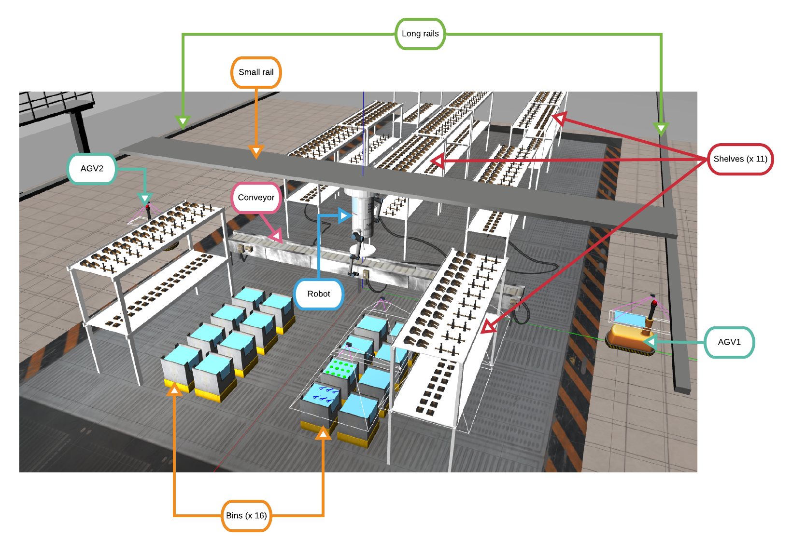
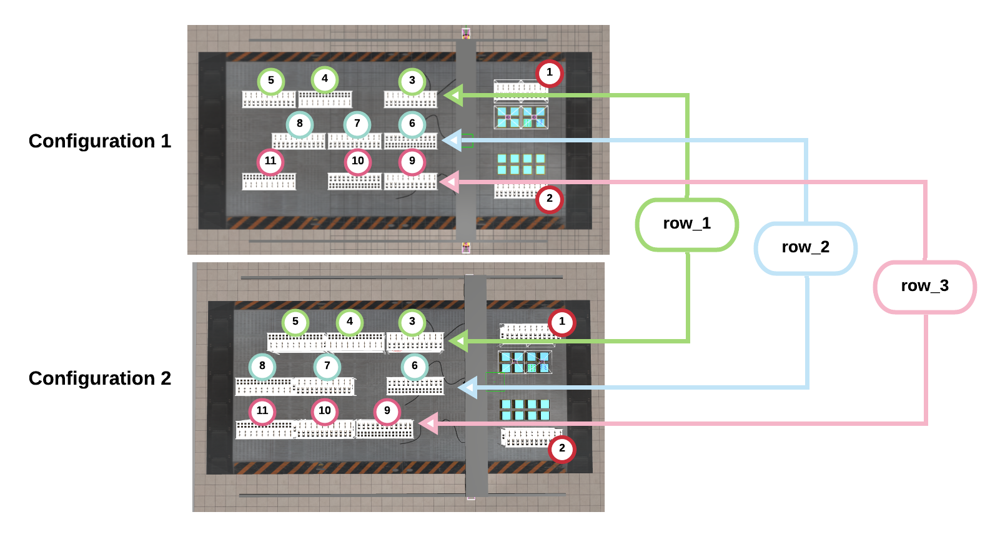
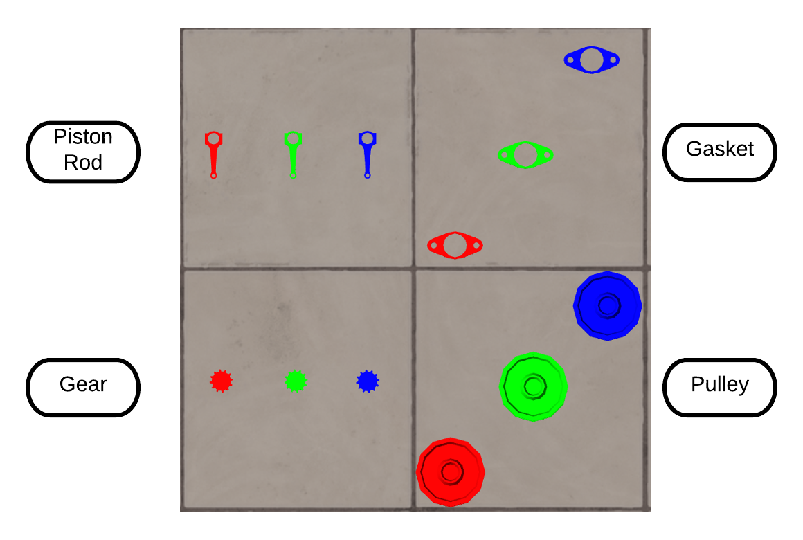
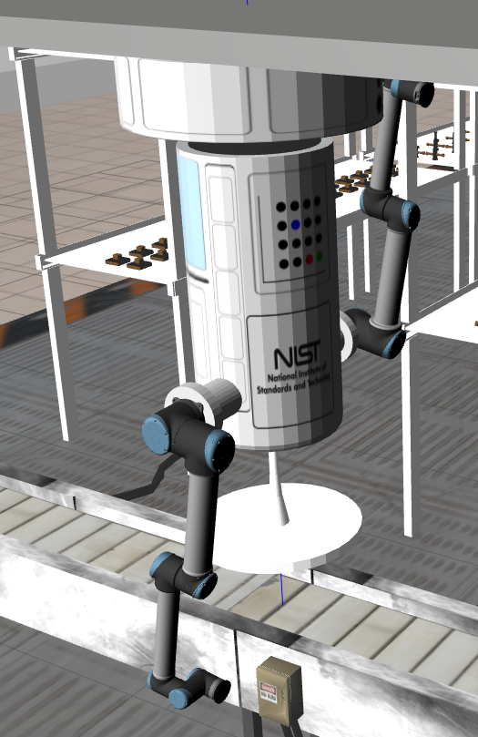

-------------------------------------------------
- Back to [Wiki | Home](../README.md)
- Back to [Wiki | Documentation](documentation.md)
-------------------------------------------------

This page outlines the specifications for [the Agile Robotics for Industrial Automation Competition](https://www.nist.gov/el/intelligent-systems-division-73500/agile-robotics-industrial-automation) (ARIAC) 2020.

The following terminology is frequently used in this document:
 is highlighted in red

1. **Order**: A set of shipments.
1. **Product**: One element of an order.
1. **Tray**: A surface that hold products.
1. **Kit**: A tray and set of products that make up an order.


# Competition Scenarios

ARIAC requires participants to complete a series of tests centered in an industrial scenario that are based around order fulfillment. The robot system will work within the environment specified in the Work Environment section.

There are three different test scenarios that all involve moving products from a supply location to a shipping box. The possible supply locations are a set of stationary bins. Challenges will be introduced in each scenario. Details about the scenarios follow.

1. **Scenario 1: Baseline Kit Building**

    The first scenario is intended as a baseline set of tasks for the other test methods to be compared against. The task for this scenario is to pick specific products and place them on a tray. The robot system will receive an *Order* that details the list of products and their target locations. Orders are covered in more detail in the Orders section.

2. **Scenario 2: Dropped Product**

    The task for scenario 2 is identical to scenario 1, however one or more products will drop from the robot's gripper. The robot will need to recover after dropping a product and complete the given Order. Recovery could entail picking up the dropped product, or fetching a new product.

3. **Scenario 3: In-Process Order Change**

    While the robot is in the middle of assembling a kit, a new high priority order will be received that needs to be completed as fast as possible. The robot will need to decide how best to complete this new order, and then complete the previous order.

The competition will consist of 15 trials: 5 trials of each of the 3 scenarios. Each trial will receive a score based on completion and efficiency metrics outlined in the Scoring section.

Details of the agility challenges used in these scenarios can be found on the [Agility Challenge](agility_challenges.md) page.

# Environment

The simulation environment is a representation of an order fulfillment workcell with a gantry robot, a conveyor belt, product bins, product shelves, AGVs, and trays.



## Conveyor Belt
* The conveyor belt is a **0.65 m wide**, **9 m long** plane that transports objects across the work environment.
* The following properties impact teams' interaction with the belt:
 1. Products will travel down the belt at a fixed speed of **0.2 m/s**.
 1. Teams can control the conveyor belt during development, but not during the final competition.
 1. There is a limited supply of products on the belt, and any products placed on the belt are automatically removed if they reach the end of the belt. Products will not be replaced once removed.

## Product Bins
* There are 16 product bins that may be used for building kits. 
* Products in these bins will not be replaced once used. 
* All products in a particular storage bin are of the same type and have the same orientation.
* The product bins are shallow boxes measuring **0.6 x 0.6 m**. 

## Product Shelves
Besides bins and the conveyor belt, we now have the possibility to spawn parts on shelves.

* Each shelf has two levels:
   * Top and bottom shelves contain ghost parts. Those parts are only there for aesthetic, meaning **they are not graspable**. There are 3 different types of shelves. They all have the same dimensions but the type of ghost parts for those shelves are different. These shelves are named `base`, `collar`, and `pipe`.
   * When parts are spawn on a shelf, they will always be spawn on the bottom shelf, never on the top shelf.
   
   
   
   * There are exactly 11 shelves in the environment.
      * 2 shelves will always be at the exact same locations (1 and 2 in the figure)
      * The locations of the 9 remaining shelves (3 - 11 in the figure) can be customized to a certain extent. 
         * The configuration for each row of shelves can be specified in `osrf_gear/config/sample.yaml`. Participants are allowed to change the configuration of each row during testing but not during qualifiers and finals.
         * The figure below combines two screenshots of the environment (top view) where 2 configurations are presented (3 rows per configuration). 
         * **Configuration 1** and **Configuration 2** show 3 rows of shelves where each row has 3 shelves and 1 gap. It is mandatory that each row has **exactly** 3 shelves and 1 gap. 
            * In **Configuration 1**, the gap is located after the first shelf (row_1), at the end of the row of shelves (row_2), and after the first two shelves (row_3).
            * In **Configuration 2**, the gap is located after all the shelves (row_1), after the first shelf (row_2), and before all the shelves (row_3). The 3 rows of shelves for **Configuration 2** is represented in the Yaml code below and can be found in `config.yaml`.
            
```yaml
shelf_layout:
   row_1: ['base','collar','collar',0] #shelves: 3, 4, 5
   row_2: ['pipe',0,'base','collar']   #shelves: 6, 7, 8
   row_3: [0,'pipe','base','collar'] #shelves: 9, 10, 11
   ``` 
   
## Parts
* ARIAC 2020 is using the same part types found in ARIAC 2019. However, each part type has 3 colors (see figure below).
  

## Trays
* Orders must be placed on a tray at one of two AGVs.
* Teams programmatically signal the AGVs when a kit is ready to be delivered.
* Each tray is shallow and measures **0.5 x 0.7 m**


# Robot
* This year, competitors will have to control a 15 DoF gantry robot to complete the challenges. The robot is depicted in the figure below and consists of:
    * 1 linear actuator which controls the base of the torso on the small rail.
      * The base moves at a velocity of **4m/s** and is within the range **y=[-7, 7]**
    * 1 linear actuator which allows the small rail to move along the long rails.
      * The small rail moves at a velocity of **4m/s** and is within the range **x=[-14.5, 5.25]**
    * 1 rotatory torso which rotates around the base z-axis.
    * Two 6 DoF UR10 arms attached to the torso. 
      * Each arm's base has a fixed joint to the torso.
    * A tray is attached at one of the extremities of the torso. Participants may put parts in this tray while fetching other parts in the environment.
    * The end of each arm is equipped with a vacuum gripper. The vacuum gripper is controlled in a binary manner (on/off) and reports whether or not it is successfully gripping an object.





# Sensors


Teams can place sensors around the environment in static locations. Each sensor has a cost that factors into the final score.

Available sensors are:

1. **Break beam**: reports when a beam is broken by an object. It does not provide distance information.
1. **Laser scanner**: provides an array of distances to a sensed object.
1. **Depth camera**: provides a point cloud of sensed distances.
1. **Cognex logical camera**: provides information about the pose and type of all models within its field of 
view.
  * **Note**: The range of the logical camera has been increased to cover 4 bins at a time (instead of 1 bin previously). With this new range, 2 logical cameras should be sufficient to cover the surface of a shelf.
1. Proximity: detects the range to an object.

* Sensors can be placed in any free space in the workcell, they do not need to be mounted so that they are touching the conveyor belt/support frame of the storage bin.
* Sensors must be used in a realistic manner and must not exploit any simulation technicalities such as the logical camera seeing through obstructions.
* For the details about how to configure the sensor locations, see the [Configuration Specifications](configuration_spec.md).

# Order

- An order is an instruction containing kits for the robot system to complete.
- Each order will specify the list of products to be put in the shipment, including the type and position/orientation of each product.
- An order may require being delivered to a particular AGV.
- For more details see the [product specification](frame_specifications.md) page.

# Faulty products

Throughout the workcell are quality control sensors that detect faulty products.
If faulty products are detected while teams are fulfilling orders, those products should be removed from the tray and replaced with another product of the same type.
Faulty products will not count for any points when the shipment is submitted, and they will cost teams the all-products bonus if left in trays (see Scoring, below).

# Scoring

Performance scores will be automatically calculated for each trial as a combination of performance metrics and costs.
These will be combined with scores from judges to determine the final winners.
See the [Scoring Metrics](scoring.md) page for more details.

# Competition process

Each trial will consist of the following steps:

1. The robot programmatically signals that it is able to begin accepting orders.

1. The first Order (Order 1) is sent to the robot.

1. A fixed amount of time is allowed to complete the order.

1. In the case of the Dropped Product testing method, up to three products will be forcibly dropped from the gripper.

1. In the case of the In-Process Order Change testing method, a new Order (Order 2) will be issued that is of higher priority than the previously issued Order 1. When Order 2 is complete, building of Order 1 is to resume.

1. The robot signals programmatically when a kit is complete and ready to be delivered.

1. The robot system will be notified that the trial is over. The trial is over when time runs out or all Orders have been fulfilled.

For details on how the communication with the competition system is performed during the trial, see the [Competition Interface](competition_interface_documentation.md) page.

There are no time limits for individual orders, but each trial has a time limit.
This information is not broadcast by the ARIAC server.
For the Finals/Qualifiers, the time limit will be set as a fixed value for all trials, which teams will be advised of in advance.

-------------------------------------------------
- Back to [Wiki | Home](../README.md)
- Back to [Wiki | Documentation](documentation.md)
-------------------------------------------------

