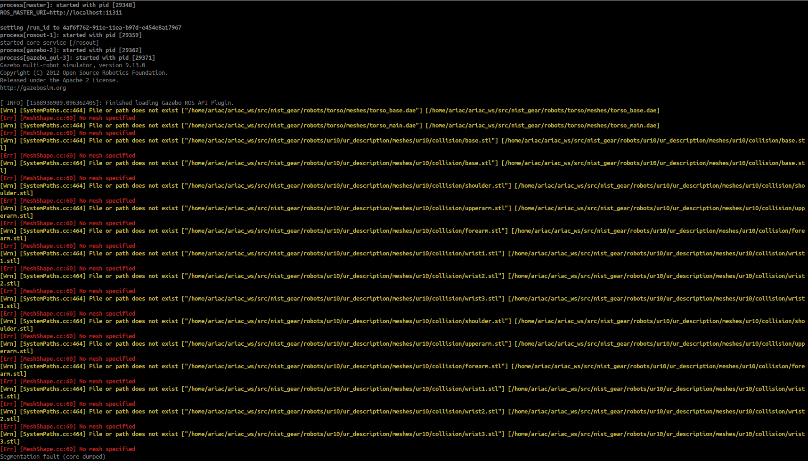

Wiki | [Home](../../README.md) | [Documentation](../documentation/documentation.md) | [Tutorials](../tutorials/tutorials.md) | [Qualifiers](../qualifiers/qualifier.md) | [Finals](../finals/finals.md)

-------------------------------------------------


- [Wiki | Documentation | Automated Evaluation](#wiki--documentation--automated-evaluation)
  - [Overview of submission requirements](#overview-of-submission-requirements)
  - [Developing/testing your submission](#developingtesting-your-submission)
  - [Uploading your submission](#uploading-your-submission)
- [Automated Evaluation Setup](#automated-evaluation-setup)
  - [Getting the code](#getting-the-code)
  - [Installing Docker](#installing-docker)
  - [Fetch the ARIAC system](#fetch-the-ariac-system)
  - [Preparing the Workspace](#preparing-the-workspace)
    - [Edit run_team_system.bash](#edit-run_team_systembash)
  - [Preparing Competitors' Systems](#preparing-competitors-systems)
  - [Running a Single Trial](#running-a-single-trial)
  - [Reviewing the Trial Performance](#reviewing-the-trial-performance)
    - [Playing back the simulation](#playing-back-the-simulation)
  - [Running all trials](#running-all-trials)
  - [Development tips](#development-tips)
    - [Keeping the competition setup software up to date](#keeping-the-competition-setup-software-up-to-date)
    - [Stopping the competition/containers](#stopping-the-competitioncontainers)
    - [Utilizing the Docker cache to when re-building the competitor system](#utilizing-the-docker-cache-to-when-re-building-the-competitor-system)
    - [Investigating build issues](#investigating-build-issues)
    - [Investigating the contents of a running competitor container](#investigating-the-contents-of-a-running-competitor-container)


# Wiki | Documentation | Automated Evaluation

During ARIAC Qualifiers/Finals, each team will submit their system so that it can be run in the automated evaluation setup. This is to ensure that teams are not using prohibited interfaces to interact with the simulation.

## Overview of submission requirements

To allow the ARIAC competition controllers to automatically run each team's system, teams are required to submit the following files:

- **team_config.yaml**: The team's sensor configuration file. One sensor configuration is used for all trials.
- **build_team_system.bash**: A bash script that, when invoked from the command-line on a clean Ubuntu system, will install the necessary dependencies and build the team's code.
- **run_team_system.bash**: A bash script that, when invoked from the command-line on a system that has had **build_team_system.bash** run, will start the team's system and begin interacting with the ARIAC competition trial.

The **build_team_system.bash** script will be run only once to setup the team's system, and the **run_team_system.bash** script will be run one time for each of the scenarios to be tested against.

## Developing/testing your submission

- Teams should develop/test their submission using the instructions provided in [automated evaluation](../tutorials/automated_evaluation.md). This page describes how to create the required bash scripts and test them in the mock competition setup.

- It is imperative that teams use the outlined process for testing their system, as it exactly replicates the process that will be used during automated evaluation.
- If your system does not score correctly in the mock competition setup, it will not score correctly when run by competition controllers.

- **IMPORTANT**: During the qualifiers and finals teams must test their systems in *Competition Mode*. That is, the option  `development-mode` should not be used.

## Uploading your submission

- Submissions will be made through secure workspaces directly with competition controllers.

- All registered teams must contact ariac@nist.gov to have their workspace prepared in advance of when they intend to submit. **This must not be left to the last minute** or teams risk missing the submission deadline.

- If your team's code is not open source, you can include access keys in your setup script: they will not be made public.

This OSRF [repository](https://github.com/osrf/ariac-docker) contains the setup that will be used to automatically evaluate teams' submission for the Agile Robotics for Industrial Automation Competition (ARIAC) hosted by the National Institute of Standards and Technology (NIST).

# Automated Evaluation Setup

The setup that is created by the code in this repository is the setup that will be used for evaluating teams' systems automatically in the Qualifiers/Finals.
There are two main components to the ARIAC competition setup: the ARIAC server, and the competitor's system.
For security and reproducibility, the ARIAC server and the competitor's system are run in separate isolated environments called containers.
Docker is used to create these containers.

## Getting the code

Clone this code repository locally:

```
mkdir -p ~/ariac_ws && cd ~/ariac_ws
git clone https://github.com/usnistgov/ariac-docker.git
cd ~/ariac_ws/ariac-docker
```

## Installing Docker

- Please, follow [these instructions](https://docs.docker.com/engine/install/ubuntu/) and install `Docker CE`. Section **Install Docker Engine.1** is what you want.

- Continue to the [post-install instructions](https://docs.docker.com/engine/install/linux-postinstall/) and complete the "Manage Docker as a non-root user" section to avoid having to run the commands on this page using `sudo`.


## Fetch the ARIAC system

To prepare the ARIAC competition system (but not run it), call:

```bash
./pull_dockerhub_images.bash
```

This will pull a Docker image of the latest version of the competition server and the base competitor machine image. This process will take a while to download, so get some coffee or watch an episode of Survivors.

## Preparing the Workspace

Competitors' configuration files must be put into the `team_config` directory (from [the step above](#getting-the-code)) in a folder with the name of the team. We have provided one  example of submission in the `team_config` directory. The name of the team is `nist_team` and consists of two bash scripts and one sensor configuration file. **Note**: `nist_team` will start GEAR with MoveIt!.

```bash
team_config
└── nist_team  # team name
    ├── build_team_system.bash
    ├── run_team_system.bash
    ├── team_config.yaml
```

<!-- 
```bash
$ ls team_config/nist_team/
build_team_system.bash  run_team_system.bash nist_team_sensor_config.yaml
``` -->

- These three files constitute a submission.
- These files are explained [above](#overview-of-submission-requirements).
- We will work with the files of the `nist_team` submission for this tutorial; you can use them as a template for your own team's submission.

### Edit build_team_system.bash

Edit `build_team_system.bash` to create a catkin workspace, to retrieve your code, and to build your package. Here is the code snippet from `build_team_system.bash` that you need to modify for your team.

```bash
# Create a catkin workspace
mkdir -p ~/nist_team_ws/src

# Fetch the source code for our team's code
cd ~/nist_team_ws/src
git clone https://github.com/zeidk/nist_team.git

cd ~/nist_team_ws
catkin build
```

### Edit run_team_system.bash

Edit `run_team_system.sh` to run your code. This is usually a `roslaunch` command or a `rosrun` command.

## Preparing Competitors' Systems

- To prepare your  system (but not run it), call:

```bash
./prepare_team_system.bash <your_team_name>
```

- This will build a Docker "image" of the example team's system built on top of the base competitor image, ready to be launched with the ARIAC competition server.

- The following command will prepare the team `nist_team`:
  
```bash
./prepare_team_system.bash nist_team
```

- This command will do multiple things including running the script `build_team_system.bash` which install dependencies, downloading your competitor package, and compiling it.


## Running a Single Trial

To run an example trial (in this case the trial associated with `trial_config/sample_kitting.yaml`), call:

```bash
./run_trial.bash nist_team sample_kitting # note: it's sample_kitting and not sample_kitting.yaml

# For your team you will run:
./run_trial.bash <your_team_name> <trial_name>
```

This will instantiate Docker containers from the images that were prepared earlier: one for the ARIAC competition server, and one for your team's system.
The ARIAC environment will be started using the competition configuration file associated with the trial name (i.e. `trial_config/sample_kitting.yaml`), and the user configuration file associated with the team name (i.e. `team_config/nist_team/team_config.yaml`).

**Note**: The team's Docker container is started before the ARIAC competition server container. As such you might see the following message before the ARIAC server with the ROS master starts:

> ERROR: Unable to communicate with Master.

**Note**: If you see the following warning, it is safe to ignore it.

>[Wrn] [RenderEngine.cc:97] Unable to create X window. Rendering will be disabled

Once the trial has finished (because your system completed the trial, because you made a call to the `/ariac/end_competition` service, or because time ran out), the logs from the trial will be available in the `logs` directory that has now been created locally.
In the above invocation, the example code will end the competition and errors being printed to the terminal as the trial shuts down are expected.

**All the sections below will be updated with correct file paths**

## Reviewing the Trial Performance

Once the behavior observed when playing back the trial's log file looks correct, you should then check the completion score. To do so, open the relevant `performance.log` file (e.g. `logs/nist_team/sample_kitting/performance.log`) and check the score output at the end of the file as it lists the scores for each order.

```text
$ tail logs/nist_team/sample_kitting/performance.log -n 25
(1518553810 6169392) [Dbg] [ROSAriacTaskManagerPlugin.cc:492] Sim time: 22
(1518553810 675725351) [Dbg] [ROSAriacTaskManagerPlugin.cc:717] Handle end service called
(1518553810 676916277) [Dbg] [ROSAriacTaskManagerPlugin.cc:579] End of trial. Final score: 0
Score breakdown:
<game_score>
Total game score: [0]
Total process time: [10.433]
Product travel time: [0]
<order_score order_0>
Total order score: [0]
Time taken: [10.432]
Complete: [false]
<shipment_score order_0_shipment_0>
Completion score: [0]
Complete: [false]
Submitted: [false]
Product presence score: [0]
All products bonus: [0]
Product pose score: [0]
</shipment_score>

</order_score>

</game_score>
```

- In this example the score is 0 because the example team system does not actually complete any orders.
- The general output structure of the `logs` directory is:


```
logs
└── nist_team  # team name
    └── sample_kitting  # trial name
        ├── gazebo
        │   └── state.log  # gazebo state log file
        ├── generated  # the specific files generated by gear.py based on team/trial config files
        │   ├── gear.launch
        │   ├── gear.urdf.xacro
        │   └── gear.world
        ├── performance.log  # scoring log file
        ├── ros  # ROS logs copied from ARIAC server container
        │   └── rosout.log
        └── ros-competitor  # ROS logs copied from competitor container
            └── example_node-1-stdout.log
```

- Additionally, there may be a `video` directory containing a video produced from playback of the simulation state log file recorded during the trial(s).
- The following properties are relevant:
  - Logs playback at a slower speed and therefore a 5 minute simulation may result in a 10-15 minute video. 
  - The simulation time is displayed in the bottom right.
  - Simulation time may jump forward a number of seconds if there is a length of time where no movement is detected in the simulation.
  - The log stops at the last time motion occurred, so log files may be shorter than expected if there is no motion.

### Playing back the simulation

- To play back a specific trial's log file, you will need to start the `gear_playback.launch` which is located in `nist_gear/launch`, so make sure you have ARIAC installed and sourced.
- `gear_playback.launch` works with `state.log`, which will be created in the `ariac-docker/logs/<team_name>/<trial_file_name>/gazebo` directory. `gazebo/state.log` will only be generated if you have the following in your trial file:
```
options:
   gazebo_state_logging: true
```
- Next, you need to either create symlinks or add a directory which contains the robot meshes and textures. If you do not perform either one of these two actions, you will get the error messages shown in the figure below. `gear_playback.launch` will try to look for robot meshes and textures on the host machine the same way the robot model is fetched in the docker container, that is, in `/home/ariac/ariac_ws/src/nist_gear/robots`. Since this path does not exist on the host, Gazebo will crash when you click the play button.
  
  - The easiest way to not get these errors is to create the following directory structure on the host `/home/ariac/ariac_ws/src/nist_gear`, then copy the whole `robots` directory from ARIAC into it. The path will finally be `/home/ariac/ariac_ws/src/nist_gear/robots`. **Note**: Make sure you are working in the `/home` directory and not in the Home directory `~`.
  - If you do not want to create a new directory just for the robot meshes/textures, you can create symbolic links that point to an existing robot model files on your machine. For instance, below is an example of a symbolic link that points to the file `torso_base.dae`

```
  sudo ln -s  /home/zeid/ariac_ws/src/ARIAC/nist_gear/robots/torso/meshes/torso_base.dae /home/ariac/ariac_ws/src/nist_gear/robots/torso/meshes/torso_base.dae
```
- Start the launch file for playback:

```
roslaunch nist_gear gear_playback.launch state_log_path:=<absolute_path_to_state.log>
```

    - A concrete example is:
    
  ```
  roslaunch nist_gear gear_playback.launch state_log_path:=/home/zeid/github/ariac-docker/logs/moveit_example_team/qual_a_1/gazebo/state.log
  ```


  - You should see the ARIAC environment start up with parts in the bins and, sometimes, on shelves. The robot is invisible until you press the play button in the Gazebo window.
  - **Note**: this is currently only possible for user accounts with user ID of 1000.

## Running all trials

_Only one trial config file is provided at the moment; this command will be more useful in the future._

To run all trials listed in the `trial_config` directory, call:

```
./run_all_trials.bash example_team

# For your team you will run:
# ./run_all_trials.bash <your_team_name>
```

- This will run each of the trials sequentially in an automated fashion.
- This is the invocation that will be used to test submissions for the Finals: your system will not be provided with any information about the trial number or the conditions of the trial.
- If your system performs correctly with this invocation, regardless of the set of configuration files in the `trial_config` directory, you're ready for the competition.

## Development tips

### Keeping the competition setup software up to date

- New releases of the ARIAC software will be accompanied by new releases of the Docker images, so that the latest ARIAC version is installed in both the ARIAC competition server image and the base competitor image.
- Whenever there is a new release of the ARIAC software, or whenever you are informed of any other changes to the competition system setup, you will have to run `git pull` to get any recent modifications to the competition system setup, and re-run all scripts in order for the changes to take effect:

```
cd ~/ariac_ws/ariac-docker
# Get any changes to the scripts in this repo.
git pull
# Get the most recent Docker images.
./pull_dockerhub_images.bash
# Re-build your team's Docker image using the latest base competitor image.
./prepare_team_system.bash <your_team_name>
```

### Stopping the competition/containers

- If during your development you need to kill the ARIAC server/competitor containers, you can do so with:


```
./kill_ariac_containers.bash
```

- This will kill and remove all ARIAC containers.


### Utilizing the Docker cache to when re-building the competitor system

- By default, runnng `./build_team_system.bash <your_team_name>` will re-build the image from scratch.
- During development you may find it useful to call `./prepare_team_system.bash <your_team_name> --use-cache` to re-use already-built image in the Docker cache if appropriate.
- However, new versions of packages may have been released since the images in the cache were built, and this will not trigger images to be re-built. Therefore you must not use this option when testing your finalized system for submission.

### Investigating build issues

- If you are having difficulties installing your team's system with the `prepare_team_system` script, you can open a terminal in a clean competitor container (before the script has been run) and see which commands you need to type manually to get your system installed.


First, run:

```
docker run -it --rm --name ariac-competitor-clean-system zeidk/ariac4-competitor-base-melodic:latest
```

- This will start a container with the state immediately before trying to run your `build_team_system` script.
- From inside this container, you can type all of the commands you need to install your code (you do not need to use `sudo`), then run `history` to get a list of the commands that you typed: that will be a good starting point for your `build_team_system` script.
- You may need to modify it slightly e.g. by adding `-y` to commands that otherwise prompt for user input, such as `apt-get install -y ros-melodic-moveit-core`.

Type `exit` to stop the container.

### Investigating the contents of a running competitor container

- Once your team's system has been successfully installed in the competitor container, if you are having difficulties *running* your team's system, you can open a terminal in the container that has your system installed with:


```
docker run -it --rm --name ariac-competitor-system ariac-competitor-<your_team_name>
# e.g. for ariac_example_team:
# docker run -it --rm --name ariac-competitor-system ariac-competitor-ariac_example_team
```

- Inside the container you can look around with, for example:


```
ls ~/my_team_ws
```

- Type `exit` to stop the container.


-------------------------------------------------
- Wiki | [Home](../../README.md) | [Documentation](../documentation/documentation.md) | [Tutorials](../tutorials/tutorials.md) | [Qualifiers](../qualifiers/qualifier.md) | [Finals](../finals/finals.md)
