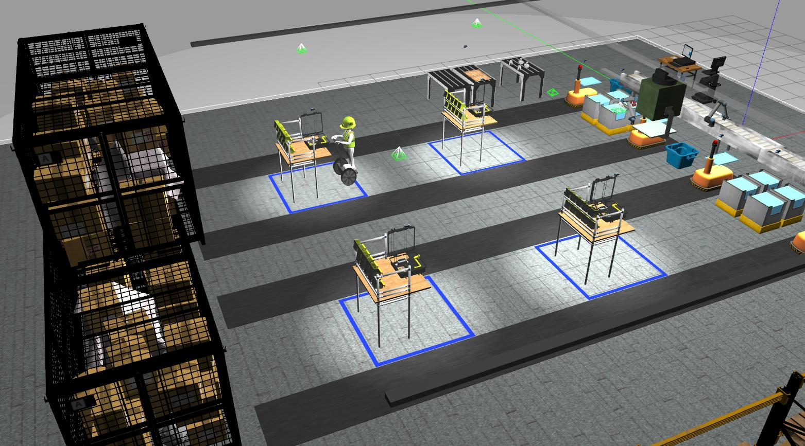
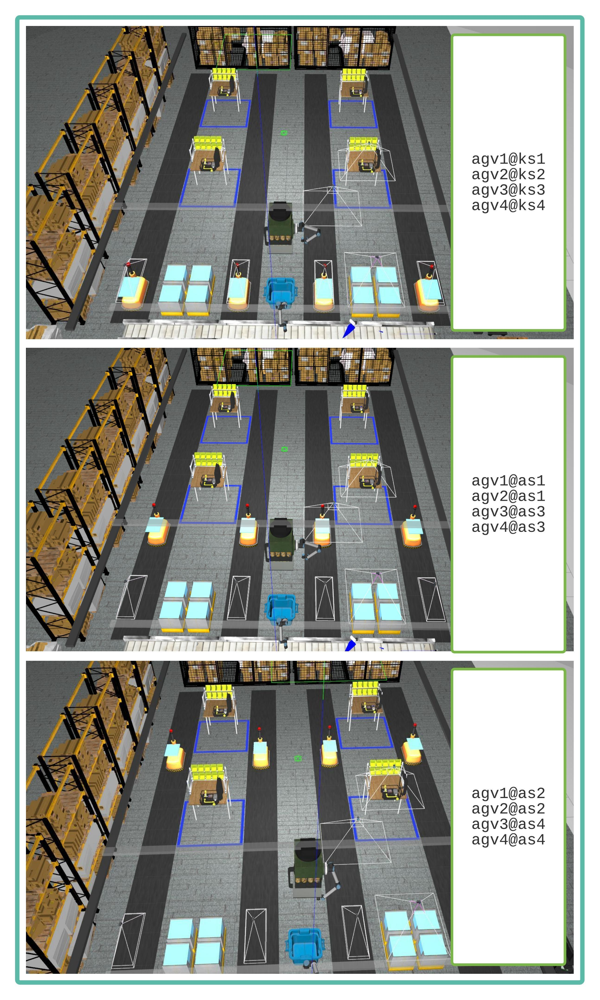
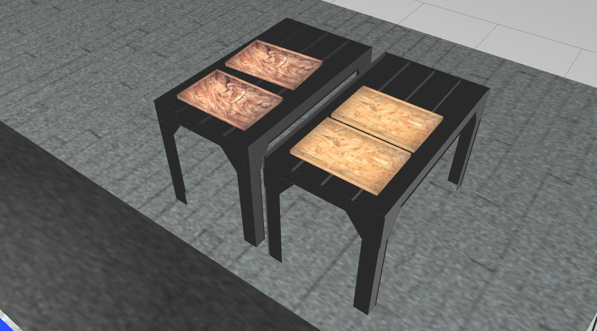
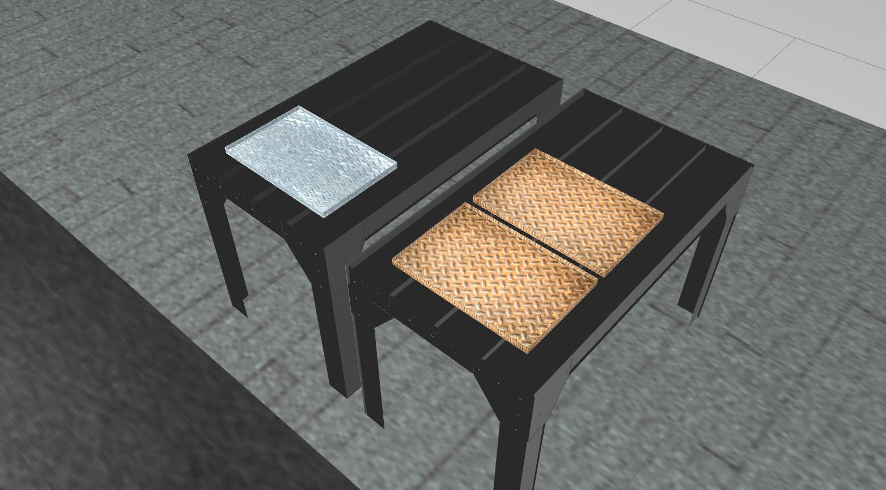
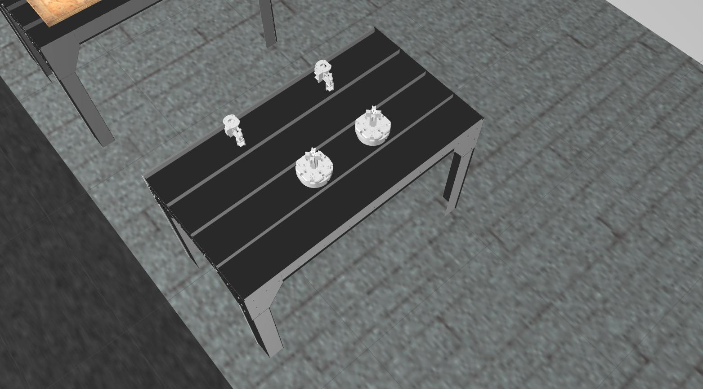
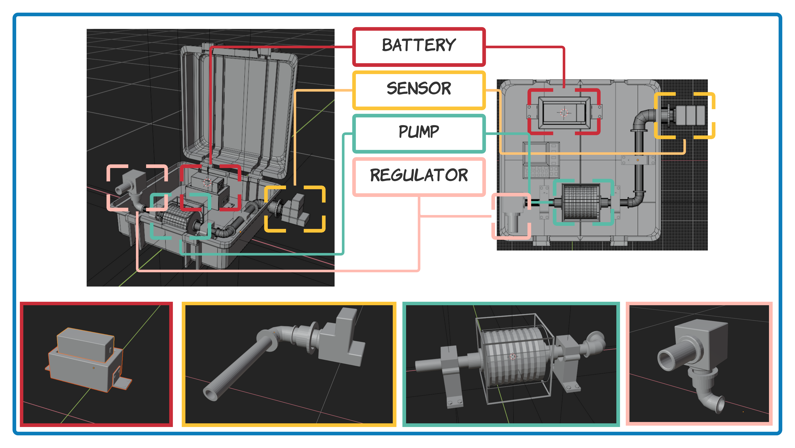
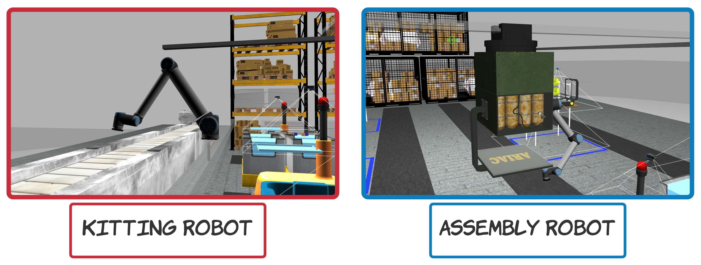
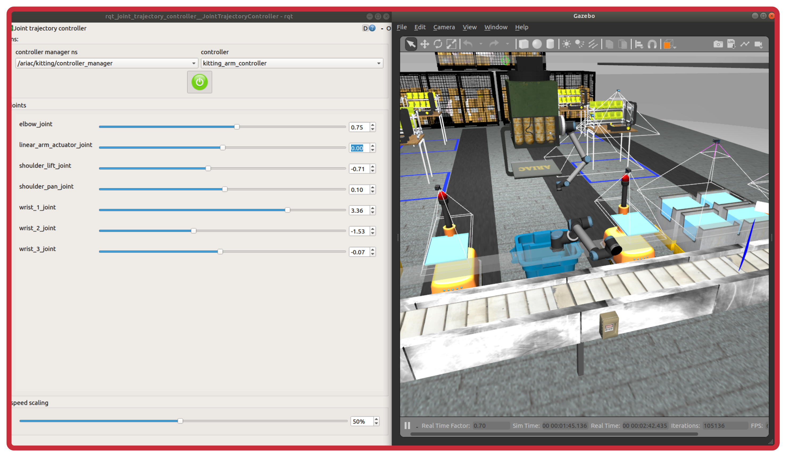
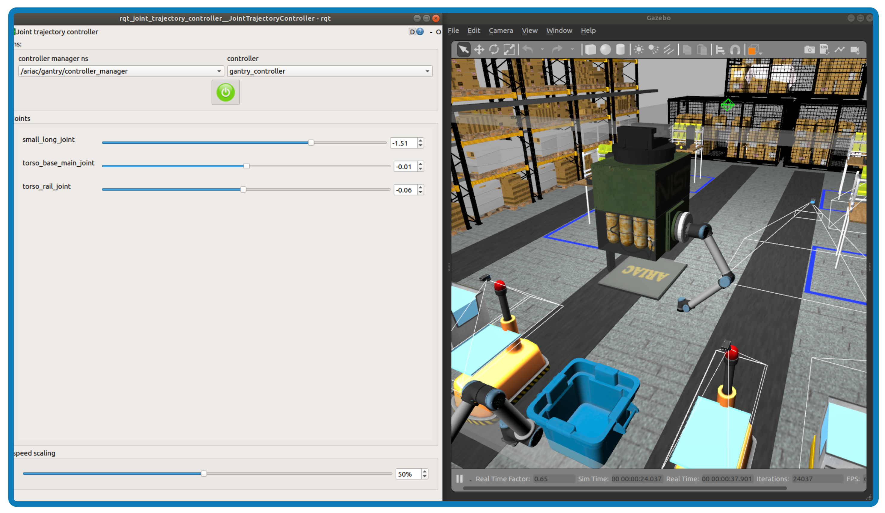

Wiki | [Home](../../README.md) | [Documentation](../documentation/documentation.md) | [Tutorials](../tutorials/tutorials.md) | [Qualifiers](../qualifiers/qualifier.md) | [Finals](../finals/finals.md)

---

- [Wiki | Documentation | Manufacturing Tasks](#wiki--documentation--manufacturing-tasks)
  - [Manufacturing Tasks](#manufacturing-tasks)
  - [Environment](#environment)
    - [Automated Guided Vehicles (AGVs)](#automated-guided-vehicles-agvs)
    - [Conveyor Belt](#conveyor-belt)
    - [Faulty Part Collector](#faulty-part-collector)
    - [Movable Trays](#movable-trays)
      - [Situations](#situations)
    - [Gripper Changing Station](#gripper-changing-station)
    - [Product Bins](#product-bins)
    - [Parts](#parts)
    - [Briefcases](#briefcases)
  - [Robots](#robots)
    - [Kitting Robot](#kitting-robot)
    - [Assembly Robot](#assembly-robot)
  - [Sensors](#sensors)
  - [Order](#order)
    - [High-priority Orders](#high-priority-orders)
    - [Regular Orders](#regular-orders)
  - [Kitting Shipments](#kitting-shipments)
  - [Assembly Shipments](#assembly-shipments)
  - [Agility Challenges](#agility-challenges)
  - [Scoring](#scoring)
  - [Competition Process](#competition-process)

# Wiki | Documentation | Manufacturing Tasks

This page outlines the specifications for [the Agile Robotics for Industrial Automation Competition](https://www.nist.gov/el/intelligent-systems-division-73500/agile-robotics-industrial-automation-competition) (ARIAC) 2022.

## Manufacturing Tasks

ARIAC requires competitors to complete a series of tests centered in an industrial scenario that are based around order fulfillments. The robot system will work within the environment specified in the Work Environment section.

There are **two** manufacturing tasks that involve moving products from a supply location to either a shipping box or an assembly station. The possible supply locations are a set of stationary bins, a conveyor belt, and Automated Guided Vehicles (AGVs). Challenges will be introduced for each task.

- **Task 1: Baseline Kit Building (Kitting)**

This task is intended as a baseline set of kitting tasks for the other kitting test methods to be compared against. In this task, competitors must pick specific products and place them on a kit tray. When this task needs to be completed, an order that contains at least one kitting shipment will be announced on the `/ariac/orders` topic. The kitting shipment(s) in this order will provide a list of product types and poses in movable tray frames. Orders are covered in more detail in the [Order](competition_specifications.md#order) section.

---

ARIAC developers provided a test competitor for kitting. Competitors can copy the source code in their own catkin package and modify it.

To see this demo in action:

```bash
$ roslaunch test_competitor kitting.launch
$ rosrun test_competitor kitting_commander_node.py
```

---

- **Task 2: Baseline Assembly**

This scenario is intended as a baseline set of assembly tasks for the other assembly test methods to be compared against. The task for this scenario is to pick products and place them in briefcases located at assembly stations. In baseline assembly, an order that contains at least one assembly shipment will be announced on the `/ariac/orders` topic. Similar to kit building, assembly shipments in this order will provide a list of product types and poses in briefcase frames.

---

The competition will consist of a number of trials with a mix of kitting and assembly. Each trial will receive a score based on completion and efficiency metrics outlined in the [Scoring](scoring.md) section. Details of the agility challenges used in these scenarios can be found in the [Agility Challenge](agility_challenges.md) section.

---

ARIAC developers provided a test competitor for assembly. Competitors can copy the source code in their own catkin package and modify it.

To see this demo in action:

```bash
$ roslaunch test_competitor assembly.launch station:=as1
$ rosrun test_competitor assembly_commander_node.py
```

---

## Environment

The simulation environment is a representation of an order fulfillment workcell with a kitting robot (on rail) and an assembly robot (gantry robot), a conveyor belt, product bins, assembly stations, a gripper changing station, tables for movable trays, and AGVs.




### Automated Guided Vehicles (AGVs)

Competitors will need to build kits on the back of AGVs (in kit trays) during kitting. During assembly, competitors will need to pick up parts from AGV trays and place them in briefcases to build ventilators.

When a trial starts, each AGV is located at one of the 3 possible locations `ks[1,2,3,4]` or `as[1,2,3,4]`where `ks` stands for kitting station and `as` stands for assembly station. The table below shows the possible locations for each AGV.


|       | `agv1` | `agv2` | `agv3` | `agv4` |
| ----- | ------ | ------ | ------ | ------ |
| `ks1` | x      |        |        |        |
| `ks2` |        | x      |        |        |
| `ks3` |        |        | x      |        |
| `ks4` |        |        |        | x      |
| `as1` | x      | x      |        |        |
| `as2` | x      | x      |        |        |
| `as3` |        |        | x      | x      |
| `as4` |        |        | x      | x      |


To specify the location of each AGV when the simulation starts, one can edit a configuration file as follows:


```yaml
agv_infos:
  agv1:
    location: as2
  agv2:
    location: ks2
  agv3:
    location: as4
  agv4:
    location: ks4
```
In this example, `agv1` is spawned at `as2`, `agv2` at `ks2`, `agv3` at `as4`, and `agv4` at `ks4`. This is also described on the [GEAR Interface](../tutorials/gear_interface.md) page.



### Conveyor Belt

- The conveyor belt is a **0.65 m** wide, **9 m** long plane that transports objects across the work environment.
- The following properties impact teams' interaction with the belt:
  - Products will travel down the belt at a fixed speed of **0.2 m/s**.
  - Competitors can control the conveyor belt during development, but not during the final competition.
  - There is a limited supply of products on the belt, and any products placed on the belt are automatically removed if they reach the end of the belt. Products will not be replaced once removed.

### Faulty Part Collector

- The faulty part collector has a deletion wall which will remove products from the scene when they are dropped in the collector. Dropping a product on the floor will also remove the product from the scene but a penalty will be applied to the score. It is recommended to use the collector to discard parts from the workcell.

### Movable Trays

The workcell has 2 tables for movable trays where each table can contain up to 3 movable trays. Movable trays on the same table will be of the same model. The differrent movable tray models are:

1. `movable_tray_dark_wood`
2. `movable_tray_light_wood`
3. `movable_tray_metal_rusty`
4. `movable_tray_metal_shiny`





#### Situations
- Movable trays will never be already located on an AGV. Competitors will always need to pick up movable trays when there is a kitting shipment.
- There will never be a situation where a movable tray, already on an AGV, needs to be replaced with a different movable tray.
- In some trials, the simulation starts with parts placed directly on AGVs' static trays (no movable trays involved). Competitors will never be asked to place movable trays below those parts. However, once all the parts have been removed from the static tray, this AGV may be reused for kitting, which requires a movable tray.

### Gripper Changing Station

The workcell has 1 gripper changing station. Some trials require the gantry robot to swap gripper to be able to handle parts or movable trays. The gantry has to move over the gripper changing station and then use a ROS service to change gripper. Unfortunately, nothing visually fancy will happen in the environment, the new gripper on the gantry will be published to the topic `/ariac/gantry/arm/gripper/type`.



The different gripper types in ARIAC 2022 are:

* `gripper_part`: When this gripper is attached to the gantry arm, it can only picks up parts and not movable trays.
* `gripper_tray`: When this gripper is attached to the gantry arm, it can only picks up movable trays and not parts.
* If the wrong gripper is attached to the gantry arm, the gripper will not be able to grasp the object which requires the other type of gripper.
* To check which gripper is attached to the robot, the topic `/ariac/gantry/arm/gripper/type` must be used.

### Product Bins

- There are 8 product bins that may be used for building kits.
- Products in these bins will not be replaced once used.
- All products in a particular storage bin are of the same type, of the same color, and have the same orientation.
- The product bins are shallow boxes measuring **0.6 x 0.6 m**.

### Parts

- ARIAC 2022 has 4 part types (battery, sensor, regulator, and pump).
- Each part type comes in 3 colors (see figure below).


### Briefcases

- Briefcases are ventilators used for patients in intensive care units (ICU). Since the theme of this year revolves around the pandemic, ventilator parts and ventilator assembly are introduced. Below is a series of figures showing how products fit in the briefcases.



## Robots

ARIAC 2022 consists of two robots: the kitting robot and the assembly robot (or gantry robot).



### Kitting Robot



Single 6 DoF UR10 arm mounted on a linear rail. This robot can only do kitting as it cannot reach the assembly stations.

- The base moves at a velocity of **4 m/s** and its range on the linear rail is **y=[-4.80, 4.80]**
- The end of the arm is equipped with a vacuum gripper. The vacuum gripper is controlled in a binary manner (on/off) and reports whether or not it is successfully gripping an object.

To start the arm in rqt with the `joint_trajectory_controller` plugin:

```bash
rosrun rqt_joint_trajectory_controller rqt_joint_trajectory_controller robot_description:=/ariac/kitting/robot_description
```

### Assembly Robot



The assembly robot is a gantry robot mounted on the ceiling, the robot consists of:

- One linear actuator (`small_long_joint`) which allows the small rail to move along the two long rails at a velocity of **4 m/s** within the range **[-12.40, 2.40]**.
- One linear actuator (`torso_rail_joint`) which controls the base of the torso on the small rail at a velocity of **4 m/s** and is within the range **y=[-4.50, 4.50]**.
- One rotatory torso (`torso_base_main_joint`) which rotates 360 degrees around the base z-axis with the range **[-6.28, 6.28]**.
- One 6 DoF UR10 arm attached to the torso with a fixed joint.
- One tray is attached to the torso. Participants may put parts in this tray while fetching other parts in the environment.
- The end of the arm is equipped with a vacuum gripper.

To start the arm in rqt with the `joint_trajectory_controller` plugin:

```bash
rosrun rqt_joint_trajectory_controller rqt_joint_trajectory_controller robot_description:=/ariac/gantry/robot_description
```

## Sensors

Competitors can place sensors around the environment in static locations. Sensors can be placed in any free space in the workcell, they do not need to be mounted so that they are touching the conveyor belt/support frame of the storage bin. Sensors must be used in a realistic manner and must not exploit any simulation technicalities such as the logical camera seeing through obstructions. Each sensor has a cost that factors into the final score. Available sensors are:

- **Break beam**: reports when a beam is broken by an object. It does not provide distance information.
- **Laser scanner**: provides an array of distances to a sensed object.
- **Depth camera**: provides a point cloud of sensed distances.
- **Cognex logical camera**: provides information about the pose and type of all models within its field of
  view. **NOTE**: The range of the logical camera has been increased to cover 4 bins at a time (instead of 1 bin previously). With this new range, 2 logical cameras should be sufficient to cover the surface of a shelf.
- **Proximity sensor** outputs how far an object is from the sensor.
- **RGB-D camera**: provides point cloud data (similar to the depth camera) along image data. RGB-D cameras can be mounted anywhere in the workcell and RGB-D cameras on the gantry can be enabled/disabled by competitors.

For the details about how to configure the sensor locations, see the [YAML Configuration Files](configuration_files.md) page. More details on each sensor can be found on the [sensor Interface](../tutorials/sensor_interface.md) page.

## Order

An order is an instruction containing kits or assembly products for the robot system to complete. Each order will specify the list of products to be put in the shipment, including the type, color, and position/orientation of each product. Orders are published on the topic `/ariac/orders`. More information on how to read orders published on `/ariac/orders` can be found in the [GEAR Interface](../tutorials/gear_interface.md) section. To understand how orders are described in YAML, please see the [YAML Configuration Files](configuration_files.md) page.

An order consists of at least one task, either `kitting` or `assembly`. Each task consists of at least one shipment and each shipment consists of at least one product.

There is a maximum of 2 orders per trial.

For each trial, the first order (`order_0`) is always announced at the start of the competition (after the call to `start_competition` is made). If the trial consists of multiple orders, subsequent orders will be announced when an action is performed. Subsequent orders can be high-priority orders or regular orders.

### High-priority Orders

These orders will be announced when a number of parts are placed on an AGV (during kitting) or in a briefcase (during assembly). High-priority orders have a priority of 3 and competitors must stop working on `order_0` to complete this new order as soon as possible. Once This new order is completed, competitors need to finish `order_0`. There are two different conditions that can trigger a high-priority order:

* Unwanted products: A number of products not needed in `order_1` is used in `order_0`. For instance:

  * `order_0` requires 1 blue pump + 1 red pump
  * `order_1` requires only 1 blue pump
  * `order_1` will be announced as soon as 1 red pump is placed in a shipment of `order_0`.
  * This condition is expressed in a trial configuration file with:
    * ```yaml
      announcement_condition: unwanted_products
          announcement_condition_value: 1
      ```
* Wanted products: A number of products needed in `order_1` is used in `order_0`. For instance:

  * `order_0` requires 1 blue pump + 1 red pump
  * `order_1` requires only 1 blue pump
  * `order_1` will be announced as soon as 1 blue pump is placed in a shipment of `order_0`.
  * This condition is expressed in a trial configuration file with:
    * ```yaml
      announcement_condition: wanted_products
      announcement_condition_value: 1
      ```

### Regular Orders

Regular orders with the id `order_1` will only be announced after a shipment is submitted (kitting or assembly). These regular orders have a priority of 1.

The example below shows that `order_1` will be announced when `agv1` is shipped to `as1` (which should happen when completing `order_0`).

```yaml
order_1:
    priority: 1 # default is 1 if omitted
    kitting_robot_health: 1 # information on health for kitting robot
    assembly_robot_health: 1 # information on health for assembly robot
    announcement_condition: kitting_submission
    announcement_condition_value: [agv1, as1]
    kitting:
      shipment_count: 1
      trays: [movable_tray_metal_shiny]
      agvs: [agv3]
      destinations: [as4]
      products:
        part_0:
          type: assembly_sensor_blue
          pose:
            xyz: [0.1, 0.1, 0]
            rpy: ['pi/2', 0, 0]
```

The example below shows that `order_1` will be announced when the assembly at `as1` is submitted (which should happen when completing `order_0`).

```yaml
order_1:
    priority: 1 # default is 1 if omitted
    kitting_robot_health: 1 # information on health for kitting robot
    assembly_robot_health: 1 # information on health for assembly robot
    announcement_condition: assembly_submission
    announcement_condition_value: [as1]
    kitting:
      shipment_count: 1
      trays: [movable_tray_metal_shiny]
      agvs: [agv3]
      destinations: [as4]
      products:
        part_0:
          type: assembly_sensor_blue
          pose:
            xyz: [0.1, 0.1, 0]
            rpy: ['pi/2', 0, 0]
```

## Kitting Shipments

- To complete `kitting` shipments, competitors must first place a movable tray on an AGV and then place parts in this movable tray. Finally, the AGV must be shipped to the correct assembly station with the ROS service `ariac/agv{N}}/submit_kitting_shipment"`, where `N` is the id of an AGV, Example:

```bash
rosservice call /ariac/agv1/submit_kitting_shipment "as1" "order_0_kitting_shipment_0"
```

Below is an example of a kitting shipment as published on the topic `ariac/orders`.
  - The id of the order is `order_0`
  - The order consists of only one shipment (`order_0_kitting_shipment_0`) which must be built on `agv1` and delivered to the assembly station `as2`. This shipment requires a movable tray of type `movable_tray_metal_rusty`. The pose of this movable tray is in the AGV frame (published on `\tf`). The shipment consists of 3 products and the pose of each product is expressed in the frame of the movable tray.
  - It is very important to understand that kitting cannot be performed directly on the AGV. A movable tray must be placed on the AGV first and kitting should be done in the movable tray. Placing parts directly on the AGV will result in a score of 0 as the AGV itself does not detect parts. 
  - It is also very important to note that kitting must be performed using an AGV located at a kitting station. If kitting is done on an AGV located at an assembly station, competitors will not be able to ship this AGV for submission. ARIAC 2022 is not implemented this way.

```bash
order_id: "order_0"
kitting_shipments: 
  - 
    shipment_type: "order_0_kitting_shipment_0"
    agv: "agv1"
    assembly_station: "as2"
    movable_tray: 
      movable_tray_type: "movable_tray_metal_rusty"
      gripper: "gripper_tray"
      pose: 
        position: 
          x: 0.0
          y: 0.0
          z: 0.0
        orientation: 
          x: 0.0
          y: 0.0
          z: 0.0
          w: 1.0
    products: 
      - 
        type: "assembly_pump_red"
        gripper: "gripper_part"
        pose: 
          position: 
            x: -0.1
            y: -0.1
            z: 0.0
          orientation: 
            x: 0.0
            y: 0.0
            z: 0.0
            w: 1.0
assembly_shipments: []
---

```


## Assembly Shipments

- To deliver assembly shipments, competitors must submit the finished assembly product (nothing visually happens when an assembly shipment is submitted).

When assembly is announced in an order, competitors will encounter the following situations (either one of them or both of them):

1. At the beginning of a trial some AGVs will already be located at assembly stations where assembly is required.
2. Competitors will first receive a kitting shipment to complete. Once the shipment is submitted a new (regular) order will be announced with an assembly to be performed at the station where the AGV was delivered.

- **NOTE**: Competitors are not forced to do assembly from parts located on the AGVs, however, this is strongly recommended. Although competitors are free to pick up parts from bins/conveyor belt and bring them directly to briefcases, there are a few points to consider in doing so:
  - Taking parts from bins/conveyor belt are not guaranteed to be non-faulty parts. AGVs already located at assembly stations (situation 1.) are guaranteed to be free of faulty parts. In the situation where  competitors are tasked to do kitting first and then assembly (situation 2.), the probability of using faulty parts at an assembly station is still lower than picking up parts directly from bins/conveyor belt (assuming competitors removed faulty parts before submitting the AGVs).
  - It may take longer to pick parts from bins/conveyor belt than to use the ones already located on the AGVs.

An order which consists of only one assembly shipment is displayed below. `station_id` shows that assembly has to be performed at assembly station `as1` and the pose of each product in this shipment is in the frame of the briefcase (published on `\tf`) at the assembly station.

```bash
order_id: "order_0"
kitting_shipments: []
assembly_shipments: 
  - 
    shipment_type: "order_0_assembly_shipment_0"
    station_id: "as1"
    products: 
      - 
        type: "assembly_battery_green"
        pose: 
          position: 
            x: -0.032465
            y: 0.174845
            z: 0.15
          orientation: 
            x: 0.0
            y: 0.0
            z: 0.0
            w: 1.0
      - 
        type: "assembly_pump_blue"
        pose: 
          position: 
            x: 0.032085
            y: -0.152835
            z: 0.25
          orientation: 
            x: 0.0
            y: 0.0
            z: 0.0
            w: 1.0
---
```

## Agility Challenges

Each trial will come with a set of [agility challenges](agility_challenges.md).

<!-- Throughout the workcell are quality control sensors that detect faulty products. If faulty products are detected while teams are fulfilling orders, those products should be removed from the tray (and placed in the faulty product collector) and replaced with another product of the same type. Faulty products will not count for any points when the shipment is submitted, and they will cost teams the all-products bonus if left in trays. -->

## Scoring

Performance scores will be automatically calculated for each trial as a combination of performance metrics and costs.
These will be combined with scores from judges to determine the final winners.
See the [scoring metrics](scoring.md) page for more details.

## Competition Process

Each trial will consist of the following steps:

1. Programmatically start the competition through the `ariac/start_competition` service. This will activate many components of the GEAR interface such as starting of the conveyor belt, publishing messages on multiple topics, activating lots of Gazebo plugins, and announcing orders.
2. The first Order (`order_0`) is sent to the topic `ariac/orders`.

   1. **NOTE**: If multiple orders are published on this topic, only the newest order will be visible as it replaces the previous order. It is recommended that competitors store all orders in a data structure.
3. Complete each shipment in each order and then submit the shipments.
4. When all orders are completed (all shipments submitted), the trial will automatically end and a breakdown of the final score is announced to the competitors. There are no time limits for individual orders, but each trial has a time limit (**500** simulation seconds). The time limit is not broadcast on the ARIAC server but will be communicated to competitors beforehand (on the wiki).

For details on how the communication with the competition system is performed during the trial, see the [competition interface](competition_interface_documentation.md) page.

<!-- ## Improving real-time factor during development

- The real-time factor of a scenario is impacted by the number of models in the environment.
- For users experiencing low real-time factors, reducing the number of products that are in the scenario will help.
  - If you are focusing on grasping products from the bins, you can set `belt_population_cycles` to `0` to avoid spawning parts on the conveyor belt.
  - If you are focusing on grasping products from a particular bin, you can comment out the other bins listed in `models_over_bins` to temporarily not spawn them.

### Remove models from worlds/ariac.world.template

Another thing you can try is to manually remove some models from Gazebo. For this, you will need to start the simulation, click on the models you want to remove, get their names, and comment out these models from worlds/ariac.world.template. The models you can remove are the ones placed in the world for aesthetics. An example is:

```xml
  <model name="CageFactory1">
    <include>
      <static>true</static>
      <uri>model://cage_factory</uri>
    </include>
      <pose frame=''>-17.6 -0.5 0. 0 0 0</pose>
  </model>
``` -->

---

Wiki | [Home](../../README.md) | [Documentation](../documentation/documentation.md) | [Tutorials](../tutorials/tutorials.md) | [Qualifiers](../qualifiers/qualifier.md) | [Finals](../finals/finals.md)
