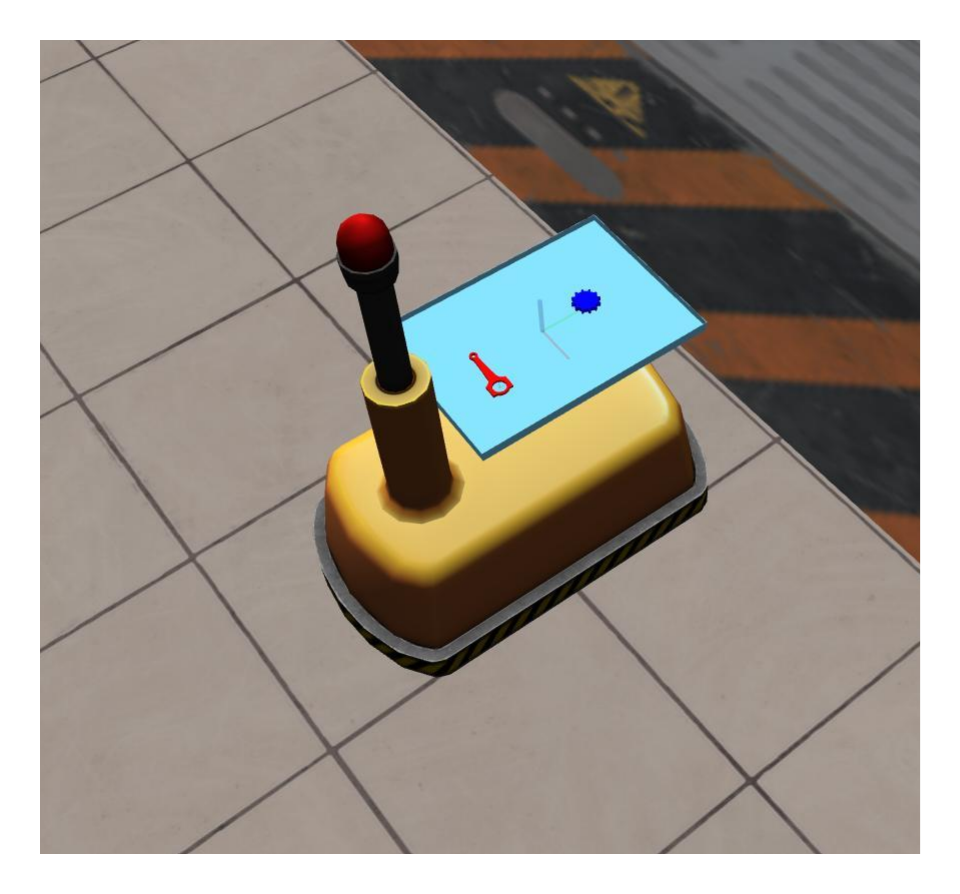
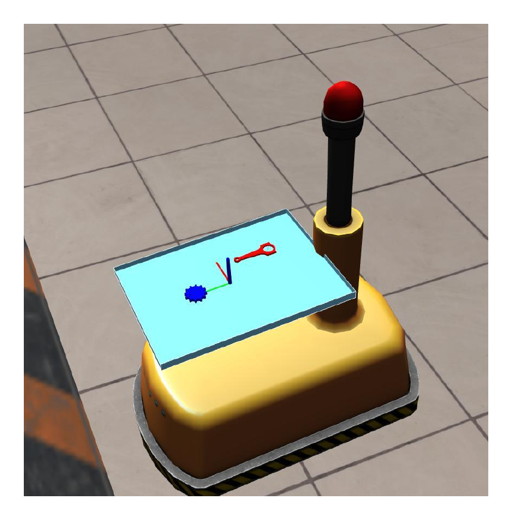
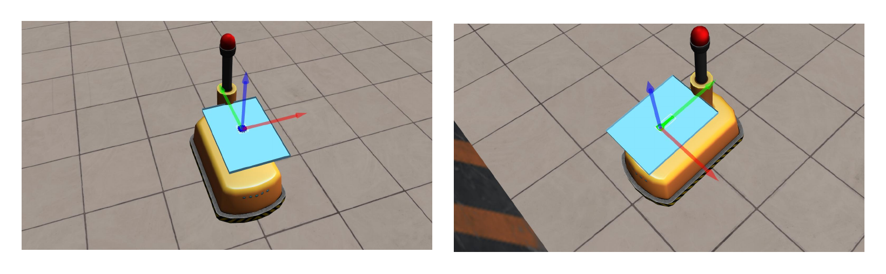
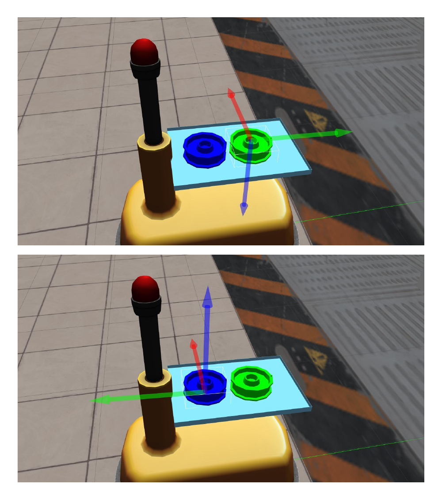

-------------------------------------------------
- Wiki | [Home](../../README.md) | [Documentation](../documentation/documentation.md) | [Tutorials](../tutorials/tutorials.md) | [Qualifiers](../qualifiers/qualifier.md) | [Finals](../finals/finals.md)
-------------------------------------------------

# Wiki | Documentation | Products
- This page outlines the specifications of the pose requirements specified in each Order.
- As outlined in the [competition specifications](competition_specifications.md#Order), an Order specifies a list of products to be put into each shipment. Each product has a specified type and required position and orientation in the shipping box.
- As specified on the [competition interface](competition_interface_documentation.md) page, Orders are communicated to teams with the `nist_gear/Order` ROS message.

## Type of the product
* The type of the product is specified as its product name, such as `gear_part_red` or `piston_rod_part_blue`.
  * **Note**: Previous ARIAC versions considered only the type of product. This year, product colors are considered on top of product types.
* The availability of these products in the workcell may be determined by querying the `material_locations` ROS service as specified [in this tutorial](../tutorials/gear_interface.md).

## Pose of the product in AGV trays
* The pose of the product is composed of the position and the orientation of the product **specified in the reference frame of the tray**.
* It is communicated in a [geometry_msgs/Pose](http://docs.ros.org/melodic/api/geometry_msgs/html/msg/Pose.html) message.

### Frame of the tray
* The following image depicts the frame of the kit tray on AGV1.
* The x, y, and z axes are represented by red, green and blue markers, respectively.

* The following image depicts kit tray for AGV1 that contains two parts:
   * One `gear_part_blue`with its origin at `(x, y, z) = (0, 0.15, 0)` (units in meters)
   * One `piston_rod_part_red` with its origin at `(x, y, z) = (0.1, -0.2, 0)` (units in meters)
   * Both parts have an orientation of `(roll, pitch, yaw) = (0, 0, 0)` (units in radians) with respect to the frame of the tray.

* The following image shows the same as above but for AGV2.
* Note that the parts still have an orientation of `(0, 0, 0)` with respect to the frame of the tray, but since the frame itself has a different orientation compared to AGV1, the parts are rotated.

### Frame of the product
* The pose of the product in the workcell environment will vary over time as the product is moved.
* The frame of each product is typically at the center of the product: it can be visualized by clicking on the product in the simulated workcell environment and pressing `t`: this will display the axes of the frame of the product.
* The following figure shows the frame of the `gear_part_blue` (left picture), with the `x`, `y` and `z` axes represented by red, green and blue markers, respectively.
* Not all parts have the frame origin at their center. The `piston_rod_part_green` (right picture), for example, has the origin of its frame off-center.

### Flipped products

- An order could contain a product that requires to be flipped, in which case the requested `roll` for the product will be specified as pi. 
- The Pulley part (`pulley_part_red`, `pulley_part_green`, and `pulley_part_blue`)  is the only product in the environment designed to be flippable. It has a flat collision surface on its top and bottom ends making it ideal for grasping it with a vacuum gripper. However, the side of the product is hollow, creating a more difficult grasp because of the small contact patch that the edges provide. 
  - Teams are not permitted to directly grasp this product from the side when a product flip is required.

### Determining the product pose in the tray programmatically
- The logical camera reports the pose of products and shipping boxes with respect to the pose of the camera.
- See the [sensor interface tutorial](../tutorials/sensor_interface.md) for details of how to use this sensor to programmatically determine the pose of products on the trays.
- Other sensors can also be used if combined with perception algorithms.
- **Note** that some parts have a raised mark on them so that their orientation can be detected.

-------------------------------------------------
- Wiki | [Home](../../README.md) | [Documentation](../documentation/documentation.md) | [Tutorials](../tutorials/tutorials.md) | [Qualifiers](../qualifiers/qualifier.md) | [Finals](../finals/finals.md)

-------------------------------------------------
