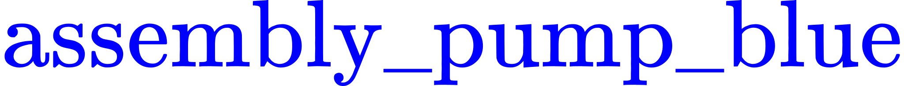

Wiki | [Home](../../README.md) | [Documentation](../documentation/documentation.md) | [Tutorials](../tutorials/tutorials.md) | [Qualifiers](../qualifiers/qualifier.md) | [Finals](../finals/finals.md)

-------------------------------------------------

# Wiki | Documentation | Scoring


- [Wiki | Documentation | Scoring](#wiki--documentation--scoring)
  - [Scoring System](#scoring-system)
  - [Stability](#stability)
  - [Cost metrics](#cost-metrics)
    - [Team System Cost (TC)](#team-system-cost-tc)
  - [Performance Metrics](#performance-metrics)
    - [Baseline System Cost (BC)](#baseline-system-cost-bc)
    - [Cost Factor (CF)](#cost-factor-cf)
    - [Shipment Completion Score (SCS)](#shipment-completion-score-scs)
      - [Kitting](#kitting)
        - [Movable Tray](#movable-tray)
        - [Products](#products)
      - [Assembly](#assembly)
    - [Order Completion Score (OCS)](#order-completion-score-ocs)
    - [Order Time (OT)](#order-time-ot)
    - [Average Time (AT)](#average-time-at)
    - [Efficiency Factor (EF)](#efficiency-factor-ef)
    - [Collision (CO)](#collision-co)
  - [Trial Score (TS)](#trial-score-ts)


## Scoring System

```
Final Score
│
└───Trial Scores + Human Judges
    │   
    └───Order Scores
        │
        └───Shipment Scores
```

Each competitor's system will be assessed on a set of trials during the qualifiers and the finals. The assessment results in a Final Score, which is a combination of cost and performance metrics after completing the qualifiers and the finals. The Final Score is  calculated as the sum of Trial Score for each of the competition trials. Each Trial Score consists of at least one Order Score and each Order Score consists of at least one Shipment Score.
- In the qualifiers, the Final Scores will be calculated only using Trial Scores. Final Scores will be used to decide which teams move to the finals. 
- In the finals, the Final Scores will be calculated using Trial Scores along with scores assigned by human judges. Judging criteria are as follows:
  - **Average of Judge Scoring** (20 points): The judges will provide a total score of 20 points, broken down as follows:
  - **Novelty/Innovativeness**: Approach taken develops new techniques to advance industry robot agility (Up to six points)
  - **Ability for Industry to Implement**: Approach taken can reasonably be applied by industry to solve similar challenges. (Up to six points)
  - **Alignment with the Spirit of the Competition**: Approach taken provides a practical and realistic approach that directly addresses the stated goals of the ARIAC Competition. (Up to eight points)

## Stability

- As outlined in the [update policy](update_policy.md), changes to the scoring metrics may be made between rounds of the competition at the discretion of the competition controllers.
- Qualifying teams will be made aware of the final scoring parameters in advance of the Finals of the competition.

## Cost metrics

- The cost metrics are calculated from a team's system setup.
- Since the same system setup is used for **all trials**, this value is constant for a competitor for all trials.
- The value in **bold** is used in the final score calculation.

### Team System Cost (TC)

- Cost of a competitor's system (sum of the cost of sensors used).
  - $300 Gantry camera (RGBD) showing gantry tray.
  - $600 Gantry camera (RGBD) showing the bins.
  - $500 for each logical camera used.
  - $300 for each RGBD camera used.
  - $200 for each depth camera used.
  - $100 for each other sensor used (breakbeam, proximity, etc).

## Performance Metrics

- Performance metrics cover both *completion* and *efficiency* and they are calculated for each trial separately.
  - *Completion* captures the quality of the shipments submitted.
  - *Efficiency* captures the responsiveness in fulfilling orders.
- There are up to two orders requested during each trial, each composed of up to two shipments.
- The following values are calculated for each order requested in a trial.
- The values in **bold** will be used in the final score calculation for a trial.

### Baseline System Cost (BC)

The baseline system cost <!-- ${BC}$ -->  is a constant cost set by NIST. This cost is calculated by adding up the cost of each camera and sensor that can cover all possible scenarios in the given workcell. The result is computed for the worst case scenario, that is, no optimization of sensor placement was taken into account.

<!-- $$
BC=8200
$$ --> 

<div align="center"></div>


### Cost Factor (CF)

The cost factor <!-- $\mathbf{CF}$ -->  is a comparison of <!-- ${BC}$ -->  to <!-- $TC$ -->   where  <!-- $\mathbf{CF}=\frac{BC}{TC}$ --> .

- <!-- $\mathbf{CF}=1$ -->   if <!-- $BC=TC$ --> .
- Competitors with <!-- $TC<BC$ -->   will be rewarded by having <!-- $\mathbf{CF}>1$ --> .
- Competitors with <!-- $TC>BC$ -->  will be penalized by having <!-- $\mathbf{CF}<1$ --> .
  
<!-- **Note** that products must be placed onto the base of the shipping box to count for scoring, not on top of other products. -->
### Shipment Completion Score (SCS)

#### Kitting

The score of a kitting shipment depends heavily on the movable tray required in the shipment. There will always be at least one movable tray of the correct model for each kitting shipment. The pose tolerance for a movable tray is <!-- $\pm$ --> 2 cm for position and <!-- $\pm$ --> 0.1 rad for orientation.

##### Movable Tray

Score for movable trays:

- If no movable tray is used for a kitting shipment when one movale tray is required then the score is 0 for the shipment.
- If the correct movable tray is used but its pose in the static kit tray is incorrect then the bonus is NOT awarded.
- If the wrong movable tray is used then points for correct product pose and bonus are not awarded.

##### Products
<!--  -->

Score for products are computed within a movable tray. For each non-faulty product <!-- $i$ -->  in a shipment of <!-- $n$ -->  products, the shipment completion score <!-- $SCS$ -->  is computed as follows:

<!-- $$
SCS=(\sum_{i=1}^{n} PCT_i + PCC_i + PCP_i + bonus) \times destination
$$ --> 

<div align="center"></div>

- <!-- $PCT_i=1$ -->  if the product <!-- $i$ -->  is of the correct type and is placed flat in the tray. <!-- $\mathrm{\mathbf{Example}}$ --> : If <!-- $\textcolor{red}{\mathrm{assembly\_pump\_red}}$ -->  is requested in the shipment but <!-- $\textcolor{blue}{\mathrm{assembly\_pump\_blue}}$ -->  was placed instead, then 1pt is awarded since the type <!-- $\mathrm{pump}$ --> () is correct.
- <!-- $PCC_i=1$ -->  if the product <!-- $i$ -->  is of the correct type, of the correct color, and is placed flat in the tray. <!-- $\mathrm{\mathbf{Counter\,\,Example}}$ -->  :  If <!-- $\textcolor{red}{\mathrm{assembly\_pump\_red}}$ -->  is requested in the shipment but <!-- $\textcolor{red}{\mathrm{assembly\_battery\_red}}$ -->  was placed instead, then NO point is awarded. Even though these two products are of the same color, they are not of the same type.
- <!-- $PCP_i=1$ -->  if the product <!-- $i$ -->  is placed in the correct pose, is of the correct color, is of the correct type, and is placed flat in the tray. The pose tolerance for a product within a movable tray is <!-- $\pm$ --> 3 cm for position and <!-- $\pm$ --> 0.1 rad for orientation.
- <!-- $bonus = n$ -->  if for each non-faulty product <!-- $i$ -->  in a shipment of <!-- $n$ -->  products: <!-- $PCT_i=1$ -->  and <!-- $PCC_i=1$ -->  and <!-- $PCP_i=1$ --> .
- <!-- $destination = correct_{agv} \times correct_{station}$ -->  where: 
  - <!-- $correct_{agv}=1$ -->  if the shipment was built on the correct AGV, otherwise <!-- $correct_{agv}=0$ --> .
  - <!-- $correct_{station}=1$ -->  if the shipment was submitted to the correct assembly station, otherwise <!-- $correct_{station}=0$ --> .


#### Assembly

<!--  -->

For each non-faulty product <!-- $i$ -->  in an assembly shipment of <!-- $n$ -->  products, the shipment completion score <!-- $SCS$ -->  for assembly is computed as shown in the formula below where the pose tolerance for a product in a briefcase is <!-- $\pm$ --> 2 cm for position and <!-- $\pm$ --> 0.1 rad for orientation.

<!-- $$
SCS=(\sum_{i=1}^{n} PCTP_i + PCC_i + bonus) \times destination
$$ --> 
<div align="center"></div>


- <!-- $PCTP_i=2$ -->  if the product is of the correct type and has the correct pose. No partial point is awarded, it is either 0 or 2. <!-- $\mathrm{\mathbf{Example}}$ --> : If <!-- $i$ -->  is of the correct type but the pose is not correct then <!-- $PCTP_i=0$ -->  for  <!-- $i$ --> .
- <!-- $PCC_i=1$ -->  for <!-- $i$ -->  if <!-- $PCTP_i=2$ -->  and <!-- $i$ -->  has the correct color. 
- <!-- $bonus$ --> : An all-products bonus is awarded to make a maximum of 4 times the number of products being inserted into the assembly (for the ventilator briefcase design, the bonus would be a maximum of 16 for a fully completed ventilator of 4 products).

  - <!-- $bonus=4\times n$ -->  for <!-- $n$ -->  products in the shipment if for each product <!-- $i$ --> , <!-- $PCTP_i=2$ -->  and <!-- $PCC_i=1$ --> . Otherwise, <!-- $bonus=0$ --> .
  - <!-- $destination=0$ -->  if assembly was done at the wrong assembly station. Otherwise,  <!-- $destination=1$ --> .

### Order Completion Score (OCS)

The order completion score <!-- $\mathbf{OCS}$ -->  is the sum of the shipment completion score for each shipment <!-- $n$ -->  in the order. The formula for <!-- $\mathbf{OCS}$ -->  is given by the following formula:

<!-- $$
\mathbf{OCS}=\sum_{n=1}^{2} SCS_n
$$ --> 

<div align="center"></div>

For a trial with two orders, <!-- $\mathbf{OCS_1}$ -->  and <!-- $\mathbf{OCS_2}$ -->  are computed for the first and for the second order, respectively.

### Order Time (OT)

The order time <!-- $OT$ -->  is the time taken to complete the order, measured from when the order was first announced. If there are 2 orders that need to be completed, then <!-- $OT_1$ -->  and <!-- $OT_2$ -->  will be computed for the first order and for the second order, respectively. 


### Average Time (AT)

The average time <!-- $AT$ -->  is computed by averaging the time taken by each competitor to complete the order in a trial. If a trial consists of two orders, then <!-- $AT_1$ -->  and <!-- $AT_2$ -->  are computed for the first order and for the second order, respectively.


### Efficiency Factor (EF)

The efficient factor <!-- $\mathbf{EF}$ -->  assesses how efficient was one competitor's system  compared to the combined systems of the other competitors in the completion of an order within a trial. The efficient factor for an order is computed as follows:
<!-- $$
\mathbf{EF}=\frac{AT}{OT}
$$ --> 

<div align="center"></div>
If a trial consists of two orders, the efficiency factor for the first order and for the second order  are computed as shown below:

<!-- $$
\mathbf{EF_1}=\frac{AT_1}{OT_1}, \mathbf{EF_2}=\frac{AT_2}{OT_2}
$$ --> 

<div align="center"></div>

### Collision (CO)

A collision occurs when both robots collide with each other, when a robot collides with itself, or when a robot collides with a simulated human. If any collision occurs, <!-- $\mathbf{CO}=0$ --> . In the case of no collision, <!-- $\mathbf{CO}=1$ --> .


## Trial Score (TS)

The score <!-- $TS$ -->  for a given trial is computed as follows:

<!-- $$
TS=(CO\times (CF\times avg(\sum_{j=1}^{2} OCS_j)+EF_1\times OCS_1 + EF_2\times OCS_2\times h))-penalty
$$ --> 

<div align="center"></div>

- The subscript <!-- $j$ -->  refers to each order in a trial.
- <!-- $h=3$ -->  is a high-priority factor which encourages quick response to the second order (higher priority).
- <!-- $penalty$ -->  is the sum of all parts dropped on the floor by the robots.


-------------------------------------------------

Wiki | [Home](../../README.md) | [Documentation](../documentation/documentation.md) | [Tutorials](../tutorials/tutorials.md) | [Qualifiers](../qualifiers/qualifier.md) | [Finals](../finals/finals.md)
