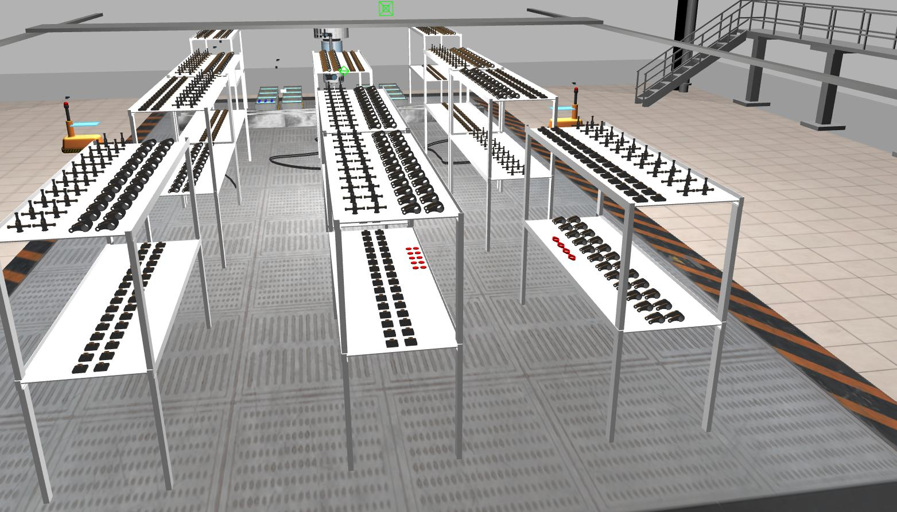
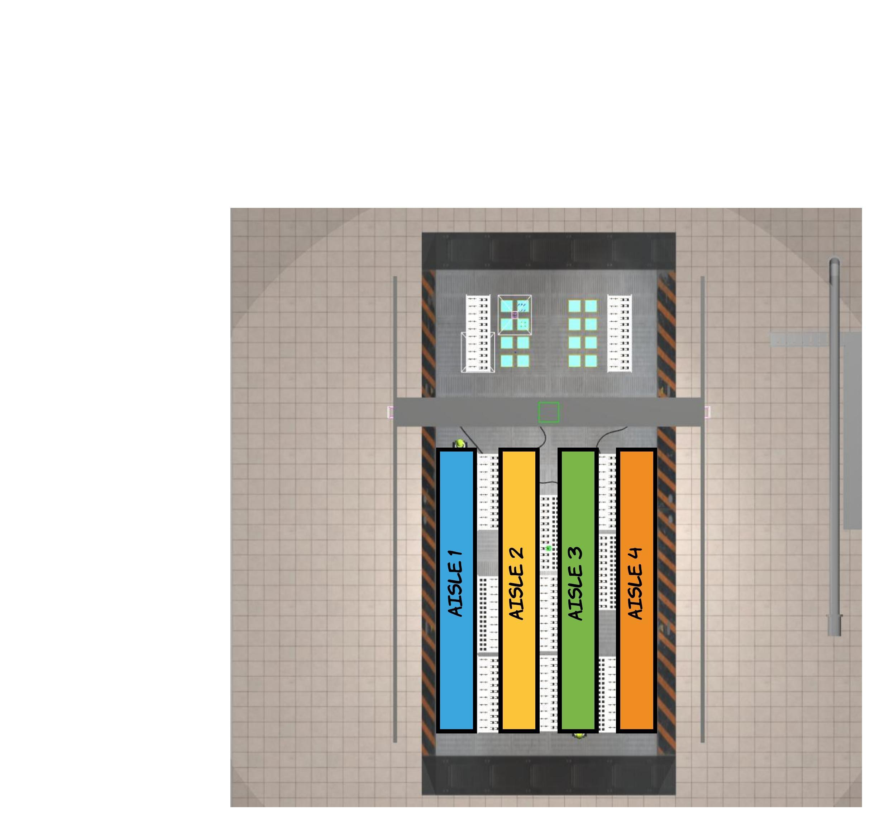

-------------------------------------------------
- Wiki | [Home](../../README.md) | [Documentation](../documentation/documentation.md) | [Tutorials](../tutorials/tutorials.md) | [Qualifiers](../qualifiers/qualifier.md) | [Finals](../finals/finals.md)
-------------------------------------------------

# Wiki | Qualifiers | Scenarios

This page describes the scenarios that are used in [ARIAC 2020 qualification](qualifier.md).

The following applies to both scenarios:

* The trials have a time limit of 500 simulation seconds
  * Any unfulfilled shipments when the time limit is reached will not be scored
  * Subscribe to `/clock` to know the current simulation time
* The use of any "cheat" interfaces is forbidden, and will be blocked in the [automated evaluation setup](../tutorials/automated_evaluation.md)

# Part A
- Part A is released for teams to practice with, and is also part of a teams qualification score.
- There are 3 trial config files:
  - <b>[qual_a_1.yaml](https://github.com/usnistgov/ARIAC/blob/master/nist_gear/config/qual_a_1.yaml)</b>
  - <b>[qual_a_2.yaml](https://github.com/usnistgov/ARIAC/blob/master/nist_gear/config/qual_a_2.yaml)</b>
  - <b>[qual_a_3.yaml](https://github.com/usnistgov/ARIAC/blob/master/nist_gear/config/qual_a_3.yaml)</b>

- In the commands found on the current page:
  - Replace `<path/to/your/config/file.yaml>` with the path to your team's [environment configuration file](configuration_spec.md#markdown-header-competitor-configuration-file).
  - Replace `<path/to/config/folder>` with the path to the config folder where <b>qual_a_1.yaml</b>, <b>qual_a_2.yaml</b>, and <b>qual_a_3.yaml</b> are located.

**Note:** By default simulation state logging is enabled in the trial config files. To disable it during development you can add `--state-logging=no` to the commands below.

## Part A-Trial 1

- Config file for this trial: <b>[qual_a_1.yaml](https://github.com/usnistgov/ARIAC/blob/master/nist_gear/config/qual_a_1.yaml)</b>

<figure>  
	  
	<figcaption>Figure 1.</figcaption>
</figure>  


<table>
  <tr>
   <th align="center" colspan="3">Part A - Trial 1</th>
   </tr>
   <tr>
     <th>ID</th>
     <th>Status</th>
     <th>Description</th>
   </tr>
   <tr>
     <td width="35%">Number of orders</td>
     <td width="10%">1</td>
     <td width="65%"></td>
   </tr>
   <tr>
     <td width="35%">Number of shipments</td>
     <td width="10%">1</td>
     <td width="65%"><ul><li>One shipment per order.</ul></li></td>
   </tr>
   <tr>
     <td width="35%">Faulty gripper</td>
     <td width="10%">No</td>
     <td width="65%"><ul><li>Parts will not dropped from grippers.</ul></li></td>
   </tr>  
   <tr>
     <td width="35%">Faulty products</td>
     <td width="10%">Yes</td>
     <td width="65%"><ul><li>Faulty products are present and should not be used to complete the order.</ul></li></td>
   </tr>  
   <tr>
     <td width="35%">Sensor blackout</td>
     <td width="10%">No</td>
     <td width="65%"></td>
   </tr>
   <tr>
     <td width="35%">High-priority order</td>
     <td width="10%">No</td>
     <td width="65%"></td>
   </tr>
   <tr>
     <td width="35%">Updated order</td>
     <td width="10%">Yes</td>
     <td width="65%"><ul><li>The order will be updated at a convenient time.<ul><li>One part type needs to be replaced by another part type.</ul></li><ul><li>One part in the tray must be moved to another location within the tray.</ul></li></ul></li><ul><li>The shipment will be scored against the updated order.</ul></li></td>
   </tr>  
   <tr>
     <td width="35%">Product flipping</td>
     <td width="10%">No</td>
     <td width="65%"></td>
   </tr>
   <tr>
     <td width="35%">Two arms advantageous</td>
     <td width="10%">Yes</td>
     <td width="65%"><ul><li>Products are placed on two opposite shelves so they can be picked up by both arms (see figure above).</ul></li></td>
   </tr>
   <tr>
     <td width="35%">Order products from belt</td>
     <td width="10%">No</td>
     <td width="65%"><ul><li>Conveyor belt is not active.</ul></li></td>
   </tr>
   <tr>
     <td width="35%">Order products from bins</td>
     <td width="10%">Yes</td>
     <td width="65%"><ul><li>Some parts must be retrieved from bin(s) to complete the order.</ul></li></td>
   </tr>
   <tr>
     <td width="35%">Order products from shelves</td>
     <td width="10%">Yes</td>
     <td width="65%"><ul><li>Some parts must be retrieved from the shelves to complete the order.</ul></li></td>
   </tr>
   <tr>
     <td width="35%">Moving obstacles</td>
     <td width="10%">No</td>
     <td width="65%"></td>
   </tr>
   <tr>
     <td width="35%">AGV used</td>
     <td width="10%">Any</td>
     <td width="65%"><ul><li>AGV1 or AGV2 can be used to complete the order.</ul></li></td>
   </tr>
   <tr>
     <td width="35%">Time limit</td>
     <td width="10%">No</td>
     <td width="65%"></td>
   </tr>
</table>
### How to run it

Run with your team's config file:

```bash
rosrun nist_gear gear.py -f <path/to/config/folder>/qual_a_1.yaml \
<path/to/your/config/file.yaml> \
--development-mode --verbose
```
## Part A-Trial 2

- Config file for this trial: <b>[qual_a_2.yaml](https://github.com/usnistgov/ARIAC/blob/master/nist_gear/config/qual_a_2.yaml)</b>


<figure>  
	  
	<figcaption>Figure 2.</figcaption>
</figure> 


<table>
  <tr>
   <th align="center" colspan="3">Part A - Trial 2</th>
   </tr>
   <tr>
     <th>ID</th>
     <th>Status</th>
     <th>Description</th>
   </tr>
   <tr>
     <td width="35%">Number of orders</td>
     <td width="10%">1</td>
     <td width="65%"></td>
   </tr>
   <tr>
     <td width="35%">Number of shipments</td>
     <td width="10%">1</td>
     <td width="65%"></td>
   </tr>
   <tr>
     <td width="35%">Faulty gripper</td>
     <td width="10%">Yes</td>
     <td width="65%"><ul><li>Grippers are faulty and will drop parts over each AGV.</ul></li></td>
   </tr>  
   <tr>
     <td width="35%">Faulty products</td>
     <td width="10%">Yes</td>
     <td width="65%"><ul><li>Faulty products are present and should not be used to complete the order.</ul></li></td>
   </tr>  
   <tr>
     <td width="35%">Sensor blackout</td>
     <td width="10%">Yes</td>
     <td width="65%"><ul><li>Communication with the sensors will be lost temporarily (50-100 simulation seconds).</ul></li></td>
   </tr>
   <tr>
     <td width="35%">High-priority order</td>
     <td width="10%">No</td>
     <td width="65%"></td>
   </tr>
   <tr>
     <td width="35%">Updated order</td>
     <td width="10%">No</td>
     <td width="65%"></td>
   </tr>  
   <tr>
     <td width="35%">Product flipping</td>
     <td width="10%">No</td>
     <td width="65%"></td>
   </tr>
   <tr>
     <td width="35%">Two arms advantageous</td>
     <td width="10%">Yes</td>
     <td width="65%"><ul><li>Products are placed on two opposite shelves so they can be picked up by both arms (see figure above).</ul></li></td>
   </tr>
   <tr>
     <td width="35%">Order products from belt</td>
     <td width="10%">Yes</td>
     <td width="65%"><ul><li>Some parts must be retrieved from the belt to complete the order.</ul></li></td>
   </tr>
   <tr>
     <td width="35%">Order products from bins</td>
     <td width="10%">Yes</td>
     <td width="65%"><ul><li>Some parts must be retrieved from bin(s) to complete the order.</ul></li></td>
   </tr>
   <tr>
     <td width="35%">Order products from shelves</td>
     <td width="10%">Yes</td>
     <td width="65%"><ul><li>Some parts must be retrieved from the shelves to complete the order.</ul></li></td>
   </tr>
   <tr>
     <td width="35%">Moving obstacles</td>
     <td width="10%">Yes</td>
     <td width="65%"><ul><li>One moving obstacle in aisle 3 (see Figure 2.).</ul></li></td>
   </tr>
   <tr>
     <td width="35%">AGV used</td>
     <td width="10%">Any</td>
     <td width="65%"><ul><li>Shipments must be delivered on both AGV1 and AGV2.</ul></li></td>
   </tr>
   <tr>
     <td width="35%">Time limit</td>
     <td width="10%">Yes</td>
     <td width="65%">500 s</td>
   </tr>
</table>


### How to run it

Run with your team's config file

```bash
rosrun nist_gear gear.py -f <path/to/config/folder>/qual_a_2.yaml \
<path/to/your/config/file.yaml> \
--development-mode --verbose
```

## Part A-Trial 3
- Config file for this trial: <b>[qual_a_3.yaml](https://github.com/usnistgov/ARIAC/blob/master/nist_gear/config/qual_a_3.yaml)</b>

<table>
  <tr>
   <th align="center" colspan="3">Part A - Trial 3</th>
   </tr>
   <tr>
     <th>ID</th>
     <th>Status</th>
     <th>Description</th>
   </tr>
   <tr>
     <td width="35%">Number of orders</td>
     <td width="10%">2</td>
     <td width="65%"><ul><li>The first order is interrupted by a second order.</ul></li></td>
   </tr>
   <tr>
     <td width="35%">Number of shipments</td>
     <td width="10%">2</td>
     <td width="65%"><ul><li>One shipment for original order and one shipment for highest priority order.</ul></li></td>
   </tr>
   <tr>
     <td width="35%">Faulty gripper</td>
     <td width="10%">No</td>
     <td width="65%"></td>
   </tr>  
   <tr>
     <td width="35%">Faulty products</td>
     <td width="10%">No</td>
     <td width="65%"></td>
   </tr>
   <tr>
     <td width="35%">Sensor blackout</td>
     <td width="10%">No</td>
     <td width="65%"></td>
   </tr>
   <tr>
     <td width="35%">High-priority order</td>
     <td width="10%">Yes</td>
     <td width="65%"><ul><li>The second order is of highest priority.</ul></li></td>
   </tr>
   <tr>
     <td width="35%">Updated order</td>
     <td width="10%">No</td>
     <td width="65%"></td>
   </tr>  
   <tr>
     <td width="35%">Product flipping</td>
     <td width="10%">Yes</td>
     <td width="65%"><ul><li>A product must be flipped to complete one of the orders.</ul></li></td>
   </tr>
   <tr>
     <td width="35%">Two arms advantageous</td>
     <td width="10%">No</td>
     <td width="65%"><ul><li>Products are placed on shelves but the robot will need to switch between aisles to grasp them.</ul></li></td>
   </tr>
   <tr>
     <td width="35%">Order products from belt</td>
     <td width="10%">No</td>
     <td width="65%"><ul><li>Belt is not activated.</ul></li></td>
   </tr>
   <tr>
     <td width="35%">Order products from bins</td>
     <td width="10%">Yes</td>
     <td width="65%"><ul><li>Some parts must be retrieved from bin(s) to complete the order.</ul></li></td>
   </tr>
   <tr>
     <td width="35%">Order products from shelves</td>
     <td width="10%">Yes</td>
     <td width="65%"><ul><li>Some parts must be retrieved from the shelves to complete the order.</ul></li></td>
   </tr>
   <tr>
     <td width="35%">Moving obstacles</td>
     <td width="10%">2</td>
     <td width="65%"><ul><li>One moving obstacle in aisle 1 and one moving obstacle in aisle 3 (see figure above).</ul></li></td>
   </tr>
   <tr>
     <td width="35%">AGV used</td>
     <td width="10%">AGV 1 and AGV 2</td>
     <td width="65%"><ul><li>First order must be completed on AGV 1.</ul></li><ul><li>Second order must be completed on AGV 2.</ul></li></td>
   </tr>
   <tr>
     <td width="35%">Time limit</td>
     <td width="10%">No</td>
     <td width="65%"><ul><li>No time limit for both orders but the second order should be completed as fast as possible.</ul></li></td>
   </tr>
</table>


### How to run it

Run with your team's config file

```bash
rosrun nist_gear gear.py -f <path/to/config/folder>/qual_a_3.yaml \
<path/to/your/config/file.yaml> \
--development-mode --verbose
```


# Part B

- Part B is not released for teams to practice with.
- Part B will present previously unseen scenarios to test system autonomy.

- Trial configs for Part B will have the following characteristics:
  - Any or all [agility challenges](../documentation/agility_challenges.md) may be present:
    - Faulty products.
    - High-priority order interruption.
    - Flipped products (only the `pulley_part` can be flipped).
    - Insufficiently many non-faulty products available.
    - Updates to an existing order.
    - Specific AGV destinations forcing products to be handled by both arms.
    - Faulty gripper dropping products.
    - Lost sensor communication.
    - There will be at most 2 orders, each made up of at most 2 shipments.
    - Same number of storage bins:
      - Some bins may be empty.
      - At most 1 product type per bin.
    - Some products may be available only via the conveyor.
    - Same AGV and quality control sensor placement.
    - Only pulleys can be requested to be flipped (roll=pi):
      - All products start in the bins unflipped.

-------------------------------------------------
- Wiki | [Home](../../README.md) | [Documentation](../documentation/documentation.md) | [Tutorials](../tutorials/tutorials.md) | [Qualifiers](../qualifiers/qualifier.md) | [Finals](../finals/finals.md)

-------------------------------------------------
