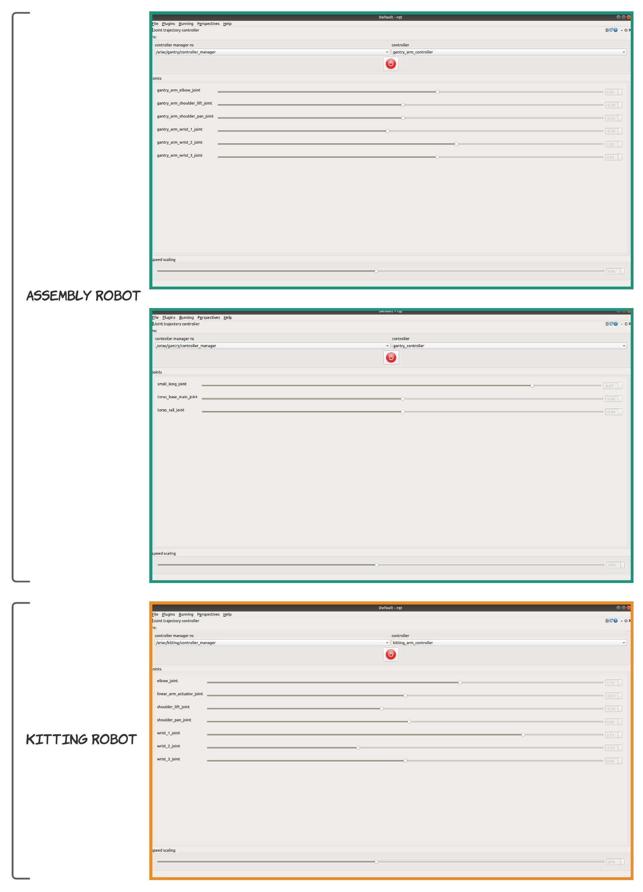
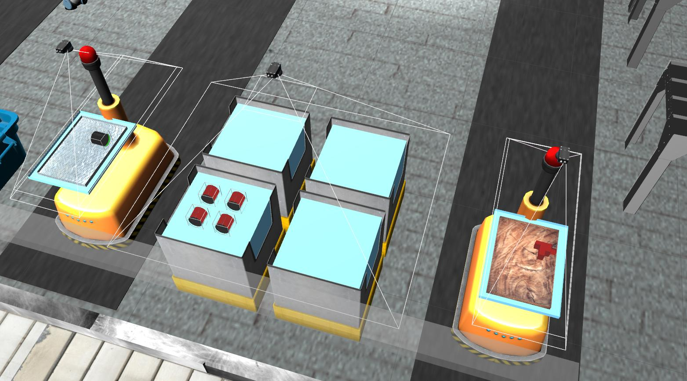

Wiki | [Home](../../README.md) | [Documentation](../documentation/documentation.md) | [Tutorials](../tutorials/tutorials.md) | [Qualifiers](../qualifiers/qualifier.md) | [Finals](../finals/finals.md)

-------------------------------------------------

- [Wiki | Tutorials | Interacting with GEAR](#wiki--tutorials--interacting-with-gear)
  - [Start GEAR](#start-gear)
  - [Start/Stop the Competition](#startstop-the-competition)
  - [Receive Orders](#receive-orders)
    - [Notes](#notes)
  - [Complete Orders](#complete-orders)
    - [Submit Kitting Shipments](#submit-kitting-shipments)
    - [Submit Assembly Shipments](#submit-assembly-shipments)
    - [Faulty Products](#faulty-products)
  - [Control the Robots](#control-the-robots)
    - [Control a Vacuum Gripper](#control-a-vacuum-gripper)
    - [Control Arm Joints](#control-arm-joints)
      - [Use rqt GUI](#use-rqt-gui)
    - [MoveIt](#moveit)
  - [Visualize in RViz](#visualize-in-rviz)
  - [Query Locations of Products](#query-locations-of-products)

# Wiki | Tutorials | Interacting with GEAR

The purpose of this tutorial is to introduce you to the [API](../documentation/api.md) which is used to interact with GEAR, the software used by competitors participating in the Agile Robotics for Industrial Automation Competition (ARIAC).

## Start GEAR

After building GEAR from source (see [Wiki | Tutorials | Installation](installation.md)), you will have to source the setup file from your catkin workspace. In the following example we assume your catkin workspace is `ariac_ws`, located in your `Home` directory.

```bash
$ source ~/ariac_ws/devel/setup.bash
```

To launch GEAR with a sample work cell that has some sensors and parts in various locations, run:

```bash
$ roslaunch nist_gear sample_environment.launch
```

## Start/Stop the Competition

When GEAR is started, various competition elements will be in an inactive state. A service must be called to activate these components.

Run the following command to manually start the competition:

```bash
$ rosservice call /ariac/start_competition
```

When all orders have been filled, or the time limit for the trial has been exhausted, the competition state published on `/ariac/competition_state` will change to `done`. To check the competition state, run:

```bash
$ rostopic echo /ariac/competition_state -n 1
```

If you wish to end the trial early (e.g. you detected a fault in your system and wish to terminate), run:

```bash
$ rosservice call /ariac/end_competition
```

## Receive Orders

Once the competition has started, competitors will start receiving orders on the `ariac/orders` topic. All the orders must be completed in due time to be awarded the maximum score. Competitors must subscribe to this topic to receive the initial order, as well as any future order updates.

To see the last order that was published, run:

```bash
$ rostopic echo /ariac/orders -n 1
```

### Notes

- The competition must be started before an order will be published.
- The most recently received order is usually the highest priority.
- If a trial consists of multiple orders, only the most recent order will be published on `ariac/orders` (the previous order will be replaced with the new order).

Below is an example of an order published on `ariac/orders`.

```bash {.line-numbers}
order_id: "order_0"
kitting_shipments: 
  - 
    shipment_type: "order_0_kitting_shipment_0"
    agv: "agv2"
    assembly_station: "as1"
    movable_tray: 
      movable_tray_type: "movable_tray_metal_shiny"
      gripper: "gripper_tray"
      pose: 
        position: 
          x: 0.0
          y: 0.0
          z: 0.0
        orientation: 
          x: 0.0
          y: 0.0
          z: 0.0
          w: 1.0
    products: 
      - 
        type: "assembly_pump_red"
        gripper: "gripper_part"
        pose: 
          position: 
            x: -0.1
            y: -0.1
            z: 0.0
          orientation: 
            x: 0.0
            y: 0.0
            z: 0.0
            w: 1.0
assembly_shipments: 
  - 
    shipment_type: "order_0_assembly_shipment_0"
    station_id: "as2"
    products: 
      - 
        type: "assembly_regulator_red"
        gripper: "gripper_part"
        pose: 
          position: 
            x: -0.222
            y: -0.164
            z: 0.212
          orientation: 
            x: -3.58054498549e-25
            y: 0.707106781188
            z: -3.58054498549e-25
            w: 0.707106781185


```

- ```order_id``` is the id for the order published. This id is unique. If a second order exists, it will be named either ```"order_1"``` or ```"order_0_update"```.
  - ```kitting_shipments``` describes all the shipments related to kitting. This example shows only one kitting shipment. 
    - ```shipment_type``` is a unique id for the current shipment. The type (```"order_0_kitting_shipment_0"```) is passed as an argument to submit a shipment.
    - ```agv``` specifies which AGV should be used to build and submit this shipment.
    - ```assembly_station``` specifies the station to send the shipment when it is completed.
    - ```movable_tray``` provides information on the movable tray needed for this shipment
      - ```movable_tray_type``` describes the model (or type) of the movable tray.
      - ```gripper``` specifies which gripper type must be used to grasp this movable tray.
      - ```pose``` describes the pose of the movable tray on the AGV, in this example, in the ```kit_tray_1``` frame.
    - ```products``` informs on the type, color, and pose of each product that is needed for the shipment. In this example, the kitting shipment requires only one product. Note that the pose is relative to the movable tray.
  - ```assembly_shipments``` describes all the shipments related to assembly.
    - ```shipment_type``` is a unique id for the current shipment. The type (```"order_0_assembly_shipment_0"```) is passed as an argument to submit a shipment.
    - ```station_id``` specifies the assembly station where assembly must be performed. When assembly is required, competitors will either have to build and ship a kit to an assembly station (i.e., do kitting first) or the environment will start with the AGV and needed parts already at the assembly station.
    - ```products``` informs on the type, color, and pose of each product that is needed for the shipment. In this example, the assembly shipment requires only one product. Note that the pose is relative to the briefcase located at the assembly station.

The example above shows an order with two shipments of different types. An order usually consists of one shipment where the shipment can be either `kitting` or `assembly`.

## Complete Orders

To complete an order, all the shipments in the order must be submitted.

### Submit Kitting Shipments

Kitting must be done on the back of AGVs, after a movable tray is placed on the AGVs. When a kit has been completed, the AGV must be commanded to deliver the kit so it can be scored. A kitting shipment submission will always take the AGV from a kitting station to an assembly station. The shipment will be scored as soon as it is submitted (even though the AGV has not physically reached the assembly station).

- The service `/ariac/agv{N}/submit_shipment as{N} shipment_type` is used to submit kitting shipments where `N` is a value in the range [1,4] and `as` stands for assembly station.
  - `agv{N}` is used to specify which AGV to submit. This should match the AGV specified in the kitting shipment in an order (see the field `agv: "agv2"` in the order above, line 5).
  - `as{N}` is used to specify the assembly station where the kitting shipment must be delivered. This should match the station specified in the kitting shipment (see the field `assembly_station: "as1"` under `kitting_shipments` in the order above, line 6).

To submit the kitting shipment described in the order above, one would call the submission service in a terminal as follows:

```bash
$ rosservice call /ariac/agv2/submit_shipment "as1" "order_0_kitting_shipment_0"
```


- Shipments built on the wrong AGV will receive a score of 0.
- Shipments submitted to the wrong assembly station will receive a score of 0.
- Non-use of a movable tray results in a score of 0.

### Submit Assembly Shipments

Assembly can be performed at four different assembly stations. When assembly has been completed, the station used for assembly must be scored.

- The service `/ariac/as{N}/submit_shipment shipment_type` is used to submit assembly shipments where `N` is a value in the range [1,4] and `as` stands for assembly station.
  - `as{N}` is used to specify the assembly station to be scored. This should match the station specified in the assembly shipment (see the field `station_id: "as4"` under `assembly_shipments` in the order above).

To submit the assembly shipment described in the order above, one needs to use the following service:

```bash
$ rosservice call /ariac/as2/submit_shipment "order_0_assembly_shipment_0"
```

### Faulty Products

- There is a quality control sensor above each AGV. Quality control sensors (QCS) publish the pose of faulty parts that they see on the tray.
  - QCSs have an equivalent interface to logical camera sensors.
  - QCSs publish tf frames of faulty parts.
  - QCSs are positioned above each AGV in pre-defined locations.
  - QCSs have a preset pose and users cannot specify the locations of these sensors.
  - QCSs report faulty parts only once they are in the tray of an AGV.
  - QCSs do not report any information about non-faulty parts.

We will test one quality control sensor with the use of [no_parts.yaml](../../nist_gear/config/trial_config/misc/no_parts.yaml). This configuration file will not spawn any part in the workcell but it describes two faulty parts: `assembly_pump_red_1` and `assembly_pump_red_2`.

```yaml
faulty_products:
  - assembly_pump_red_1
  - assembly_pump_red_2
```

 Note that this configuration file is only for demonstration purpose.


Edit `sample_environment.launch` to use the trial configuration file `no_parts.yaml`. 

```xml
<node name="ariac_sim" pkg="nist_gear" type="gear.py"
        args="--development-mode
          $(arg verbose_args)
          $(arg state_logging_args)
          $(arg gui_args)
          $(arg load_moveit_args)
          $(arg fill_demo_shipment_args)
          --visualize-sensor-views
          -f $(find nist_gear)/config/trial_config/misc/no_parts.yaml
          $(find nist_gear)/config/user_config/sample_user_config.yaml
          " required="true" output="screen" />
```

Start the ARIAC simulation environment with the command below.
  
  ```bash
  $ roslaunch nist_gear sample_environment.launch
  ```


The command below spawns these faulty part in the tray located on agv1. ***Note***: This command is not available during qualifiers and finals. However, it is a very useful command to test and debug your application.

```bash
$ rosrun gazebo_ros spawn_model -sdf -x 0.1 -y 0.1 -z 0.05 -R 0 -P 0 -Y 0 -file `rospack find nist_gear`/models/assembly_pump_red_ariac/model.sdf -reference_frame agv1::kit_tray_1::kit_tray_1::tray -model assembly_pump_red_1
```
Next, run the following command to see the quality control sensor's output.

***Note***: The id of the quality control sensors matches the id of the AGVs (`quality_control_sensor_1` is located above `agv1`, `quality_control_sensor_2` is located above `agv2`, etc).

```bash
$ rostopic echo /ariac/quality_control_sensor_1 -n 1
```

You should get the following result.

```bash {.line-numbers}
models: 
  - 
    type: "model"
    pose: 
      position: 
        x: 0.698899746505
        y: 0.128108284161
        z: -0.378588626198
      orientation: 
        x: 0.498971509407
        y: 0.501280765773
        z: -0.496468763759
        w: -0.503253209903
pose: 
  position: 
    x: -2.393395
    y: 4.702724
    z: 1.506952
  orientation: 
    x: -0.707106896726
    y: -1.22474483074e-07
    z: 0.707106665647
    w: -1.22474523098e-07
---


```

- The first part of the output (`models:`) shows that a faulty product has been detected and its pose is reported in the QCS frame. Reminder that this sensor does not report non-faulty products. Therefore, if `assembly_pump_red_1` was not a faulty product, the result would have been.

```bash {.line-numbers}
models: []
pose: 
  position: 
    x: -2.393393
    y: -1.325227
    z: 1.506952
  orientation: 
    x: -0.707106896726
    y: -1.22474483074e-07
    z: 0.707106665647
    w: -1.22474523098e-07

```

- The second part of the output (`pose:`) describes the pose of the sensor itself in the world frame.

## Control the Robots

There are two robots in the simulation where each robot consists of one UR10 arm. The UR10 simulation and control code is provided by [ROS Industrial's universal_robot ROS packages](https://github.com/ros-industrial/universal_robot). The control parameters have been modified for use in the ARIAC simulation.

### Control a Vacuum Gripper

Each arm has a simulated pneumatic gripper attached to the arm's end effector. Competitors can enable or disable the suction of the gripper. When the suction is enabled and the gripper is making contact with a product, the contacting product will be attached to the gripper. At any point, competitors will also be able to disable the suction, causing the detachment of the object if it was previously attached.

To enable the gripper suction for the kitting and the assembly robots through the command line, run:

```bash
$ rosservice call /ariac/kitting/arm/gripper/control true
$ rosservice call /ariac/gantry/arm/gripper/control true
```

The gripper periodically publishes its internal state on the topic `/ariac/kitting/arm/gripper/state` for the kitting robot and on the topic `/ariac/gantry/arm/gripper/state` for the assembly robot.

***Note***: Subscribe to these topics to introspect the grippers' state.

You can check whether the suction is enabled/disabled or whether there is an object attached to the gripper. Execute the following commands to display the gripper's state for each robot:

```bash
$ rostopic echo /ariac/kitting/arm/gripper/state -n 1
$ rostopic echo /ariac/gantry/arm/gripper/state -n 1
```

You should get the following output for both grippers, showing the suction is on for both grippers but there are no products attached  to the grippers.

```bash
---
enabled: True
attached: False
---
```

The following commands disable the suction for each gripper and then display the state of each gripper.

```bash
rosservice call /ariac/kitting/arm/gripper/control false
rosservice call /ariac/gantry/arm/gripper/control false
rostopic echo /ariac/kitting/arm/gripper/state -n 1
rostopic echo /ariac/gantry/arm/gripper/state -n 1
```

### Control Arm Joints

Each robot has its own command topics for controlling the joints of the robots.

- The topic for controlling the kitting robot is `/ariac/kitting/kitting_arm_controller/command`
- The topics for controlling the assembly robot are:
  - `/ariac/gantry/gantry_controller/command` for controlling the torso on the linear rails.
  - `/ariac/gantry/gantry_arm_controller/command` for controlling the arm attached to the torso.
  
All the topics use [trajectory_msgs/JointTrajectory](http://docs.ros.org/api/trajectory_msgs/html/msg/JointTrajectory.html) messages. The robots' controllers will try to match the commanded states. The robots are controlled by an instance of [ros_controllers/joint_trajectory_controller](http://wiki.ros.org/joint_trajectory_controller).


#### Use rqt GUI

- To control the robots from a GUI, first install the rqt joint trajectory controller:

  ```bash
  $ sudo apt install ros-melodic-rqt-joint-trajectory-controller
  ```

  - **NOTE**: Past experience shows that the plugin does not show up in `rqt_gui` after the Debian install. If this is the case you may need to build it from source (see https://github.com/ros-visualization/rqt)

- In one terminal, start the joint trajectory controller for the assembly robot:

  ```bash
  $ rosrun rqt_gui rqt_gui robot_description:=/ariac/gantry/robot_description
  ```

- In another terminal, start the joint trajectory controller for the kitting robot:

  ```bash
  $ rosrun rqt_gui rqt_gui robot_description:=/ariac/kitting/robot_description
  ```

- Open a joint controller plugin with `Plugins` -> `Robot Tools` -> `Joint trajectory controller`.
  - ***Assembly robot***: Select `/ariac/gantry/controller_manager`
    - Select `gantry_controller` to control the torso joints.
    - or
    - Select `gantry_arm_controller` to control the arm attached to the torso.
  - **Kitting robot**: Select `/ariac/kitting/controller_manager`
    - Select `kitting_arm_controller` to control the arm mounted on the linear rail.
  - Click on the red button to activate the plugin.
  - Use the sliders to move the different robot links.

<!-- <div style="text-align:center"></div> -->


**Be Aware**: Enabling the joint trajectory controller in rqt can conflict with other joint trajectories that the arm might be receiving from, for example, the command-line. Disable the controller in rqt if you wish to send trajectories from the command-line.

### MoveIt

See the [MoveIt tutorial](moveit_interface.md).

## Visualize in RViz

<!-- #### TF frames -->

GEAR publishes various TF frames of various poses in the world. These frames may be useful when developing the robot control algorithm.

To view them, use the provided rviz configuration file:

1. ```roslaunch nist_gear sample_environment.launch```
2. ```rosrun rviz rviz```
3. `File` &#8594; `Open Config` (or `Ctrl+O`).
4. Open `ariac.rviz` file located in `nist_gear/rviz`

**NOTE**: GEAR uses `tf2_msgs` and not the deprecated `tf_msgs`. Accordingly, you should use the tf2 package instead of tf.

<!-- #### Robot Model -->

<!-- Using the RobotModel display, one arm at a time can be visualized in rviz.
It requires remapping the `tf` topics and `robot_description` parameter.

Arm 1
```bash
rosrun rviz rviz /tf:=/ariac/gantry/tf /tf_static:=/ariac/gantry/tf_static robot_description:=/ariac/gantry/robot_description
```

Arm 2
```bash
rosrun rviz rviz /tf:=/ariac/arm2/tf /tf_static:=/ariac/arm2/tf_static robot_description:=/ariac/arm2/robot_description
``` -->

## Troubleshooting Interfaces

There are a few interfaces that will not be available during the competition but can be useful during development. **These interfaces will not be available during the competition.**

### Control the Conveyor Belt

The service `/ariac/conveyor/control` can be used to modify the power of the conveyor belt or stop it. The power can be 0 or a value in the range of 50 to 100, with 100 representing full speed.

You can start the conveyor belt with

```bash
rosservice call /ariac/start_competition
rosservice call /ariac/conveyor/control 100
```

### View Tray Contents

The `/ariac/trays` topic can be used during development for seeing the pose of products in the shipping boxes in the same frame as that which will be used for shipment evaluation.

Consider the scenario depicted in the figure.




```bash
$ rostopic echo /ariac/trays

kit_tray: "agv1"
movable_tray: 
  movable_tray_name: "movable_tray_dark_wood_1"
  movable_tray_type: "movable_tray_dark_wood"
  movable_tray_pose: 
    position: 
      x: 0.0136439258976
      y: 0.00861219998877
      z: 0.0094993657257
    orientation: 
      x: 0.000832880502475
      y: -2.8662820062e-06
      z: -0.000282231056878
      w: 0.999999613324
products: 
  - 
    type: "assembly_sensor_red"
    is_faulty: False
    pose: 
      position: 
        x: -0.100505335379
        y: -0.100192745229
        z: 0.037004043839
      orientation: 
        x: 9.93642793666e-05
        y: -5.82857209824e-05
        z: -0.00414029407003
        w: 0.99999142231
---
kit_tray: "agv2"
movable_tray: 
  movable_tray_name: "movable_tray_metal_shiny_1"
  movable_tray_type: "movable_tray_metal_shiny"
  movable_tray_pose: 
    position: 
      x: 0.00298124583741
      y: 0.00208219470258
      z: 0.00949914439999
    orientation: 
      x: 0.000560465387336
      y: -0.000412018236565
      z: -0.000882754345604
      w: 0.999999368432
products: 
  - 
    type: "assembly_pump_green"
    is_faulty: False
    pose: 
      position: 
        x: -0.10053936394
        y: -0.100041544791
        z: 0.0599978138424
      orientation: 
        x: 2.72945005904e-06
        y: 5.05155616675e-06
        z: -0.00167028391356
        w: 0.999998605058
---
```

The above output does not show any information for kit trays 3 and 4. This is simply because there is no movable tray on these fixed kit trays. 

To get the content of a specific fixed kit tray, competitors can use the service `/ariac/kit_tray_{N}/get_content`.

```bash
rosservice call /ariac/kit_tray_1/get_content

movable_tray: 
  agv_name: "agv1"
  movable_tray_type: "movable_tray_dark_wood"
  movable_tray_name: "movable_tray_dark_wood_1"
  pose: 
    position: 
      x: -0.0426268244255
      y: -0.0102098003887
      z: 0.00949982083406
    orientation: 
      x: -3.37398814568e-07
      y: -0.00124593125375
      z: -0.00695335001223
      w: 0.999975048978
```


### View Assembly Contents

`/ariac/briefcases` and `/ariac/briefcase_{N}/get_content` can be used to get the content of all briefcases or a specific briefcase, respectively.
<!-- 
### Submit Trays without Delivery

The `/ariac/submit_shipment` service can be used during development for submitting kits for evaluation without them being ready for delivery.

```bash
$ rosservice call /ariac/start_competition
$ rosservice call /ariac/submit_shipment "agv2::kit_tray_2::kit_tray_2::tray" "order_0_kitting_shipment_0" "as1"

success: True
inspection_result: 4.0
```

- The first argument describes the scoped name of the tray in a specific AGV (`agv2` in this case).
- The second argument is the shipment type (usually retrieved on the topic `/ariac/orders`)
- The third argument is the assembly station where the AGV should be delivered. Even though the AGV is not moving during this service call, we still to pass the correct assembly station. -->

## Query Locations of Products

To determine where in the workcell products may be found, you can use the [GetMaterialLocations](../../nist_gear/srv/GetMaterialLocations.srv) service. This service will report where to find a specific part type and color in the workcell, including bins, the conveyor belt, an AGVs.

An example service call and response is:

```bash
$ rosservice call /ariac/material_locations "assembly_battery_blue"

storage_units: 
  - 
    unit_id: "agv1"
  - 
    unit_id: "bin8"
```

The result suggests that products of type `assembly_battery_blue` may be found in bin8 and on `agv1`. 

The TF frame `bin8_frame` can be used to know the location of `bin8` with respect to the origin of the `world`:

```bash
$ rosrun tf tf_echo /world /bin8_frame
At time 0.000
- Translation: [-2.652, -3.380, 0.720]
- Rotation: in Quaternion [0.000, 0.000, 1.000, 0.000]
            in RPY (radian) [0.000, -0.000, 3.142]
            in RPY (degree) [0.000, -0.000, 180.000]
```

-------------------------------------------------
Wiki | [Home](../../README.md) | [Documentation](../documentation/documentation.md) | [Tutorials](../tutorials/tutorials.md) | [Qualifiers](../qualifiers/qualifier.md) | [Finals](../finals/finals.md)
