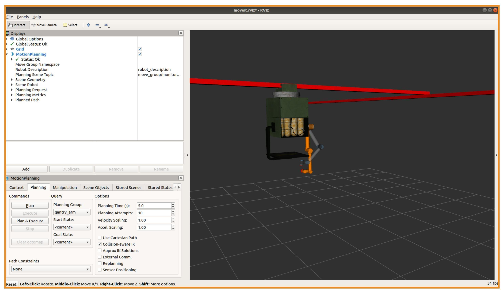
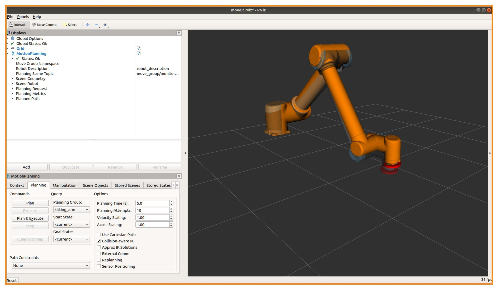

Wiki | [Home](../../README.md) | [Documentation](../documentation/documentation.md) | [Tutorials](../tutorials/tutorials.md) | [Qualifiers](../qualifiers/qualifier.md) | [Finals](../finals/finals.md)

-------------------------------------------------

- [Wiki | Tutorials | MoveIt!](#wiki--tutorials--moveit)
  - [Setting up your System](#setting-up-your-system)
    - [Install MoveIt](#install-moveit)
    - [Configure the Robot for MoveIt](#configure-the-robot-for-moveit)
  - [Run ARIAC and MoveIt](#run-ariac-and-moveit)
    - [Programmatically](#programmatically)
    - [Troubleshooting](#troubleshooting)

# Wiki | Tutorials | MoveIt!

Both robots in ARIAC accept [trajectory_msgs/JointTrajectory](http://docs.ros.org/melodic/api/trajectory_msgs/html/msg/JointTrajectory.html) messages. The [GEAR interface tutorial](gear_interface.md) has already shown you that these messages can be sent manually using the command line.

MoveIt is a tool that can generate these trajectories programmatically. It feeds the robot's current state and the state of the environment around it to a motion planning algorithm.
This tutorial will introduce you to controlling the robot in ARIAC 2021 using [MoveIt](https://moveit.ros.org/).

Competitors may modify these configuration files and use them during the competition. However, this is only one of many possible approaches for controlling the arm. Teams are free to use alternative motion planning and execution strategies entirely.

**Important, this tutorial and the associated configuration files are published only to provide competitors with a starting point for controlling the arm. The ARIAC competition support team will not provide technical support for MoveIt or these configuration files.**

## Setting up your System

### Install MoveIt

The following command installs the base moveit packages, which are needed for this tutorial.

```bash
$ sudo apt-get install ros-melodic-moveit
```

### Configure the Robot for MoveIt

Controlling the robots with MoveIt requires a custom configuration package called `gantry_moveit_config` and `kitting_moveit_config` which are included in the ARIAC repository (see [here](../../gantry_moveit_config/) and [here](../../kitting_moveit_config/)). This can also be generated from scratch using [`moveit_setup_assistant`](http://docs.ros.org/kinetic/api/moveit_tutorials/html/doc/setup_assistant/setup_assistant_tutorial.html).

## Run ARIAC and MoveIt

MoveIt's main functionality is provided by the `move_group` node, which needs to be launched in the
`/ariac/gantry` namespace for the assembly robot and in the `/ariac/kitting` namespace for the kitting robot concurrently with the ARIAC environment. For convenience, we have added a
command line argument for loading this node when launching the sample environment.

- The following command launches the MoveIt package for both robots:
  
  ```bash
  $ roslaunch nist_gear sample_environment.launch load_moveit:=true
  ```
<!-- 
- The following command launches the MoveIt package for only the kitting robot:
  
  ```bash
  $ roslaunch nist_gear sample_environment.launch load_kitting_moveit:=true
  ```

- The following command launches the MoveIt package for only the assembly robot:
  
  ```bash
  $ roslaunch nist_gear sample_environment.launch load_gantry_moveit:=true
  ``` -->

## Interface with MoveIt

### RViz

RViz is a visualization tool that can represent the state of robots, both simulated and real.
There is an RViz plugin for motion planning with MoveIt which can be used to interactively interface with the move_group.
To launch RViz with this plugin, we can use the following short launch file which you can create in your own package. 

**NOTE**: The code snippet below is included in `sample_environment.launch` but commented out.

```bash
<launch>
  <group ns='ariac/gantry'>
    <include file="$(find gantry_moveit_config)/launch/moveit_rviz.launch">
      <arg name="rviz_config" value="$(find gantry_moveit_config)/launch/moveit.rviz"/>
    </include>
  </group>
  <group ns='ariac/kitting'>
    <include file="$(find kitting_moveit_config)/launch/moveit_rviz.launch">
      <arg name="rviz_config" value="$(find kitting_moveit_config)/launch/moveit.rviz"/>
    </include>
  </group>
</launch>
```

This should bring up a visualization like the following, which shows the robot state, an "interactive marker" for moving the end effector around, and the goal position for the robot in orange. You may have to [move the RViz camera](wiki.ros.org/rviz/UserGuide#The_different_camera_types) to see the arm.





- Select the `Planning` tab in the Motion Planning plugin. In this tab, you can select the planning group used by MoveIt, the goal state of the robot, as well as other planning parameters.

- Move the end effector using the interactive marker and select `Plan` to get MoveIt to generate a joint trajectory matching that goal position.
- If all goes well, you should be able to click `Execute` to send this trajectory to the arm's controller.

You should see that the robot move in Gazebo, and that this movement is reflected in the visualization in RViz.

### Programmatically

We have provided test competitors that use MoveIt's python interface to control the robots. They can be found in the **test_competitor** package.  


To see kitting in action:
```bash
$ roslaunch test_competitor assembly.launch station:=as1
$ rosrun test_competitor assembly_commander_node.py
```

* To see assembly in action:

```bash
$ roslaunch test_competitor kitting.launch
$ rosrun test_competitor kitting_commander_node.py
```

For additional information, please see the official [MoveIt tutorials](https://ros-planning.github.io/moveit_tutorials/), and [API](https://moveit.ros.org/documentation/source-code-api/).

### Troubleshooting

As previously stated, this tutorial is provided as a starting point.
The ARIAC competition support team will not provide technical support for using MoveIt.

-------------------------------------------------

Wiki | [Home](../../README.md) | [Documentation](../documentation/documentation.md) | [Tutorials](../tutorials/tutorials.md) | [Qualifiers](../qualifiers/qualifier.md) | [Finals](../finals/finals.md)
