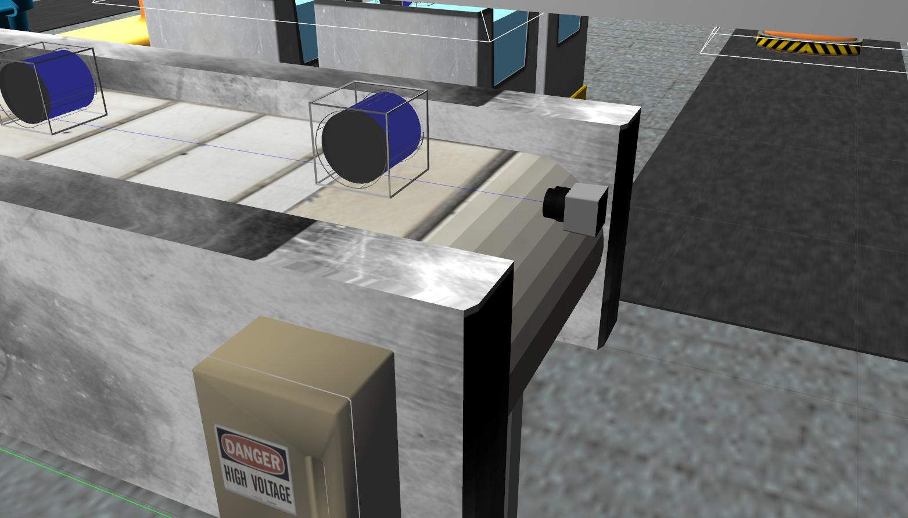
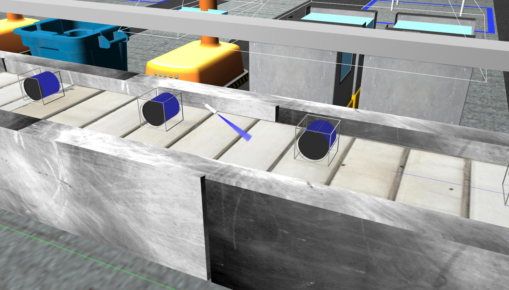
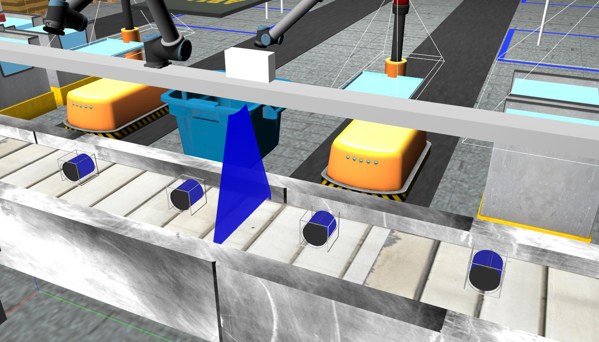
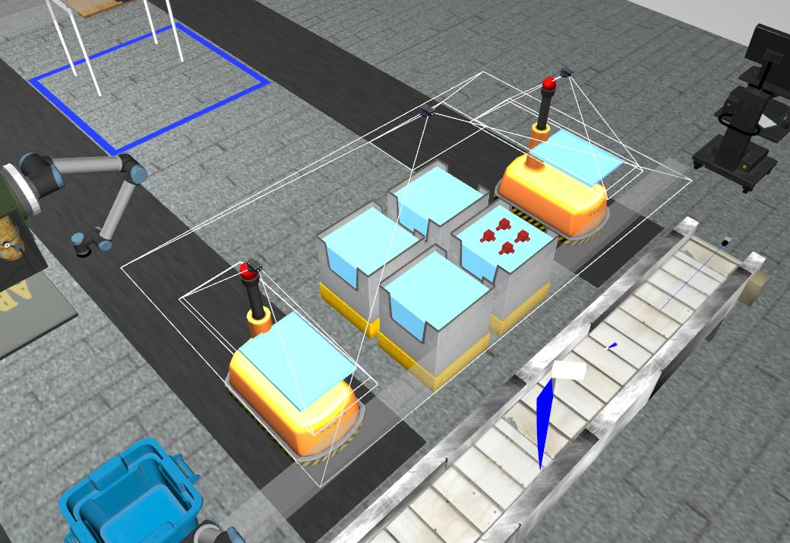
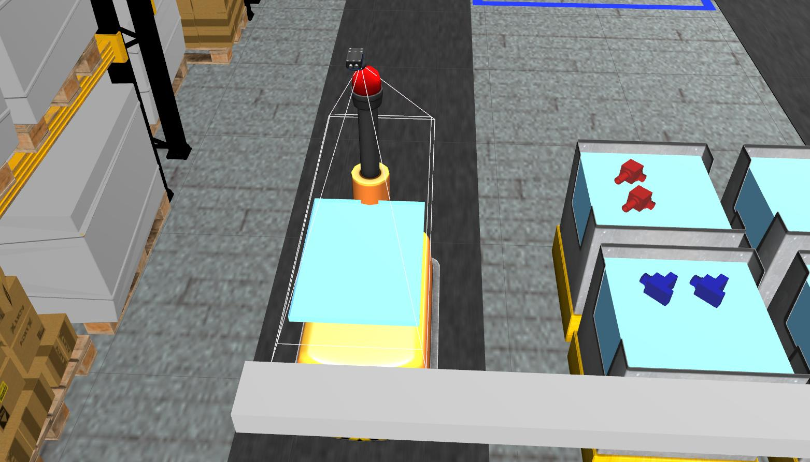

Wiki | [Home](../../README.md) | [Documentation](../documentation/documentation.md) | [Tutorials](../tutorials/tutorials.md) | [Qualifiers](../qualifiers/qualifier.md) | [Finals](../finals/finals.md)

-------------------------------------------------

- [Wiki | Tutorials | Sensor Interface](#wiki--tutorials--sensor-interface)
- [Prerequisites](#prerequisites)
- [Cameras and Sensors in ARIAC 2022](#cameras-and-sensors-in-ariac-2022)
  - [Break Beam Sensor](#break-beam-sensor)
    - [Reading Data](#reading-data)
    - [Adding Sensor](#adding-sensor)
  - [Proximity Sensor](#proximity-sensor)
    - [Reading Data](#reading-data-1)
    - [Adding Sensor](#adding-sensor-1)
  - [Laser Profiler](#laser-profiler)
    - [Reading Data](#reading-data-2)
    - [Adding Sensor](#adding-sensor-2)
  - [Depth Camera](#depth-camera)
    - [Reading Data](#reading-data-3)
    - [Adding Camera](#adding-camera)
  - [RGBD Camera](#rgbd-camera)
    - [Reading Data](#reading-data-4)
    - [Adding Camera](#adding-camera-1)
  - [Logical Camera](#logical-camera)
    - [Reading Data](#reading-data-5)
    - [Adding Camera](#adding-camera-2)
  - [Quality Control Sensor](#quality-control-sensor)
  - [Cameras Mounted on the Gantry Robot](#cameras-mounted-on-the-gantry-robot)

# Wiki | Tutorials | Sensor Interface

The purpose of this tutorial is to introduce you to the sensors available to you in the Agile Robotics for Industrial Automation Competition (ARIAC) and how to interface with them from the command-line. The discussion in this tutorial uses the sensors defined in [sample_user_config](../../nist_gear/config/user_config/sample_user_config.yaml)

# Prerequisites

You should have already completed the [GEAR interface tutorial](gear_interface.md).

# Cameras and Sensors in ARIAC 2022

As described in the competition specifications, there are sensors available for you to place in the environment. How you can select which sensors to use is covered in the [competition configuration specifications](../documentation/competition_specifications.md).

To start with, launch ARIAC with a sample workcell environment configuration that contains some sensors in various locations:

```bash
roslaunch nist_gear sample_environment.launch
```

## Break Beam Sensor



- This is a simulated photoelectric sensor, such as the Sick W9L-3.
- This sensor has a detection range of 1 meter and the binary output will tell you whether there is an object crossing the beam.
- **Cost**: $100

### Reading Data

- There are two ROS topics that show the output of the sensor:
  - `/ariac/{sensor_name}`
  - `/ariac/{sensor_name}_change`

- An [osrf_gear/Proximity](../../nist_gear/msg/Proximity.msg) message is periodically published on topic `/ariac/{sensor_name}`.
- Run this command to see the message on the command line:

```bash
rostopic echo /ariac/breakbeam_0
```

- Alternatively, you could subscribe to the `/ariac/{sensor_name}_change` which will only show one message per transition from object not detected to object detected or vice verse.
- Run this command to see the messages on the command line:

```bash
rostopic echo /ariac/breakbeam_0_change
```

### Adding Sensor

- Here is an example of adding a break beam sensor to your configuration file:

```yaml
  breakbeam_0:
    type: break_beam
    pose:
      xyz: [-0.004795, 4.492549, 0.879306]
      rpy: [0, 0, -1.557900]
```

## Proximity Sensor



- This is a simulated ultrasound proximity sensor such as the SU2-A0-0A.
- This sensor has a detection range of ~0.15 meters and the output will tell you how far an object is from the sensor.
- **Cost**: $100

### Reading Data

- The ROS topic `/ariac/{sensor_name}` publishes the data as [sensor_msgs/Range](http://docs.ros.org/api/sensor_msgs/html/msg/Range.html).
- Run this command to see the proximity sensor from the example world on the command line:

```bash
rostopic echo /ariac/proximity_sensor_0
```

- The proximity sensor can be visualized in RViz using the **Range** display.
- It helps to disable or decrease the marker scale on the **TF** display to see the cone of the range sensor in RViz.

### Adding Sensor

- Here is an example of adding a proximity sensor to your configuration file:

```yaml
  proximity_sensor_0:
    type: proximity_sensor
    pose:
      xyz: [0, 2.840000, 0.970000]
      rpy: [1.570796, 0.524365, 1.570796]
```

## Laser Profiler



- This is a simulated 3D laser profiler such as the Cognex DS1300.
- The output of the sensor is an array of ranges and intensities.
- The size of the array is equal to the number of beams in the sensor.
- The maximum range of each beam is ~0.725m.
- **Cost**: $100

### Reading Data

- The output of the sensor is periodically published on the topic `/ariac/{sensor_name}` as a [sensor_msgs/LaserScan](http://docs.ros.org/api/sensor_msgs/html/msg/LaserScan.html).
- Run this command to see the output on the command line:

```bash
rostopic echo /ariac/laser_profiler_0
```

- This can be visualized in RViz by adding a **LaserScan** display.
- There is an offset between the position of the laser profiler and the origin of the data.
- The position of the laser profiler is in a **tf** frame named `{sensor_name}_frame`, while the origin of the data is in a frame named `{sensor_name}_laser_source_frame`.

### Adding Sensor

- Here is an example of adding a laser profiler to your configuration file:

```yaml
  laser_profiler_0:
    type: laser_profiler
    pose:
      xyz: [0., 1.486, 1.526]
      rpy: ['pi/2', 'pi/2', 0]
```

## Depth Camera

- This is a simulated time-of-flight depth camera such as the Swissranger SR4000.
- The output of the sensor is [sensor_msgs/Pointcloud](http://docs.ros.org/api/sensor_msgs/html/msg/PointCloud.html)
- **Cost**: $200

### Reading Data

- Because of the large amount of data being published, if you want to echo the sensor message you probably want to use `--noarr` to suppress the data values on the command line:

```bash
rostopic echo /ariac/depth_camera_1/depth/image_raw --noarr
```

- Pointclouds can be visualized in RViz using the **PointCloud** display.

### Adding Camera

- Here is an example of adding a depth camera to your configuration file:

```yaml
  depth_camera_0:
    type: depth_camera
    pose:
      xyz: [3.082385, 1.750927, 1.82]
      rpy: [0, 'pi/2', 0]
```

## RGBD Camera

- This is a simulated time-of-flight depth camera such as the Swissranger SR4000.
- The output of the sensor is [sensor_msgs/Pointcloud](http://docs.ros.org/api/sensor_msgs/html/msg/PointCloud.html) and [sensor_msgs/Image](http://docs.ros.org/api/sensor_msgs/html/msg/Image.html).
- **Cost**: $300

### Reading Data

- Because of the large amount of data being published, if you want to echo the sensor message you probably want to use `--noarr` to suppress the data values on the command line:

```bash
rostopic echo /ariac/rgbd_camera_1/depth/image_raw --noarr
```

```bash
rostopic echo /ariac/rgbd_camera_1/ir/image_raw --noarr
```

- Point clouds can be visualized in RViz using the **PointCloud** display.
- Images can be visualized in RViz using the **Image** display.

### Adding Camera

- Here is an example of adding a RGBD camera to your configuration file:

```yaml
rgbd_camera_0:
    type: rgbd_camera
    pose:
      xyz: [3.082385, 1.750927, 1.82]
      rpy: [0, 'pi', 0]
```

## Logical Camera




- This is a simulated camera with a built-in object classification and localization system.
- The sensor reports the position and orientation of the camera in the world, as well as a collection of the objects detected within its frustum.
- The camera reports an object's type and pose from the camera reference frame as an [osrf_gear/LogicalCameraImage](https://github.com/usnistgov/ARIAC/blob/master/nist_gear/msg/LogicalCameraImage.msg) message.
- **Cost**: $500

### Reading Data

- In the sample environment there is a logical camera above one of the bins.
- Run the following command to see the output of the logical camera:

```bash
rostopic echo /ariac/logical_camera_0
```

- Logical cameras also publish `tf` transforms.
- Use the TF2 library to calculate the pose of the products detected by the logical cameras in the `world` frame (see http://wiki.ros.org/tf2).

- Here is an example using TF2 command-line tools to get a the pose of a part detected by a logical camera in world frame.
- Note that the frame of the detected products is prefixed by the name of the camera that provides the transform, so if multiple cameras see the same product they will publish transforms with different frame names.

```bash
rosrun tf tf_echo world logical_camera_0_assembly_pump_blue_2_frame

At time 82.601
- Translation: [-1.798, 3.280, 0.784]
- Rotation: in Quaternion [0.008, -0.008, 0.001, 1.000]
            in RPY (radian) [0.017, -0.017, 0.003]
            in RPY (degree) [0.967, -0.975, 0.153]
```

For more information on working with TF frames programmatically see [the tf2 tutorials](http://wiki.ros.org/tf2/Tutorials).

**Note that GEAR uses tf2_msgs and not the deprecated tf_msgs. Accordingly, you should use the tf2 package instead of tf.**

### Adding Camera

- Here is an example of adding a logical camera to your configuration file:

```yaml
  logical_camera_0:
    type: logical_camera
    pose:
      xyz: [-2.515033, 2.925223, 1.82]
      rpy: [-1.570796, 1.570796, 0]
```

## Quality Control Sensor



- This is a simulated sensor that reports the pose of the sensor itself in the world frame and the pose of faulty parts (non-faulty parts are not reported) in the sensor frame.

- There are 4 quality control sensors in the environment (1 above each AGV).

- Locations of quality control sensors are set and competitors cannot change those locations.

- Run the following command to see the output of the sensors:
  
```bash
$ rostopic echo /ariac/quality_control_sensor_1
$ rostopic echo /ariac/quality_control_sensor_2
$ rostopic echo /ariac/quality_control_sensor_3
$ rostopic echo /ariac/quality_control_sensor_4
```

## Cameras Mounted on the Gantry Robot

- **Cost**: \$300 and \$600

Two depth cameras are located on the gantry robot. The pose of these cameras cannot be changed but competitors can enable or disable them. The following must be placed in the sensor configuration file:
```yaml
gantry_bin_camera:
  enable: false
    
gantry_tray_camera:
  enable: false
```

The `gantry_bin_camera` costs \$600 and can clearly see parts located in bins. The `gantry_tray_camera` costs \$300 and can see parts placed on the gantry tray. To see the view from each camera using RViz, uncomment the following section in `sample_environment.launch` and start the simulation. In RViz, check the box next to `Image`.

```yaml
 <!-- <group ns='ariac/gantry'>
    <include file="$(find gantry_moveit_config)/launch/moveit_rviz.launch">
      <arg name="rviz_config" value="$(find gantry_moveit_config)/launch/moveit.rviz"/>
    </include>
  </group>  -->
  ```


-------------------------------------------------
Wiki | [Home](../../README.md) | [Documentation](../documentation/documentation.md) | [Tutorials](../tutorials/tutorials.md) | [Qualifiers](../qualifiers/qualifier.md) | [Finals](../finals/finals.md)
