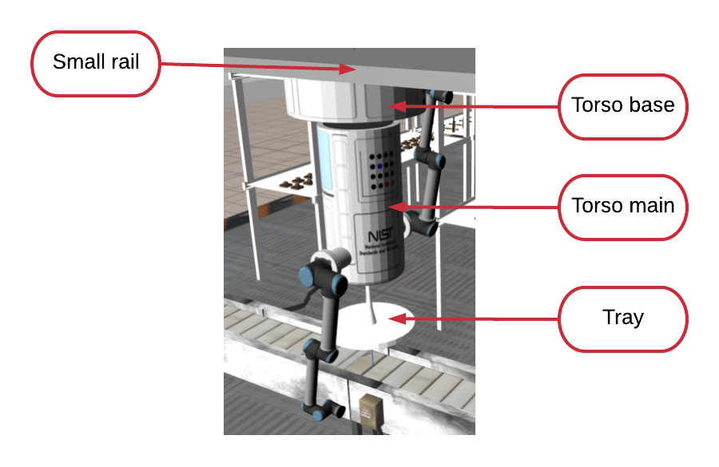
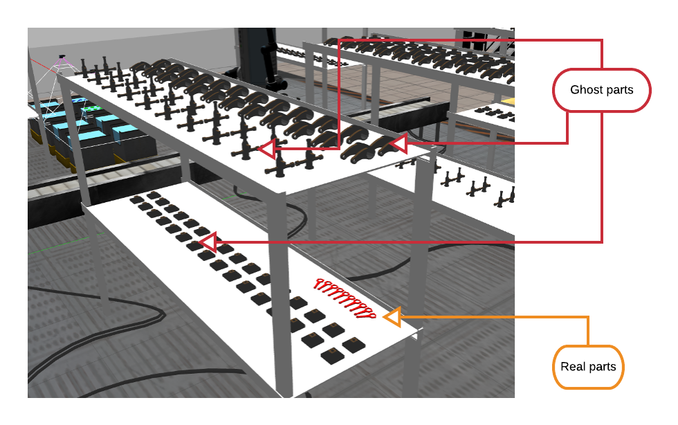
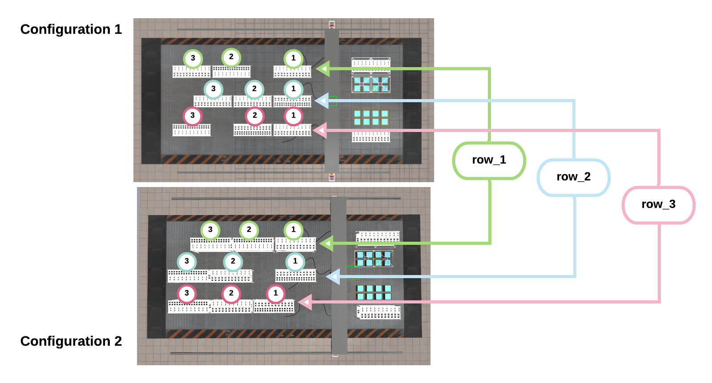

[//]: # (This may be the most platform independent comment)

-------------------------------------------------
- Go to [Wiki | Home](../README.md)
- Go to [Wiki | Documentation](documentation.md)
- Go to [Wiki | Tutorials](tutorials.md)
- Go to [Wiki | Qualifiers](qualifier.md)
- Go to [Wiki | Finals](finals.md)
- Go to [Wiki | News](updates.md)
-------------------------------------------------

# ARIAC 2019 Vs. ARIAC 2020
This section lists all the changes that were made from ARIAC 2019. If you participated in ARIAC 2019 and plan to participate in ARIAC 2020 then you may need to be aware of the following changes:
## Robot
* This year, competitors will have to control a 15 DoF gantry robot to complete the challenges. The robot consists of:
    * 1 linear actuator which allows the base of the robot to move along a small rail.
    * 1 linear actuator which allows the small rail to move along the long rails.
    * 1 rotatory torso which rotates around the base z-axis.
    * Two 6 DoF UR10 arms attached to the torso. 
      * Each arm's base has a fixed joint to the torso.
    * A tray is attached at one of the extremities of the torso. Participants may put parts in this tray while fetching other parts in the environment.




## Shelves
Besides bins and the conveyor belt, we now have the possibility to spawn parts on shelves.

* Each shelf has two levels:
   * Top and bottom shelves contain ghost parts. Those parts are only there for aesthetic. **They are not graspable"
   * Parts will never be spawn on the top shelf.
   * When parts are spawn on a shelf, they will always be spawn on the bottom shelf.
   
   
   
   * There are exactly 11 shelves in the environment.
      * 2 shelves will always be at the exact same locations.
      * The location of the 9 remaining shelves can be customized to a certain extent. 
         * The configuration for those shelves can be specified in `osrf_gear/config/sample.yaml`. Participants are allowed to change those shelves configuration during testing but not during qualifiers and finals.
         * The figure combines two screenshots of the environment (top view) where 2 shelves configurations are presented. 
         * **Configuration 1** and **Configuration 2** show 3 rows of shelves with each row having 3 shelves and 1 gap. 
            * In **Configuration 1**, the gap is located after the first shelf (row_1), at the end of the row of shelves (row_2), and after the first two shelves (row_3). The 3 rows of shelves for **Configuration 1** is represented as follows in `config.yaml`
            
            ```yaml
shelf_layout:
  row_1: ['base','collar','collar',0] #shelves: 3, 4, 5
  row_2: ['pipe',0,'base','collar']   #shelves: 6, 7, 8
  row_3: [0,'pipe','base','collar'] #shelves: 9, 10, 11
``` 
            
            * In **Configuration 2**, the gap is located after all the shelves (row_1), after the first shelf (row_2), and before all the shelves (row_3). The 3 rows of shelves for **Configuration 1** is represented as follows in `config.yaml`

 


-------------------------------------------------
- Go to [Wiki | Home](../README.md)
- Go to [Wiki | Documentation](documentation.md)
- Go to [Wiki | Tutorials](tutorials.md)
- Go to [Wiki | Qualifiers](qualifier.md)
- Go to [Wiki | Finals](finals.md)
- Go to [Wiki | News](updates.md)
-------------------------------------------------
